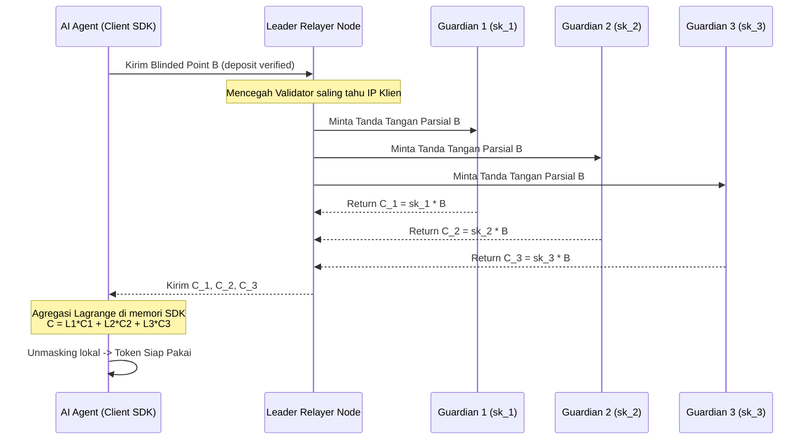

# Riset R&D: Desentralisasi Minting Menggunakan Threshold BDHKE (Multi-Authority Mint)

Dokumen ini memetakan rancangan desain kriptografi untuk melakukan desentralisasi peran **Penerbit Token (Issuer/Mint)** pada Nimbus Protocol menggunakan teknik **Threshold Blind Diffie-Hellman Key Exchange (Threshold BDHKE)** di atas kurva BLS12-381.

---

## 1. Latar Belakang & Masalah Sentralisasi
Pada implementasi e-cash tradisional (seperti Cashu v3) atau versi awal Nimbus, terdapat satu entitas tunggal (**Single Mint/Issuer**) yang memegang kunci rahasia penerbitan ($sk_{iss}$). 
* **Risiko**: Jika server Issuer disita, diretas, atau offline, pengguna tidak dapat melakukan pencetakan (*minting*) token baru atau pembukaan kunci masking (*unmasking*).
* **Solusi**: Membagi kunci rahasia $sk_{iss}$ ke dalam beberapa validator independen (**Guardians/Federation**) menggunakan skema **Shamir Secret Sharing $(t, n)$**. Token hanya dapat diterbitkan jika setidaknya $t$ dari $n$ validator bersedia menandatanganinya.

---

## 2. Keindahan Homomorfik BDHKE (Keuntungan Efisiensi Klien)
Karena protokol BDHKE berbasis perkalian titik kurva eliptik ($C = sk \cdot B$), skema ini memiliki sifat homomorfik linear yang sangat menguntungkan. 

Kita dapat melakukan integrasi threshold **sepenuhnya di sisi klien (klien-side aggregation)**. Artinya:
* **Gas Fee Tetap Rendah**: Smart contract L2 (`nimbus-contracts`) tidak perlu tahu bahwa tanda tangan dibuat secara threshold. Kontrak tetap memverifikasi tanda tangan final yang bersih terhadap satu kunci publik gabungan ($pk_{iss}$) menggunakan precompile `BLS12_PAIRING_CHECK` (EIP-2537) biasa.
* **Komputasi Murah**: Tidak ada overhead gas tambahan di blockchain untuk verifikasi multi-signature.

---

## 3. Formulasi Matematika Threshold BDHKE

### A. Setup Kunci (Distributed Key Generation - DKG)
Kunci rahasia issuer $sk$ dibagi menjadi $n$ bagian ($sk_1, sk_2, \dots, sk_n$) menggunakan polinomial acak derajat $t-1$ di atas lapangan skalar kurva $F_r$:
$$f(x) = sk + a_1 x + a_2 x^2 + \dots + a_{t-1} x^{t-1} \pmod P$$
Setiap validator $i$ memegang share kunci rahasia $sk_i = f(i)$ dan mempublikasikan komitmen kunci publik parsial mereka $pk_i = sk_i \cdot G_2$.
Kunci publik agregat nasional adalah $pk_{iss} = sk \cdot G_2$.

### B. Alur Penandatanganan Terbutakan Parsial (Partial Blind Signing)
1. **Klien (User)** melakukan blinding terhadap pesan $M$ (titik kurva G1):
   $$B = r \cdot H(M) + I \pmod P$$
   *Di mana $r$ adalah blinding factor acak, dan $I$ adalah identitas rahasia klien.*
2. Klien mengirimkan titik kurva $B$ ke $t$ validator terpilih secara paralel.
3. Setiap validator $i$ menghasilkan tanda tangan parsial $C_i$ secara independen menggunakan share kunci mereka:
   $$C_i = sk_i \cdot B \pmod P$$
4. Klien mengumpulkan $t$ tanda tangan parsial $\{C_i\}_{i \in S}$ (di mana $S$ adalah subset validator berukuran $t$).

### C. Agregasi Klien-Side (Lagrange Interpolation)
Klien menggabungkan tanda tangan parsial menjadi tanda tangan terbutakan penuh $C$ menggunakan koefisien interpolasi Lagrange $L_i$ di atas kurva eliptik:
$$L_i = \prod_{j \in S, j \neq i} \frac{-j}{i - j} \pmod P$$
Klien menghitung:
$$C = \sum_{i \in S} (L_i \cdot C_i) = \sum_{i \in S} (L_i \cdot sk_i \cdot B) = \left( \sum_{i \in S} L_i \cdot sk_i \right) \cdot B = sk \cdot B$$
Tanda tangan terbutakan $C$ sekarang identik dengan tanda tangan yang dibuat seolah-olah oleh satu Issuer tunggal!

### D. Unblinding Klien
Klien melakukan unblinding secara lokal menggunakan kunci publik agregat $pk_{iss}$:
$$\alpha = C - r \cdot pk_{iss}$$
Tanda tangan $\alpha$ siap dibelanjakan secara anonim di smart contract Arbitrum Stylus.

---

## 4. Arsitektur Komunikasi Relayer Node (Fase C / M2M)

---

## 5. Rencana Langkah Implementasi Teoretis

1. **Modul SDK (`nimbus-sdk`)**:
   * Menambahkan kalkulator koefisien Lagrange $L_i$ menggunakan aritmetika skalar BLS12-381 $Fr$.
   * Menambahkan fungsi `aggregate_partial_signatures(shares: Vec<G1Point>) -> G1Point`.
2. **Validator Node Daemon**:
   * Menyediakan endpoint aman `POST /api/sign-share` khusus untuk memproses operasi scalar multiplication $sk_i \cdot B$.
3. **Decentralized Escrow Smart Contract**:
   * Tidak membutuhkan perubahan logika verifikasi spending, karena tanda tangan akhir $\alpha$ tetap berupa tanda tangan standar yang kompatibel dengan EIP-2537.
