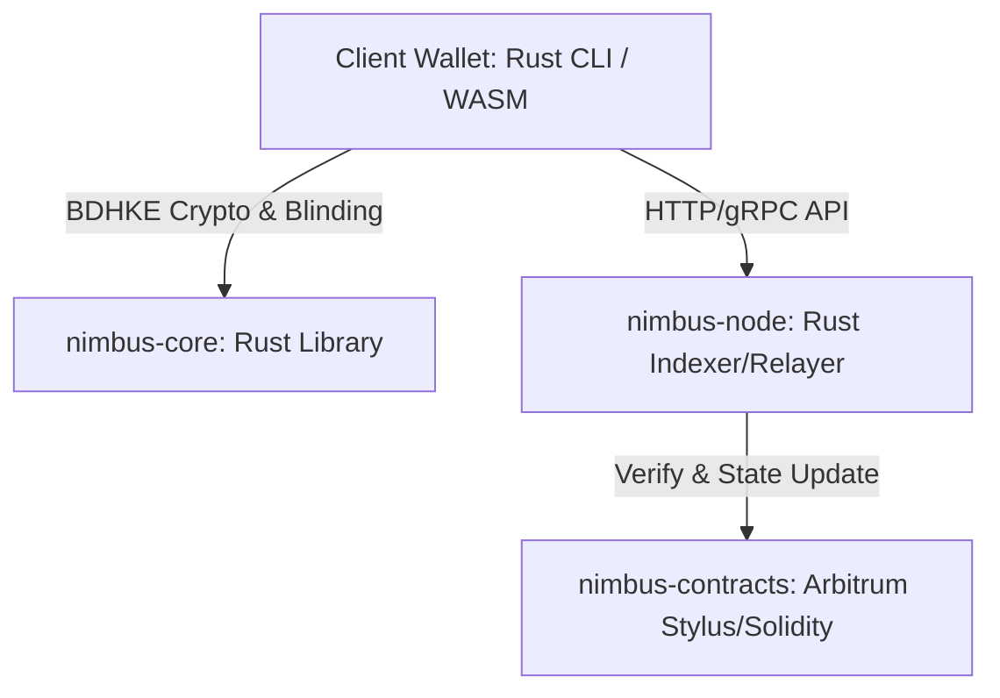

# Nimbus Protocol: Architecture & Technical Design

## 1. Project Overview & Name
*   **Project Name:** **Nimbus Protocol** (dari kata *Nimbus* - awan terang/halo, melambangkan transaksi yang ringan, cepat, dan menyelimuti privasi).
*   **Core Concept:** Implementasi **Blockchain Anonymous Tokens (BAT)** berdasarkan riset terbaru 2026. Protokol ini menggabungkan keamanan desentralisasi blockchain dengan kecepatan dan keringanan teknologi *Chaumian Ecash* (tanpa beban Zero-Knowledge Proofs pada client).
*   **Primary Language:** **Rust** (untuk core cryptography, client SDK, CLI, dan smart contract).

---

## 2. Technology Stack (Rust-Centric)

Untuk mencapai performa maksimal, portabilitas tinggi, dan keamanan memori, seluruh stack dirancang menggunakan ekosistem Rust:



*   **`nimbus-core` (Rust):** Library kriptografi utama. Mengimplementasikan *Blind Diffie-Hellman Key Exchange (BDHKE)* berbasis kurva eliptik yang kompatibel dengan EVM (misal: kurva `secp256k1` atau `bn254` untuk bilinear pairing).
*   **`nimbus-contracts` (Rust / Arbitrum Stylus):** Smart contract untuk verifikasi on-chain. Kita menggunakan **Arbitrum Stylus**, teknologi L2 yang memungkinkan penulisan smart contract EVM langsung dalam bahasa Rust. Ini menghemat gas fee hingga 10x dibanding Solidity tradisional.
*   **`nimbus-cli` / `nimbus-sdk` (Rust & WASM):** SDK klien untuk diintegrasikan ke mobile/web. Rust akan dikompilasi ke **WebAssembly (WASM)** agar bisa berjalan dengan performa native di web browser atau aplikasi mobile (Flutter/React Native).

---

## 3. Cryptographic Workflow (Cara Kerja BAT)

BAT menggabungkan teknik blinding tanda tangan (David Chaum) dengan transparansi blockchain publik untuk mencegah *double-spending* tanpa perlu mempercayai penerbit token.

### A. Tahap 1: Deposit & Minting (Penerbitan Token)
1. User mendepositkan aset (misal: 10 USDC) ke smart contract `Nimbus`.
2. Client wallet men-generate sebuah rahasia acak $x$ dan faktor pembuai (blinding factor) $r$.
3. Client menghitung pesan terbutakan (blinded message) $T = r \cdot H(x)$ lalu mengirimkannya ke smart contract.
4. Smart contract memverifikasi deposit lalu menandatangani $T$ menggunakan private key milik contract $k$, menghasilkan $S' = k \cdot T$.
5. Client mengunduh $S'$ dan melepas kebutaan (unblinds) menggunakan $r^{-1}$ untuk mendapatkan tanda tangan valid $S = k \cdot H(x)$. 
6. Token anonim akhir adalah pasangan $(x, S)$.

### B. Tahap 2: Pembayaran & Transfer Anonim (Off-chain & Offline)
1. Pengirim memberikan token $(x, S)$ kepada Penerima secara off-chain (bisa lewat QR Code, NFC, atau chat aman).
2. Penerima melakukan verifikasi cepat secara lokal (off-chain) bahwa $S$ adalah tanda tangan valid dari smart contract atas pesan $x$. Proses ini **instan** (< 1 milidetik) karena tidak membutuhkan ZK-proof.

### C. Tahap 3: Pencegahan Double-Spending Offline (Self-Revealing Identity)
Jika transaksi dilakukan secara offline tanpa koneksi internet ke L2:
1. Merchant menantang dompet pengirim dengan nilai acak $x_1$.
2. Dompet pengirim menghasilkan respon $y_1 = a \cdot x_1 + I \pmod p$, di mana $I$ adalah identitas rahasia pengguna (kunci privat dompet utama) dan $a$ adalah slope acak.
3. Selama pengirim jujur (hanya membelanjakan koin sekali), identitas $I$ terlindungi sepenuhnya oleh kerahasiaan informasi satu titik.
4. Jika pengirim curang dan membelanjakan koin yang sama ke merchant lain dengan tantangan $x_2$, dia harus merespon dengan $y_2 = a \cdot x_2 + I \pmod p$.
5. Ketika kedua merchant kembali online dan menyetor bukti ke smart contract `Nimbus`, smart contract menyelesaikan sistem persamaan linear tersebut secara instan untuk membongkar identitas asli pelaku kecurangan ($I$) dan menyita dana jaminan mereka (*slashing*).

### D. Tahap 4: Swapping / Pencairan (Double-Spend Protection Online)
1. Untuk transaksi online, Penerima segera mengirimkan $x$ dan $S$ ke smart contract `Nimbus`.
2. Smart contract memverifikasi tanda tangan $S$ terhadap public key contract dan memeriksa tabel data **Nullifier List** (daftar rahasia $x$ yang sudah pernah dibelanjakan).
3. Jika $x$ belum pernah digunakan, kontrak mencatat $x$ ke dalam *Nullifier List*, lalu mengirimkan USDC ke Penerima (atau menerbitkan token BAT baru yang bersih untuk Penerima).

---

## 5. Integrasi Khusus: Dark Prediction Markets (Polymarket)

Untuk mendukung privasi *whale* dan mencegah pelacakan posisi taruhan di platform seperti Polymarket, infrastruktur Nimbus memiliki kesiapan integrasi penuh:

1. **Decoupled Betting (Pemisahan Taruhan)**:
   * Pengguna mengubah USDC publik menjadi token privat menggunakan `nimbus-contracts` on-chain.
   * Pengguna melakukan *unblinding* off-chain untuk menghasilkan tanda tangan BLS final ($\alpha$).
   * Melalui SDK kita, pengguna membuat alamat dompet *ephemeral* (sekali pakai) secara otomatis untuk setiap taruhan.

2. **Eksekusi Gasless & Bundling (EIP-7702 & Relayer)**:
   * Alamat ephemeral pengguna tidak memiliki ETH untuk gas fee.
   * Relayer (`nimbus-node`) membungkus otorisasi EIP-7702 untuk dompet ephemeral tersebut.
   * Relayer mengirimkan transaksi multi-call (batch): memicu `spend()` pada kontrak Nimbus untuk mengisi saldo USDC di alamat ephemeral, lalu memanggil fungsi taruhan di kontrak Polymarket (membeli shares Yes/No) dalam satu transaksi tunggal.
   * Seluruh gas fee ditalangi oleh Relayer dan dipotong langsung dari stablecoin (USDC) taruhan.

Hasilnya, bot pelacak whale tidak dapat menghubungkan taruhan di Polymarket dengan dompet utama milik pengguna, melindungi taktik taruhan dan alpha mereka sepenuhnya.

---

## 6. Keunggulan Teknis dibanding ZK-Privacy (Zcash/Tornado)

| Fitur | Tornado Cash / Zcash (ZK) | Nimbus Protocol (BAT 2026) |
| :--- | :--- | :--- |
| **Beban Komputasi Client** | Sangat Tinggi (HP panas/lambat) | Sangat Rendah (Instant, kalkulasi ringan) |
| **Waktu Pembuatan Bukti** | ~5 hingga 30 detik | < 2 milidetik (7.000x lebih cepat) |
| **Keamanan Double-Spend** | On-chain verification | On-chain Nullifier |
| **Ketergantungan Trusted Setup** | Ya (Sering kali membutuhkan setup) | Tidak (Menggunakan skema tanda tangan klasik) |

---

## 7. Rencana Struktur Folder Project di Rust

Kita akan menginisialisasi project Rust ini dengan struktur monorepo:

```text
nimbus-protocol/
├── Cargo.toml
├── nimbus-core/        # Kriptografi BDHKE, Blinding, & Unblinding (Rust)
├── nimbus-contracts/   # Smart Contract untuk Arbitrum Stylus (Rust)
├── nimbus-cli/         # Aplikasi terminal dompet client (Rust)
└── nimbus-sdk/         # Binding untuk WASM / Web / Mobile integration
```
