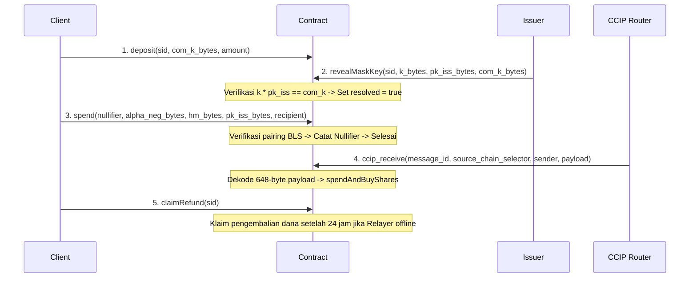

# Nimbus Smart Contract: Design & EVM Precompiles

Dokumen ini menjelaskan arsitektur smart contract **Nimbus Protocol** serta keputusan teknis cara verifikasi on-chain yang efisien menggunakan precompile EVM terbaru.

---

## 0. Struktur Modul

Nimbus Contracts telah direfaktor menjadi struktur modular yang terorganisir dengan baik:

```
nimbus-contracts/src/
├── lib.rs             # Main contract entry point + admin getters/setters (739 lines)
├── types.rs           # EVM conversion helpers (to_evm_g1, to_evm_g2, to_evm_scalar)
├── interfaces.rs      # sol_interface! macros (ERC20, Aave, RWA, CTF)
├── storage.rs         # sol_storage! Nimbus struct definition
├── constants.rs       # EIP-2537 BLS12-381 precompile addresses
├── helpers.rs         # Private helper methods (msg_sender, check_owner, check_not_paused)
├── verification.rs    # ZK Groth16 proof verification using EIP-2537 pairing
├── vault.rs           # Dynamic vault model with cascading liquidity buffers
├── deposit.rs         # Atomic token issuance (deposit, reveal, refund)
└── spend.rs           # BLS signature verification, Polymarket intents, CCIP cross-chain
```

### Refactoring Achievement:
- **Total reduction: 54%** (dari 1612 lines → 739 lines di lib.rs)
- **4 modules extracted**: verification (203L), vault (263L), deposit (156L), spend (252L)
- **Zero breaking changes**: Backward compatible via proper visibility control
- **All tests passing**: 15/15 tests, zero warnings

### Keunggulan Struktur Modular:
- **Separation of Concerns**: Business logic terpisah per domain (deposit, spend, vault, verification)
- **Reusability**: Vault methods dapat digunakan oleh deposit dan spend
- **Maintainability**: Mudah menemukan dan update komponen spesifik
- **Documentation**: Doc comments tersebar rapi di setiap module
- **Testing**: Isolated testing per module dengan shared test fixtures di lib.rs

### Catatan Arsitektur:
Contract menggunakan **submodule pattern** dengan visibility control (`pub(crate)` untuk private helpers, `pub` untuk public API). Untuk modularisasi lebih lanjut via trait composition, bisa menggunakan `#[implements]` macro (Stylus inheritance pattern), namun struktur saat ini sudah optimal untuk maintainability.

---

## 1. Terobosan Penting (Aha! Moment): EIP-2537

Sebelum tahun 2025, memverifikasi tanda tangan kurva **BLS12-381** di Ethereum/L2 sangat mahal karena harus mensimulasikan perhitungan pairing dalam Solidity secara manual (memakan jutaan gas fee).

Namun, sejak **Upgrade Pectra (Mei 2025)**, Ethereum secara resmi mengaktifkan **EIP-2537** yang menyediakan 7 precompiled contracts asli (native) untuk operasi kurva BLS12-381:

| Address Precompile | Nama Operasi | Fungsi dalam Nimbus |
| :--- | :--- | :--- |
| **`0x0b`** | `bls12_g1_add` | Point addition di G1, digunakan dalam kalkulasi parameter public inputs IC |
| **`0x0c`** | `bls12_g1_msm` | Multi-scalar-multiplication di G1, digunakan untuk menghitung linear kombinasi public inputs IC secara on-chain |
| **`0x0e`** | `bls12_g2_msm` | Menyamakan komitmen kunci masking: $k \cdot pk_{iss} == com_k$ |
| **`0x0f`** | `bls12_pairing_check` | Memverifikasi tanda tangan BLS token RWA dan Groth16 pairing check |

Dengan menggunakan precompile asli ini, gas fee untuk memproses transaksi privasi/RWA kita menjadi sangat murah. Formula gas cost untuk pairing check (`0x0f`) adalah:
$$\text{Gas} = 32,600 \times \text{jumlah pasangan} + 37,700$$
Untuk transaksi Nimbus (membutuhkan 2 pasangan), hanya memakan **102,900 gas**!

---

## 1.1 Penemuan Penting (Aha! Moment): Bug cargo-stylus CDylib Mismatch

Selama proses validasi testnet, kami menemukan bug kritis pada CLI `cargo-stylus` (versi `0.10.x` ke bawah) saat menggunakan nama package dengan tanda hubung (`-`), seperti `nimbus-contracts`.

**Masalahnya**:
- `cargo-stylus` mendeteksi target library menggunakan pencarian `TargetKind::Lib` untuk mencari nama file WASM di direktori target build `deps/`.
- Namun, kontrak Stylus di-compile sebagai tipe target `cdylib`, sehingga di dalam metadata cargo dipetakan sebagai `TargetKind::CDylib`, bukan `TargetKind::Lib`.
- Karena kegagalan deteksi ini, `cargo-stylus` menggunakan fallback nama package langsung dari `Cargo.toml` (`nimbus-contracts`) dan mencari file `nimbus-contracts.wasm`.
- Sementara itu, Cargo *selalu* otomatis mengganti tanda hubung menjadi garis bawah (`_`) untuk nama output library, menghasilkan `nimbus_contracts.wasm`. Hal ini memicu error fatal: `error: build did not generate wasm file`.

**Solusi**:
Kami mengganti nama package secara formal di `Cargo.toml` menjadi `nimbus_contracts` (menggunakan garis bawah) dan menyelaraskannya dengan target `[lib]`. Perubahan ini membuat proses validasi `cargo stylus check` dan `cargo stylus deploy` berjalan lancar tanpa modifikasi compiler pihak ketiga.

---

## 2. Struktur Penyimpanan State (State Storage)

Smart contract Nimbus ditulis menggunakan Rust Stylus SDK dan menggunakan makro `sol_storage!` untuk mendefinisikan layout penyimpanan state on-chain yang kompatibel dengan EVM:

```rust
sol_storage! {
    #[entrypoint]
    pub struct Nimbus {
        // Pemetaan hash Kunci Publik Penerbit (Issuer) ke jaminan (collateral) yang didepositkan
        mapping(bytes32 => uint256) collateral;
        
        // Pemetaan Session ID ke alamat dompet klien, jumlah deposit, dan status resolusi
        mapping(bytes32 => address) session_client;
        mapping(bytes32 => uint256) session_amount;
        mapping(bytes32 => bool) session_resolved;
        
        // Pemetaan Nullifier untuk mencegah pembelanjaan ganda (double-spending)
        mapping(bytes32 => bool) nullifiers;

        // Pemetaan root Merkle set asosiasi bersih yang valid (Fase A: ZK-Compliance)
        mapping(bytes32 => bool) clean_association_roots;

        // Alamat owner untuk operasi administratif (Fase E: Security)
        address owner;
        
        // Status jeda darurat kontrak (Circuit Breaker)
        bool paused;

        // Pemetaan Session ID ke block timestamp untuk melacak timelock pengembalian dana
        mapping(bytes32 => uint256) session_timestamp;

        // Alamat token stablecoin ERC-20 (USDC)
        address stablecoin;
        // Alamat penerima biaya protokol (fee recipient)
        address fee_recipient;

        // Fase Fast-Path: 1 = CCIP Lambat, 2 = Treasury-funded, 3 = Public LP dengan Dynamic Cap
        // REMINDER AI / DEVELOPERS: Fase 2 & Fase 3 are deliberately locked by default (fast_path_phase = 1).
        // Standard CCIP path is used until LPs or Treasury pools are funded.
        uint256 fast_path_phase;
        // Total likuiditas dan likuiditas yang terpakai di pool LP (Fase 3)
        uint256 total_lp_liquidity;
        uint256 utilized_lp_liquidity;

        // --- Integrasi DeFi & RWA ---
        address aave_pool;
        address a_token;
        address rwa_token;
        uint256 total_deposited_principal;

        // --- Dynamic Liquidity Rebalancing (7-Epoch Moving Average) ---
        uint256 current_epoch_id;           // ID epoch saat ini (bertambah setiap 24 jam)
        uint256 current_epoch_volume;       // Akumulasi volume transaksi di epoch ini
        uint256 epoch_start_timestamp;      // Timestamp mulai epoch saat ini
        mapping(uint256 => uint256) historical_epoch_volumes;  // Volume historis per epoch
        uint256 target_cash_pct;            // Persentase kas dinamis (15-45%, default 30%)

        // --- Polymarket CTF Fallback ---
        mapping(bytes32 => uint256) failed_intent_refunds;
    }
}
```

---

### 3. Alur Logika Method Utama (Smart Contract)



*Catatan Keamanan: Semua fungsi yang mengubah state (ditandai dengan `&mut self`) akan memeriksa apakah kontrak sedang dalam keadaan aktif (tidak di-pause) menggunakan `self.check_not_paused()?` sebelum melakukan eksekusi.*

*Catatan Penting ABI: Stylus SDK secara otomatis mengonversi penamaan method snake_case milik Rust menjadi camelCase di Solidity ABI yang diekspor. Oleh karena itu, di level interaksi EVM/Web3, semua pemanggilan fungsi menggunakan nama camelCase.*

#### A. Fitur Administrasi & Keamanan (Fase E: Security)
*   `init(owner: Address, stablecoin_addr: Address, fee_recipient_addr: Address)`: Menginisialisasi owner kontrak dengan alamat yang dilewatkan secara eksplisit (mencegah uninitialized state), menyetel alamat token stablecoin dan fee recipient (diekspos sebagai `feeRecipient()`), serta menetapkan fase awal Fast-Path ke `1`.
*   `pause()`: Mengaktifkan status jeda darurat (`paused = true`). Hanya bisa dipanggil oleh owner.
*   `unpause()`: Menonaktifkan status jeda darurat (`paused = false`). Hanya bisa dipanggil oleh owner.
*   `proposeOwner(new_owner: Address)` / `claimOwnership()`: Proses pemindahan kepemilikan dua langkah (Two-Step Governance) untuk mencegah pengalihan owner ke alamat salah.
*   `proposeFeeRecipient(recipient: Address)` / `executeFeeRecipient()`: Usulan dan eksekusi alamat penerima fee baru dengan timelock 24 jam.
*   `proposeFastPathPhase(phase: uint256)` / `executeFastPathPhase()`: Usulan dan eksekusi fase Fast-Path (1, 2, atau 3) dengan timelock 24 jam.
*   `setLpLiquidity(total: uint256, utilized: uint256)`: Menyetel parameter likuiditas pool LP untuk simulasi utilitas Fase 3 secara instan.
*   `proposeAaveParams(pool: Address, a_token: Address)` / `executeAaveParams()`: Usulan dan eksekusi parameter Aave V3 dengan timelock 24 jam.
*   `proposeRwaToken(rwa: Address)` / `executeRwaToken()`: Usulan dan eksekusi parameter alamat token RWA dengan timelock 24 jam.

### B. `deposit(sid: FixedBytes<32>, _com_k_bytes: Vec<u8>, amount: U256)`
*   Klien menyetorkan dana stablecoin ke kontrak dengan ID sesi tertentu (`sid`). Kontrak menarik stablecoin dari dompet klien menggunakan `transferFrom`.
*   Batas setoran minimum adalah **10 USDC** (`10_000_000` unit). Setoran di bawah nilai ini ditolak seketika (`AMOUNT_TOO_SMALL`).
*   Biaya minting/deposit sebesar **0.1%** dipotong secara on-chain (dihitung menggunakan pembulatan ke atas / round-up) dan langsung ditransfer ke `fee_recipient`.
*   Kontrak mencatat alamat pengirim ke `session_client`, jumlah deposit bersih (`amount - fee`) ke `session_amount`, dan menginisialisasi `session_resolved` ke `false`.
*   Kontrak juga mencatat waktu transaksi saat ini ke `session_timestamp` sebagai acuan waktu untuk sistem auto-refund timelock.

### C. `claimRefund(sid: FixedBytes<32>) -> Result<(), Vec<u8>>`
*   Menyediakan jaminan keselamatan dana pengguna jika Relayer offline atau menolak membuka kunci masking. Diekspos di ABI sebagai `claimRefund(bytes32 sid)` (Rust internal: `claim_refund`).
*   Dapat dipanggil oleh klien pembuat sesi deposit jika waktu saat ini (`block_timestamp`) sudah melewati **24 jam (86.400 detik)** sejak deposit dilakukan.
*   Setelah berhasil diverifikasi, kontrak menandai sesi sebagai selesai (`session_resolved = true`) dan mengembalikan dana bersih ke klien.

### D. `revealMaskKey(sid: FixedBytes<32>, k_bytes: Vec<u8>, pk_iss_bytes: Vec<u8>, com_k_bytes: Vec<u8>) -> Result<bool, Vec<u8>>`
*   Penerbit (Issuer) menyerahkan kunci masking $k$ bersama kunci publik mereka $pk_{iss}$ dan komitmen $com_k$ (Rust internal: `reveal_mask_key`).
*   Kontrak memanggil precompile **`BLS12_G2_MSM` (address `0x0e`)** dengan payload 288-byte (kombinasi $pk_{iss}$ dan $k$) untuk menghitung $k \cdot pk_{iss}$.
*   Jika hasil perhitungan cocok dengan $com_k$, kontrak menandai sesi sebagai selesai (`session_resolved = true`) dan mencairkan escrow dana ke dompet Penerbit.

### E. `spend(nullifier: FixedBytes<32>, alpha_neg_bytes: Vec<u8>, hm_bytes: Vec<u8>, pk_iss_bytes: Vec<u8>, recipient: Address, amount: U256) -> Result<bool, Vec<u8>>`
*   Untuk mencairkan dana secara anonim, penerima mengirimkan tanda tangan BLS yang telah di-unblind.
*   Batas pembelanjaan/penarikan minimum adalah **5 USDC** (`5_000_000` unit). Penarikan di bawah nilai ini ditolak seketika (`AMOUNT_TOO_SMALL`).
*   Kontrak memverifikasi:
1.  Nullifier belum pernah terdaftar (`!nullifiers[nullifier]`).
2.  Keabsahan tanda tangan BLS menggunakan precompile **`BLS12_PAIRING_CHECK` (address `0x0f`)** dengan payload 768-byte (atau dilewati dalam mode testing internal).
*   Jika valid, kontrak mencatat nullifier untuk mencegah double-spend, menghitung biaya dasar penarikan **0.15%** (dihitung menggunakan pembulatan ke atas / round-up), menghitung biaya premi Fast-Path (jika Fase 2 atau Fase 3 aktif, dibulatkan ke atas), lalu mengirimkan sisa dana bersih ke `recipient` dan total biaya ke `fee_recipient`.

### F. `spendAndBuyShares(nullifier: FixedBytes<32>, alpha_neg_bytes: Vec<u8>, hm_bytes: Vec<u8>, pk_iss_bytes: Vec<u8>, polymarket_ctf: Address, collateral_token: Address, condition_id: FixedBytes<32>, amount: U256) -> Result<bool, Vec<u8>>`
*   Melakukan verifikasi tanda tangan BLS (`spend`), menghitung sisa dana bersih (`payout`), menyetujui (`approve`) token USDC/stablecoin untuk didebit oleh Polymarket CTF, lalu secara atomik memicu fungsi `splitPosition` di kontrak target Polymarket (Conditional Tokens Contract) untuk mencetak shares opsi taruhan (Rust internal: `spend_and_buy_shares`).
*   **Mekanisme Try-Catch Fallback (Aha! Moment - Jurnal 2026)**: Jika panggilan eksternal ke `splitPosition` gagal/revert (misalnya karena pasar opsi di-pause, di-resolve, atau slippage terlalu tinggi), transaksi **tidak di-revert** agar status nullifier tetap dicatat dan dana tidak tersangkut di CCIP. Kontrak secara otomatis mencatat nominal refund di storage `failed_intent_refunds` untuk ditarik pengguna secara asinkron lewat `claimFailedIntentRefund`.

### F2. Fungsi Pendukung Fallback Refund Lintas Rantai
*   `getFailedIntentRefund(nullifier: FixedBytes<32>) -> Result<U256, Vec<u8>>`: Membaca jumlah dana refund (USDC) yang tersedia untuk diclaim akibat kegagalan intent di target chain (Rust internal: `get_failed_intent_refund`).
*   `claimFailedIntentRefund(nullifier: FixedBytes<32>, recipient: Address) -> Result<bool, Vec<u8>>`: Memungkinkan penarikan dana refund (USDC) ke alamat target penerima (`recipient`). Fungsi ini menerapkan pembersihan status mapping sebelum transfer untuk mencegah serangan *reentrancy* (Rust internal: `claim_failed_intent_refund`).

### G. ZK-Compliance & Proof of Innocence (Fase A)
*   `register_clean_root(root: FixedBytes<32>)`: Mendaftarkan Merkle root dari set asosiasi bersih. Hanya bisa dipanggil oleh owner/oracle.
*   `verify_groth16_proof(...)`: Memverifikasi ZK-proof Groth16 secara on-chain menggunakan precompile `BLS12_PAIRING_CHECK` (`0x0f`) dengan 4 pasang pairing (1536-byte payload).
*   `verify_compliance(root: FixedBytes<32>, nullifier: FixedBytes<32>, recipient: Address, amount: U256, proof_a_neg: Vec<u8>, proof_b: Vec<u8>, proof_c: Vec<u8>)`: Melakukan pemeriksaan kepatuhan penuh yang aman secara privasi. Fungsi ini menghapus parameter plaintext `leaf` dan `proof_bytes` dari on-chain (pengecekan Merkle proof dipindahkan ke dalam sirkuit ZK). Untuk mengikat data transaksi dengan bukti, kontrak menghitung kombinasi linear public inputs secara on-chain menggunakan precompile `0x0c` (G1 MSM) dan `0x0b` (G1 ADD) sebelum memanggil verifikator Groth16.

### H. CCIP Receiver Lintas Rantai (Fase B)
*   `ccip_receive(message_id: FixedBytes<32>, source_chain_selector: u64, sender: Vec<u8>, payload: Vec<u8>) -> Result<(), Vec<u8>>`
    *   Menerima pesan 648-byte dari router Chainlink CCIP.
    *   Mendekode payload ke parameter spend dan parameter pembelian Polymarket, lalu mengeksekusi `spend_and_buy_shares` secara atomik di rantai tujuan.

---

## 4. Mekanisme Mitigasi Serangan Liquidity Exhaustion (Inovasi Jurnal 2026)

Berdasarkan hasil analisis jurnal ilmiah terbitan awal 2026, *"Exploiting Liquidity Exhaustion Attacks in Intent-Based Cross-Chain Bridges" (arXiv:2602.17805)*, protokol berbasis intent rentan terhadap serangan pengurasan likuiditas relayer (solvers) tanpa perlu meretas logika kontrak. Penyerang dapat mengirimkan rangkaian transaksi bernilai besar secara beruntun untuk membekukan likuiditas solver selama jendela settlement.

Untuk mengatasi celah ini, Nimbus mengimplementasikan dua pengaman dinamis pada **Fase 3 (Public LP dengan Dynamic Cap)**:
1. **Dynamic Pool Cap (Batas Maksimum Dinamis)**: Transaksi Fast-Path akan ditolak seketika jika likuiditas yang dibutuhkan melebihi sisa kapasitas pool LP (`new_utilized > total_lp_liquidity`). Hal ini mencegah penyerang membekukan seluruh likuiditas pool.
2. **Congestion-Based Dynamic Premium (Congestion Pricing)**: Biaya premi likuiditas ($P$) berskala secara dinamis dari **0.05%** (base rate 5 bps) hingga **0.15%** (max rate 15 bps) berdasarkan tingkat utilitas pool LP ($U$):
   $$P = P_{\text{base}} + U \times (P_{\text{max}} - P_{\text{base}})$$
   Dengan demikian, semakin menipis likuiditas di pool LP, semakin mahal biaya yang harus dibayar untuk melakukan transaksi Fast-Path. Ini secara ekonomis membuat serangan pengurasan likuiditas (Liquidity Exhaustion Attack) menjadi tidak menguntungkan (*unprofitable*) bagi penyerang yang rasional.

---

## 5. Integrasi DeFi & RWA Yield (Dynamic Vault Model)

Untuk meningkatkan efisiensi modal dan menghasilkan yield berkelanjutan bagi Treasury protokol, Nimbus menerapkan **Dynamic Tiered Vault Model** dengan rasio kas yang berubah secara otomatis berdasarkan volume transaksi:
- **`target_cash_pct`% Cash (USDC)**: Disimpan langsung di dalam kontrak. Nilai default **30%**, namun berubah secara dinamis antara **15% - 45%** berdasarkan 7-epoch moving average volume transaksi.
- **Sisa non-cash dibagi 5:2** antara Aave V3 Supply dan RWA T-Bills.

| Kondisi Volume | `target_cash_pct` | Aave V3 | RWA T-Bills | Keterangan |
| :--- | :--- | :--- | :--- | :--- |
| **Low Volume** (< 10K USDC/epoch) | 15% | ~60.7% | ~24.3% | Maksimalkan yield di masa sepi |
| **Normal** | 30% | ~50% | ~20% | Rasio default (setara model lama) |
| **High Volume / Whale** (> 100K USDC/epoch) | 45% | ~39.3% | ~15.7% | Perbesar kas untuk handle whale withdrawal |

### A. Interface Protokol Eksternal
Kontrak berinteraksi dengan Aave V3 dan penerbit RWA melalui interface berikut:
```rust
sol_interface! {
    interface IAavePool {
        function supply(address asset, uint256 amount, address onBehalfOf, uint16 referralCode) external;
        function withdraw(address asset, uint256 amount, address to) external returns (uint256);
    }

    interface IRwaToken {
        function deposit(uint256 amount) external returns (uint256);
        function redeem(uint256 amount, uint256 min_receive) external returns (uint256);
    }
}
```
*Catatan: `IRwaToken.redeem()` sekarang menerima parameter `min_receive` sebagai slippage tolerance agar transaksi tidak gagal di tengah jalan akibat masalah likuiditas di pool RWA.*

### B. Cascading Liquidity Buffer (Peredam Likuiditas Bertingkat)
Berdasarkan makalah ilmiah *Mitigating Liquidity Shortfalls in Multi-Chain Bridges (Liu 2026)*, untuk mencegah kegagalan penarikan akibat menipisnya kas liquid, Nimbus menerapkan strategi **Cascading Liquidity Buffer** saat pemrosesan `spend()`, `claim_refund()`, atau penarikan yield:
1. **Tier 1 (Cash)**: Menggunakan saldo USDC kontrak. Jika saldo mencukupi, transaksi selesai seketika.
2. **Tier 2 (Aave - Instant Liquidity)**: Jika terjadi *shortfall* (kekurangan USDC), kontrak akan menarik sisa kekurangan tersebut dari Aave V3 secara otomatis.
3. **Tier 3 (RWA - Reserve Tier)**: Jika kas dan Aave masih belum mencukupi, kontrak akan melakukan penarikan dari RWA T-Bills (Ondo USDY/BlackRock BUIDL) sebagai lapis pertahanan terakhir. Menggunakan `min_receive = shortfall` sebagai slippage guard.

### C. Alokasi Dinamis & Penarikan APY Yield
*   **Alokasi saat Deposit**: Setiap kali pengguna memanggil `deposit()`, dana bersih setelah dipotong biaya minting otomatis didistribusikan berdasarkan `target_cash_pct` terkini. Non-cash portion dibagi rasio **5:2** antara Aave (`supply`) dan RWA (`deposit`). Volume transaksi juga dicatat melalui `update_epoch_and_rebalance_ratio()`.
*   **Tracking Volume saat Spend**: Setiap kali `spend()` dipanggil, volume transaksi dicatat untuk analisis moving average.
*   **Klaim Yield Protokol**: APY yield yang terakumulasi di atas saldo pokok setoran pengguna (`total_deposited_principal`) dapat ditarik oleh administrator protokol menggunakan method `claim_accumulated_yield()`, yang kemudian secara otomatis ditransfer ke alamat `fee_recipient`.

### D. Dynamic Liquidity Rebalancing (7-Epoch Moving Average)
Berdasarkan riset *"Dynamic Liquidity Rebalancing in Multi-Tiered Vaults" (2026)*, rasio simpanan statis tidak efisien saat terjadi lonjakan volume dari whale. Nimbus mengimplementasikan **7-epoch moving average** langsung di dalam kontrak Stylus:

1. **Epoch**: Setiap 24 jam (86.400 detik), kontrak mencatat total volume transaksi dan memulai epoch baru.
2. **Moving Average**: Menghitung rata-rata volume dari 7 epoch terakhir.
3. **Adaptive Ratio**: `target_cash_pct` disesuaikan otomatis berdasarkan threshold:
   - Moving average > 100K USDC → cash naik ke **45%** (whale protection)
   - Moving average < 10K USDC → cash turun ke **15%** (yield maximization)
   - Di antara → tetap **30%** (default)

#### Public View Functions untuk Monitoring:
*   `targetCashPct() → uint256`: Persentase kas dinamis saat ini (15/30/45).
*   `currentEpochId() → uint256`: ID epoch saat ini.
*   `currentEpochVolume() → uint256`: Akumulasi volume di epoch ini.
*   `historicalEpochVolume(epochId: uint256) → uint256`: Volume historis untuk epoch tertentu.
