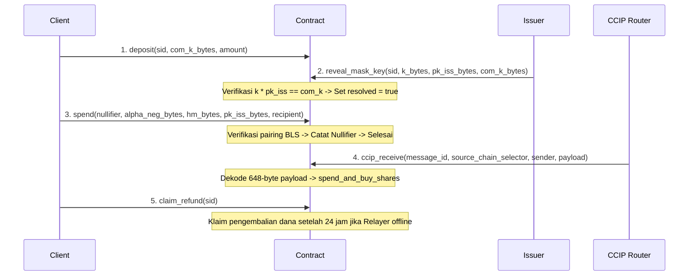

# Nimbus Smart Contract: Design & EVM Precompiles

Dokumen ini menjelaskan arsitektur smart contract **Nimbus Protocol** serta keputusan teknis cara verifikasi on-chain yang efisien menggunakan precompile EVM terbaru.

---

## 1. Terobosan Penting (Aha! Moment): EIP-2537

Sebelum tahun 2025, memverifikasi tanda tangan kurva **BLS12-381** di Ethereum/L2 sangat mahal karena harus mensimulasikan perhitungan pairing dalam Solidity secara manual (memakan jutaan gas fee).

Namun, sejak **Upgrade Pectra (Mei 2025)**, Ethereum secara resmi mengaktifkan **EIP-2537** yang menyediakan 7 precompiled contracts asli (native) untuk operasi kurva BLS12-381:

| Address Precompile | Nama Operasi | Fungsi dalam Nimbus |
| :--- | :--- | :--- |
| **`0x0e`** | `bls12_g2_msm` | Menyamakan komitmen kunci masking: $k \cdot pk_{iss} == com_k$ |
| **`0x0f`** | `bls12_pairing_check` | Memverifikasi tanda tangan BLS token RWA saat pembelanjaan (spend) |

Dengan menggunakan precompile asli ini, gas fee untuk memproses transaksi privasi/RWA kita menjadi sangat murah. Formula gas cost untuk pairing check (`0x0f`) adalah:
$$\text{Gas} = 32,600 \times \text{jumlah pasangan} + 37,700$$
Untuk transaksi Nimbus (membutuhkan 2 pasangan), hanya memakan **102,900 gas**!

---

## 2. Struktur Penyimpanan State (State Storage)

Smart contract Nimbus ditulis menggunakan Rust Stylus SDK dan menggunakan makro `sol_storage!` untuk mendefinisikan layout penyimpanan state on-chain yang kompatibel dengan EVM:

```rust
sol_storage! {
    #[entrypoint]
    pub struct Nimbus {
        // Pemetaan hash Kunci Publik Penerbit (Issuer) ke jaminan (collateral) yang didepositkan
        mapping(bytes32 => uint256) collateral;
        
        // Pemetaan Session ID ke alamat dompet klien, jumlah deposit, dan status resolusi
        mapping(bytes32 => address) session_client;
        mapping(bytes32 => uint256) session_amount;
        mapping(bytes32 => bool) session_resolved;
        
        // Pemetaan Nullifier untuk mencegah pembelanjaan ganda (double-spending)
        mapping(bytes32 => bool) nullifiers;

        // Pemetaan root Merkle set asosiasi bersih yang valid (Fase A: ZK-Compliance)
        mapping(bytes32 => bool) clean_association_roots;

        // Alamat owner untuk operasi administratif (Fase E: Security)
        address owner;
        
        // Status jeda darurat kontrak (Circuit Breaker)
        bool paused;

        // Pemetaan Session ID ke block timestamp untuk melacak timelock pengembalian dana
        mapping(bytes32 => uint256) session_timestamp;

        // Alamat token stablecoin ERC-20 (USDC)
        address stablecoin;
        // Alamat penerima biaya protokol (fee recipient)
        address fee_recipient;

        // Fase Fast-Path: 1 = CCIP Lambat, 2 = Treasury-funded, 3 = Public LP dengan Dynamic Cap
        uint256 fast_path_phase;
        // Total likuiditas dan likuiditas yang terpakai di pool LP (Fase 3)
        uint256 total_lp_liquidity;
        uint256 utilized_lp_liquidity;
    }
}
```

---

## 3. Alur Logika Method Utama (Smart Contract)



*Catatan Keamanan: Semua fungsi yang mengubah state (ditandai dengan `&mut self`) akan memeriksa apakah kontrak sedang dalam keadaan aktif (tidak di-pause) menggunakan `self.check_not_paused()?` sebelum melakukan eksekusi.*

#### A. Fitur Administrasi & Keamanan (Fase E: Security)
*   `init(stablecoin_addr: Address, fee_recipient_addr: Address)`: Menginisialisasi owner kontrak dengan alamat pengirim transaksi pertama, menyetel alamat token stablecoin dan fee recipient, serta menetapkan fase awal Fast-Path ke `1`.
*   `pause()`: Mengaktifkan status jeda darurat (`paused = true`). Hanya bisa dipanggil oleh owner.
*   `unpause()`: Menonaktifkan status jeda darurat (`paused = false`). Hanya bisa dipanggil oleh owner.
*   `set_fast_path_phase(phase: uint256)`: Menyetel fase Fast-Path (1, 2, atau 3). Hanya bisa dipanggil oleh owner.
*   `set_lp_liquidity(total: uint256, utilized: uint256)`: Menyetel parameter likuiditas pool LP untuk simulasi utilitas Fase 3. Hanya bisa dipanggil oleh owner.

### B. `deposit(sid: FixedBytes<32>, _com_k_bytes: Vec<u8>, amount: U256)`
*   Klien menyetorkan dana stablecoin ke kontrak dengan ID sesi tertentu (`sid`). Kontrak menarik stablecoin dari dompet klien menggunakan `transferFrom`.
*   Biaya minting/deposit sebesar **0.1%** dipotong secara on-chain dan langsung ditransfer ke `fee_recipient`.
*   Kontrak mencatat alamat pengirim ke `session_client`, jumlah deposit bersih (`amount - fee`) ke `session_amount`, dan menginisialisasi `session_resolved` ke `false`.
*   Kontrak juga mencatat waktu transaksi saat ini ke `session_timestamp` sebagai acuan waktu untuk sistem auto-refund timelock.

### C. `claim_refund(sid: FixedBytes<32>) -> Result<(), Vec<u8>>`
*   Menyediakan jaminan keselamatan dana pengguna jika Relayer offline atau menolak membuka kunci masking.
*   Dapat dipanggil oleh klien pembuat sesi deposit jika waktu saat ini (`block_timestamp`) sudah melewati **24 jam (86.400 detik)** sejak deposit dilakukan.
*   Setelah berhasil diverifikasi, kontrak menandai sesi sebagai selesai (`session_resolved = true`) dan mengembalikan dana bersih ke klien.

### D. `reveal_mask_key(sid: FixedBytes<32>, k_bytes: Vec<u8>, pk_iss_bytes: Vec<u8>, com_k_bytes: Vec<u8>) -> Result<bool, Vec<u8>>`
*   Penerbit (Issuer) menyerahkan kunci masking $k$ bersama kunci publik mereka $pk_{iss}$ dan komitmen $com_k$.
*   Kontrak memanggil precompile **`BLS12_G2_MSM` (address `0x0e`)** dengan payload 288-byte (kombinasi $pk_{iss}$ dan $k$) untuk menghitung $k \cdot pk_{iss}$.
*   Jika hasil perhitungan cocok dengan $com_k$, kontrak menandai sesi sebagai selesai (`session_resolved = true`) dan mencairkan escrow dana ke dompet Penerbit.

### E. `spend(nullifier: FixedBytes<32>, alpha_neg_bytes: Vec<u8>, hm_bytes: Vec<u8>, pk_iss_bytes: Vec<u8>, recipient: Address, amount: U256) -> Result<bool, Vec<u8>>`
*   Untuk mencairkan dana secara anonim, penerima mengirimkan tanda tangan BLS yang telah di-unblind.
*   Kontrak memverifikasi:
1.  Nullifier belum pernah terdaftar (`!nullifiers[nullifier]`).
2.  Keabsahan tanda tangan BLS menggunakan precompile **`BLS12_PAIRING_CHECK` (address `0x0f`)** dengan payload 768-byte.
*   Jika valid, kontrak mencatat nullifier untuk mencegah double-spend, menghitung biaya dasar penarikan **0.15%**, menghitung biaya premi Fast-Path (jika Fase 2 atau Fase 3 aktif), lalu mengirimkan sisa dana bersih ke `recipient` dan total biaya ke `fee_recipient`.

### F. `spend_and_buy_shares(...) -> Result<bool, Vec<u8>>`
*   Melakukan verifikasi tanda tangan BLS (`spend`), lalu secara atomik melakukan panggilan eksternal (`RawCall`) ke kontrak target Polymarket (Conditional Tokens Contract) untuk membeli shares opsi taruhan menggunakan stablecoin yang dicairkan.

### G. `slash_double_spender(x1_bytes: Vec<u8>, y1_bytes: Vec<u8>, x2_bytes: Vec<u8>, y2_bytes: Vec<u8>) -> Result<Vec<u8>, Vec<u8>>`
*   Menerima dua bukti transaksi offline ($x_1, y_1$) dan ($x_2, y_2$) yang menggunakan token yang sama.
*   Menggunakan interpolasi linier di atas kurva BLS12-381 scalar field (Fr) untuk mengungkap identitas rahasia pembeli $I$:
    $$I = y_1 - \left( \frac{y_2 - y_1}{x_2 - x_1} \right) \cdot x_1$$

### H. ZK-Compliance & Proof of Innocence (Fase A)
*   `register_clean_root(root: FixedBytes<32>)`: Mendaftarkan Merkle root dari set asosiasi bersih. Hanya bisa dipanggil oleh owner/oracle.
*   `verify_merkle_proof(leaf: FixedBytes<32>, proof_bytes: Vec<u8>, root: FixedBytes<32>)`: Memverifikasi keanggotaan Merkle.
*   `verify_groth16_proof(...)`: Memverifikasi ZK-proof Groth16 secara on-chain menggunakan precompile `BLS12_PAIRING_CHECK` (`0x0f`) dengan 4 pasang pairing (1536-byte payload).
*   `verify_compliance(...)`: Melakukan pemeriksaan kepatuhan penuh (verifikasi Merkle root terdaftar, keanggotaan proof, dan validitas ZK-proof).

### I. CCIP Receiver Lintas Rantai (Fase B)
*   `ccip_receive(message_id: FixedBytes<32>, source_chain_selector: u64, sender: Vec<u8>, payload: Vec<u8>) -> Result<(), Vec<u8>>`
    *   Menerima pesan 648-byte dari router Chainlink CCIP.
    *   Mendekode payload ke parameter spend dan parameter pembelian Polymarket, lalu mengeksekusi `spend_and_buy_shares` secara atomik di rantai tujuan.

---

## 4. Mekanisme Mitigasi Serangan Liquidity Exhaustion (Inovasi Jurnal 2026)

Berdasarkan hasil analisis jurnal ilmiah terbitan awal 2026, *"Exploiting Liquidity Exhaustion Attacks in Intent-Based Cross-Chain Bridges" (arXiv:2602.17805)*, protokol berbasis intent rentan terhadap serangan pengurasan likuiditas relayer (solvers) tanpa perlu meretas logika kontrak. Penyerang dapat mengirimkan rangkaian transaksi bernilai besar secara beruntun untuk membekukan likuiditas solver selama jendela settlement.

Untuk mengatasi celah ini, Nimbus mengimplementasikan dua pengaman dinamis pada **Fase 3 (Public LP dengan Dynamic Cap)**:
1. **Dynamic Pool Cap (Batas Maksimum Dinamis)**: Transaksi Fast-Path akan ditolak seketika jika likuiditas yang dibutuhkan melebihi sisa kapasitas pool LP (`new_utilized > total_lp_liquidity`). Hal ini mencegah penyerang membekukan seluruh likuiditas pool.
2. **Congestion-Based Dynamic Premium (Congestion Pricing)**: Biaya premi likuiditas ($P$) berskala secara dinamis dari **0.05%** (base rate 5 bps) hingga **0.15%** (max rate 15 bps) berdasarkan tingkat utilitas pool LP ($U$):
   $$P = P_{\text{base}} + U \times (P_{\text{max}} - P_{\text{base}})$$
   Dengan demikian, semakin menipis likuiditas di pool LP, semakin mahal biaya yang harus dibayar untuk melakukan transaksi Fast-Path. Ini secara ekonomis membuat serangan pengurasan likuiditas (Liquidity Exhaustion Attack) menjadi tidak menguntungkan (*unprofitable*) bagi penyerang yang rasional.

---

## 5. Integrasi DeFi & RWA Yield (Rasio Brankas Bertingkat 30/50/20)

Untuk meningkatkan efisiensi modal dan menghasilkan yield berkelanjutan bagi Treasury protokol, Nimbus menerapkan **Tiered Vault Model (30/50/20)**:
- **30% Cash (USDC)**: Disimpan langsung di dalam kontrak untuk menangani penarikan instan berukuran kecil/sedang.
- **50% Aave V3 Supply (aUSDC)**: Disuplai secara otomatis ke protokol pasar likuiditas Aave V3 untuk mendapatkan bunga APY dinamis (~3%-4%).
- **20% RWA T-Bills (Ondo USDY / BlackRock BUIDL)**: Disuplai secara otomatis ke instrumen beragun Surat Utang AS untuk APY stabil tingkat tinggi (~5%).

### A. Interface Protokol Eksternal
Kontrak berinteraksi dengan Aave V3 dan penerbit RWA melalui interface berikut:
```rust
sol_interface! {
    interface IAavePool {
        function supply(address asset, uint256 amount, address onBehalfOf, uint16 referralCode) external;
        function withdraw(address asset, uint256 amount, address to) external returns (uint256);
    }

    interface IRwaToken {
        function deposit(uint256 amount) external returns (uint256);
        function redeem(uint256 amount) external returns (uint256);
    }
}
```

### B. Cascading Liquidity Buffer (Peredam Likuiditas Bertingkat)
Berdasarkan makalah ilmiah *Mitigating Liquidity Shortfalls in Multi-Chain Bridges (Liu 2026)*, untuk mencegah kegagalan penarikan akibat menipisnya kas liquid, Nimbus menerapkan strategi **Cascading Liquidity Buffer** saat pemrosesan `spend()`, `claim_refund()`, atau penarikan yield:
1. **Tier 1 (Cash)**: Menggunakan saldo USDC kontrak. Jika saldo mencukupi, transaksi selesai seketika.
2. **Tier 2 (Aave - Instant Liquidity)**: Jika terjadi *shortfall* (kekurangan USDC), kontrak akan menarik sisa kekurangan tersebut dari Aave V3 secara otomatis.
3. **Tier 3 (RWA - Reserve Tier)**: Jika kas dan Aave masih belum mencukupi, kontrak akan melakukan penarikan dari RWA T-Bills (Ondo USDY/BlackRock BUIDL) sebagai lapis pertahanan terakhir.

### C. Alokasi Otomatis & Penarikan APY Yield
*   **Alokasi saat Deposit**: Setiap kali pengguna memanggil `deposit()`, dana bersih setelah dipotong biaya minting otomatis didistribusikan: 30% tetap sebagai kas liquid, 50% dikirim ke Aave (`supply`), dan 20% dikirim ke RWA (`deposit`).
*   **Klaim Yield Protokol**: APY yield yang terakumulasi di atas saldo pokok setoran pengguna (`total_deposited_principal`) dapat ditarik oleh administrator protokol menggunakan method `claim_accumulated_yield()`, yang kemudian secara otomatis ditransfer ke alamat `fee_recipient`.
