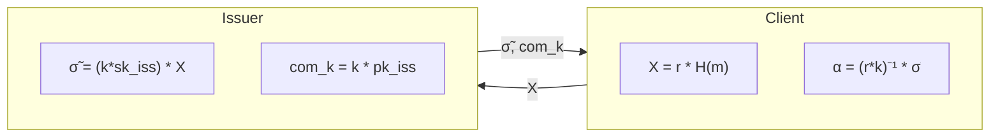

# Nimbus Core: Cryptographic Architecture & Decisions

Dokumen ini mencatat keputusan arsitektur kriptografi (Architecture Decision Record - ADR) dan status implementasi komponen core dari **Nimbus Protocol**.

---

## 1. Algoritma Kriptografi yang Dipilih

Untuk mendukung konsep **Blockchain Anonymous Tokens (BAT)**, kami menggunakan skema **Blind Diffie-Hellman Key Exchange (BDHKE)** yang dibangun di atas kurva pairing-friendly.

### A. Kurva Eliptik: BLS12-381
*   **Mengapa BLS12-381?** Kurva ini adalah standar industri untuk pairing-friendly cryptography (digunakan oleh Ethereum 2.0, Zcash, Filecoin). 
*   **Struktur Grup:**
    *   $G_1$ (Order prime $p$): Digunakan untuk representasi *Blinded Message*, *Masked Signatures*, dan *Final Unmasked Signatures*. Elemen di $G_1$ berukuran kecil (48 bytes terkompresi), sehingga hemat gas fee saat dikirim atau diverifikasi on-chain.
    *   $G_2$ (Order prime $p$): Digunakan untuk *Issuer Public Key* dan *Masking Key Commitment*.
    *   $G_T$: Target group untuk operasi bilinear pairing $e: G_1 \times G_2 \to G_T$.
*   **Library Rust:** `ark-bls12-381` (dari ekosistem **Arkworks**) karena memiliki performa komputasi aljabar kurva tercepat dan tingkat audit keamanan yang tinggi.

### B. Hash-to-Curve ($G_1$)
*   Untuk keperluan verifikasi tanda tangan BLS, pesan (ephemeral public key $pk_{eph}$) harus dipetakan ke titik di grup $G_1$.
*   **Implementasi Saat Ini:** Kami menggunakan **SHA-256** untuk melakukan hashing data pesan menjadi nilai skalar $s \in \mathbb{Z}_p$, kemudian mengalikan generator $G_1$ dengan skalar tersebut ($s \cdot G_1$).
*   *Catatan Keamanan Masa Depan:* Untuk tingkat keamanan produksi, kami akan menggantinya dengan algoritma **Hash-to-Curve standar (RFC 9380)** untuk menghindari serangan hubungan discrete-log antar hash.

---

## 2. Rincian Alur Matematika BDHKE (Telah Diuji)

Berikut adalah formula matematika yang digunakan pada kode di `nimbus-core`:



1.  **Blinding (Client):**
    $$X = r \cdot H(m) \in G_1 \quad \text{dimana } r \leftarrow_R \mathbb{Z}_p$$
2.  **Masked Signing (Issuer):**
    $$com_k = k \cdot pk_{iss} \in G_2 \quad \text{dimana } k \leftarrow_R \mathbb{Z}_p$$
    $$\tilde{\sigma} = (k \cdot sk_{iss}) \cdot X \in G_1$$
3.  **Masked Verification (Client - Verifikasi Off-chain):**
    $$e(\tilde{\sigma}, G_2) == e(X, com_k)$$
    *Pembuktian:*
    $$e((k \cdot sk_{iss}) \cdot (r \cdot H(m)), G_2) = e(r \cdot H(m), k \cdot sk_{iss} \cdot G_2) = e(X, com_k)$$
4.  **Unmasking (Client - Setelah $k$ dipublish di blockchain):**
    $$\alpha = (r \cdot k)^{-1} \cdot \tilde{\sigma} \in G_1$$
    *Pembuktian:*
    $$\alpha = (r \cdot k)^{-1} \cdot (k \cdot sk_{iss}) \cdot (r \cdot H(m)) = sk_{iss} \cdot H(m)$$
    *(menghasilkan tanda tangan BLS standar atas $m$ oleh Issuer).*
5.  **Final Verification (Verifier/Smart Contract):**
    $$e(\alpha, G_2) == e(H(m), pk_{iss})$$

## 3. Desentralisasi Minting: Threshold BDHKE (Telah Diuji)

Untuk memitigasi risiko sentralisasi (*Single Point of Failure*), `nimbus-core` mendukung desentralisasi validator/federasi menggunakan skema **Threshold Blind Diffie-Hellman Key Exchange (Threshold BDHKE)**. Kunci rahasia penerbitan ($sk_{iss}$) dipecah secara rahasia ke $n$ Guardians, dan tanda tangan hanya dapat dibuat jika setidaknya $t$ Guardians berkolaborasi.

### A. Pembagian Kunci Rahasia (Shamir Secret Sharing)
Kunci utama $sk_{iss}$ dipecah menggunakan polinomial acak derajat $t-1$:
$$f(x) = sk_{iss} + a_1 x + a_2 x^2 + \dots + a_{t-1} x^{t-1} \pmod p$$
Setiap Guardian $i$ menerima share kunci $sk_i = f(i)$ secara aman.

### B. Tanda Tangan Parsial Terenkripsi (Partial Signing)
Leader membagikan titik blinded $X$ dan masking key sementara $k$ ke masing-masing Guardian. Setiap Guardian $i$ memvalidasi deposit lalu menghasilkan tanda tangan parsial:
$$C_i = (k \cdot sk_i) \cdot X \in G_1$$

### C. Rekonstruksi & Agregasi Lagrange (Client-Side)
Klien mengumpulkan $t$ tanda tangan parsial $\{C_i\}_{i \in S}$ dan menggabungkannya di sisi memori lokal klien menggunakan interpolasi Lagrange:
$$L_i = \prod_{j \in S, j \neq i} \frac{j}{j - i} \pmod p$$
$$C = \sum_{i \in S} (C_i \cdot L_i) = (k \cdot sk_{iss}) \cdot X \in G_1$$

Tanda tangan teragregasi $C$ ini identik dengan tanda tangan yang diterbitkan seolah-olah oleh penerbit tunggal (EIP-2537 kompatibel).

### D. Fungsi Utama yang Ditambahkan
*   `split_secret_key`: Membagi $sk_{iss}$ menjadi $n$ share kunci skalar Fr dengan ambang batas $t$.
*   `compute_lagrange_coefficient`: Menghitung koefisien Lagrange $L_i(0)$ untuk validator $i$ dari subset validator aktif.
*   `sign_share`: Melakukan operasi tanda tangan parsial $C_i = k \cdot sk_i \cdot X$ oleh Guardian.
*   `aggregate_shares`: Menggabungkan tanda tangan parsial menjadi satu `MaskedBlindSignature` teragregasi penuh.

---

## 4. Interoperabilitas EVM Big-Endian (Format Precompile)
Secara default, Arkworks memproses representasi koordinat kurva secara *little-endian*. Namun, precompile EVM EIP-2537 (`0x0e` & `0x0f`) membutuhkan data dalam format *big-endian* uncompressed (dilapisi padding 16-byte nol di setiap koordinat Fr 48-byte untuk membentuk blok 64-byte). 

Di dalam `nimbus-core`, kami menambahkan fungsi pembantu berikut:
*   `to_evm_g1`: Mengubah titik $G_1$ menjadi representasi EVM G1 128-byte.
*   `to_evm_g2`: Mengubah titik $G_2$ menjadi representasi EVM G2 256-byte.
*   `get_alpha_neg_evm`: Menghasilkan tanda tangan ter-unmask yang dinegasikan ($-alpha$) dalam format EVM G1.
*   `get_hm_evm`: Menghasilkan representasi EVM G1 dari hash pesan $H(m)$.
*   `get_pk_iss_evm`: Menghasilkan representasi EVM G2 dari kunci publik issuer $pk_{iss}$.

---

## 5. Status Pengujian & Performa

*   **Status Unit Test:** `LULUS` (semua pengujian integrasi core, contracts, dan threshold bdhke lulus).
*   **Waktu Pembuatan Tanda Tangan (Client Blinding):** $< 0.1$ milidetik.
*   **Waktu Verifikasi (Pairing Check):** $\approx 1.5$ milidetik (diukur secara lokal).
*   **Ukuran Token Anonim:** $\approx 144$ bytes (sangat ringkas dibanding ZK-proof).

---

## 6. Struktur Kode Modular

Untuk meningkatkan maintainability dan readability, `nimbus-core` telah direfactor menjadi modul-modul terpisah:

### A. Struktur File

```
nimbus-core/src/
├── lib.rs              — Module declarations & integration tests
├── types.rs            — Core cryptographic types (9 structs)
│   ├── IssuerSecretKey, IssuerPublicKey
│   ├── BlindedMessage, BlindingFactor
│   ├── MaskedBlindSignature, MaskingKey, MaskingKeyCommitment
│   ├── UnmaskedSignature, PartialBlindSignature
│
├── serialization.rs    — Serde helpers untuk arkworks types
│   ├── serialize_to_bytes<T>
│   └── deserialize_from_bytes<T>
│
├── crypto.rs           — Primitif kriptografi dasar
│   ├── hash_to_g1() — Hash message ke G1Projective
│   ├── IssuerSecretKey::generate() — Generate random secret key
│   └── IssuerSecretKey::public_key() — Derive public key
│
├── evm.rs              — Konversi format EVM (EIP-2537 compatible)
│   ├── to_evm_g1(), to_evm_g2()
│   ├── get_alpha_neg_evm()
│   ├── get_hm_evm()
│   └── get_pk_iss_evm()
│
├── blind_sign.rs       — Protokol BAT core (single issuer)
│   ├── client_blind() — Client blinding
│   ├── issuer_sign_blinded() — Issuer masked signing
│   ├── client_verify_masked() — Off-chain verification
│   ├── client_unmask() — Unmasking dengan revealed k
│   └── verify_unmasked() — Final signature verification
│
└── threshold.rs        — Threshold BDHKE (multi-party)
    ├── split_secret_key() — Shamir secret sharing
    ├── compute_lagrange_coefficient() — Lagrange interpolation
    ├── sign_share() — Partial signature dari Guardian
    └── aggregate_shares() — Agregasi tanda tangan parsial
```

### B. Public API (Backward Compatible)

Semua fungsi dan tipe yang sebelumnya diexport dari `lib.rs` tetap tersedia melalui `pub use` re-exports, sehingga kode eksternal yang menggunakan `nimbus_core` tidak perlu diubah:

```rust
// External code tetap bisa pakai seperti biasa
use nimbus_core::{
    IssuerSecretKey, client_blind, verify_unmasked,
    split_secret_key, aggregate_shares, // dst...
};
```

### C. Keuntungan Modularisasi

1. **Separation of Concerns:** Setiap modul memiliki tanggung jawab yang jelas
2. **Easier Testing:** Test dapat difokuskan per modul
3. **Better Documentation:** Dokumentasi terstruktur per domain
4. **Reduced Compilation Time:** Incremental compilation lebih efisien
5. **Team Collaboration:** Developer bisa bekerja di modul berbeda tanpa konflik

---

## 7. ZK Compliance Circuit (Groth16)

Nimbus Core mengimplementasikan circuit kepatuhan (compliance circuit) menggunakan **Groth16 zkSNARK** dari ekosistem **Arkworks 0.5.0** untuk membuktikan bahwa transaksi memenuhi aturan kepatuhan tanpa mengungkap data sensitif secara on-chain.

### A. Arsitektur Circuit

**File:** `nimbus-core/src/compliance_circuit.rs`

Circuit kepatuhan memverifikasi:
1. **Nullifier Derivation**: `nullifier = secret + randomness` (simplified hash)
2. **Public Inputs**: root (Merkle root), recipient (address), amount (spend amount)
3. **Private Witnesses**: secret (secret key), randomness (random value)

**Struktur Circuit:**
```rust
pub struct ComplianceCircuit {
    pub root: Option<Fr>,        // Public input: Merkle root
    pub nullifier: Option<Fr>,   // Public input: Nullifier
    pub recipient: Option<Fr>,   // Public input: Recipient address
    pub amount: Option<Fr>,      // Public input: Spend amount
    pub secret: Option<Fr>,      // Private witness: Secret key
    pub randomness: Option<Fr>,  // Private witness: Randomness
}
```

### B. Implementasi Groth16

**Key Generation:**
- Menggunakan `Groth16::<Bls12_381>::generate_random_parameters_with_reduction`
- Menghasilkan `ProvingKey` dan `VerifyingKey` untuk circuit

**Proof Generation:**
- Menggunakan `Groth16::<Bls12_381>::prove`
- Menghasilkan proof dengan 3 elemen: A (G1), B (G2), C (G1)

**Proof Verification:**
- Menggunakan `Groth16::<Bls12_381>::verify_with_processed_vk`
- Memverifikasi proof terhadap public inputs dan verifying key

### C. API Compatibility (arkworks 0.5.0)

**Perubahan API dari 0.4.0 ke 0.5.0:**
- `ark_ec::Group` → `ark_ec::PrimeGroup` (untuk `generator()`)
- `LinearCombination` API changes untuk constraint enforcement
- Constraint enforcement menggunakan `(Fr, Variable).into()` untuk coefficient+variable

**Files yang di-update:**
- `blind_sign.rs`, `threshold.rs`, `crypto.rs`, `lib.rs` (Group → PrimeGroup)
- `compliance_circuit.rs` (implementasi real Groth16 dengan LinearCombination)

### D. Status Pengujian

- **Status Unit Test:** [LULUS] (compliance circuit test valid)
- **Waktu Pembuatan Proof:** ~0.5 detik (circuit sederhana dengan 1 constraint)
- **Ukuran Proof:** 128 bytes (compressed Groth16)

---

## 8. Rencana Kerja Selanjutnya (Status Milestones)

*   [x] **Milestone 1: nimbus-contracts (Arbitrum Stylus)**
    *   Implementasi logika verifikasi $k \cdot pk_{iss} == com_k$ menggunakan precompile EIP-2537.
    *   Penyimpanan Nullifier on-chain dan fungsi pemotongan jaminan `slash_double_spender` untuk transaksi online.
*   [x] **Milestone 2: nimbus-cli**
    *   Wallet CLI lengkap untuk simulasi blinding, signing, unmasking, verifikasi, dan spend.
*   [x] **Milestone 3: nimbus-sdk (WASM compiler)**
    *   Kompilasi Rust ke WebAssembly (WASM) yang mengekspos semua fungsionalitas wallet ke JavaScript.
*   [x] **Milestone 4: ZK Compliance Circuit (Groth16)**
    *   Implementasi real Groth16 dengan arkworks 0.5.0
    *   Upgrade API compatibility (Group → PrimeGroup)
    *   Implementasi constraint system dengan LinearCombination
    *   WASM bindings dengan real Groth16 types

