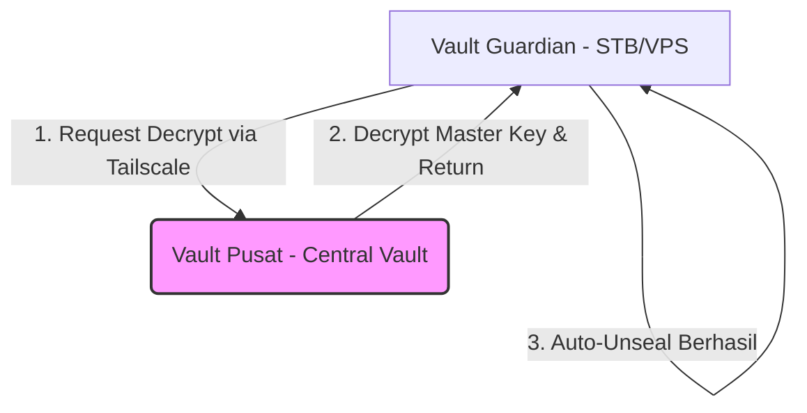
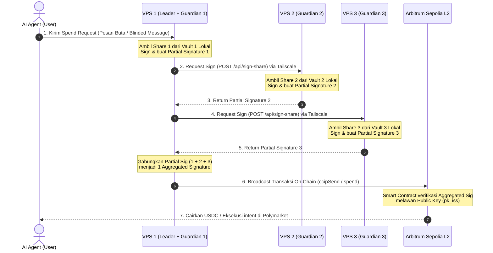

# Panduan Setup KMS (HashiCorp Vault / OpenBao) untuk Guardian Node

Dokumen ini menjelaskan konfigurasi, arsitektur, dan instruksi replikasi untuk sistem **Key Management System (KMS)** yang telah dipindahkan dari mode *development* (RAM-only) ke mode **produksi persistent** (disimpan di disk & otomatis menyala kembali setelah restart).

---

## 1. Penjelasan Konsep & File yang Dibuat

### Apa Arti Status dari AI Sebelah?
1. **Mode Normal / Bukan Dev**: Vault sekarang berjalan sebagai server produksi. Data dienkripsi menggunakan kunci kriptografis dan disimpan di dalam hard disk VPS, bukan di memori RAM. Jika VPS mati atau restart, **data share_key tetap aman dan tidak hilang**.
2. **Vault Sealed & Unsealed**: Secara default, demi keamanan, setiap kali Vault restart, ia masuk ke mode terkunci (**Sealed**). Ketika terkunci, data di dalamnya tidak bisa dibaca sama sekali karena kunci enkripsi utamanya dibelah menjadi beberapa bagian (*unseal keys*).
3. **Auto-Unseal via Systemd**: Untuk mencegah relayer mati saat server restart, AI sebelah membuat skrip otomatisasi (`vault-unseal.sh`) yang berjalan sesaat setelah server booting untuk memasukkan *unseal keys* ke Vault secara otomatis agar statusnya menjadi **Unsealed** (terbuka).

---

## 2. Dokumentasi File Konfigurasi

Berikut adalah file-file penting yang telah dipasang di VPS Anda. Anda dapat menyalin file-file ini saat memindahkan sistem ke perangkat hardware baru (**STB / Raspberry Pi**).

### A. Konfigurasi Server Vault (`/etc/vault.d/vault.hcl`)
File ini mengatur agar Vault menyimpan data ke disk lokal dan hanya mendengarkan koneksi di IP Tailscale:

```hcl
# Penyimpanan persistent di disk lokal
storage "file" {
  path = "/opt/vault/data"
}

# Bind listener hanya ke IP Tailscale agar aman dari internet publik
listener "tcp" {
  address     = "100.115.234.97:8200" # Ganti dengan IP Tailscale STB Anda nanti
  tls_disable = 1                      # Nonaktifkan TLS karena sudah dilindungi enkripsi Tailscale
}

# Izinkan UI web diakses via Tailscale (opsional)
ui = true
disable_mlock = true
```

### B. Script Auto-Unseal (`/usr/local/bin/vault-unseal.sh`)
Script bash ini otomatis dipanggil saat boot untuk membuka kunci Vault:

```bash
#!/bin/bash
export VAULT_ADDR="http://100.115.234.97:8200" # Ganti dengan IP Tailscale STB Anda nanti

# Tunggu sampai port Vault siap mendengarkan koneksi
until curl -s $VAULT_ADDR/v1/sys/health > /dev/null; do
    sleep 2
done

# Masukkan Unseal Keys Anda secara otomatis (biasanya butuh 3 kunci)
# Kunci ini diambil dari file init (/root/vault-init.json)
vault operator unseal <UNSEAL_KEY_1>
vault operator unseal <UNSEAL_KEY_2>
vault operator unseal <UNSEAL_KEY_3>
```

### C. Systemd Service Auto-Unseal (`/etc/systemd/system/vault-unseal.service`)
Service ini memastikan script auto-unseal berjalan otomatis setiap kali sistem operasi menyala:

```ini
[Unit]
Description=Auto Unseal Vault Service
After=vault.service tailscaled.service
Requires=vault.service

[Service]
Type=oneshot
ExecStart=/usr/local/bin/vault-unseal.sh
RemainAfterExit=true
User=root

[Install]
WantedBy=multi-user.target
```

---

## 3. Cara Setup Ulang di Hardware Baru (STB / Raspberry Pi)

Jika nanti Anda sudah memiliki hardware **STB / Raspberry Pi** khusus untuk Guardian, berikut adalah langkah-langkah setup-nya:

### Langkah 1: Install Tailscale & Hubungkan
1. Install Tailscale di STB:
   ```bash
   curl -fsSL https://tailscale.com/install.sh | sh
   sudo tailscale up
   ```
2. Catat IP Tailscale STB dengan menjalankan `tailscale ip -4`.

### Langkah 2: Install Vault / OpenBao
Tambahkan repository resmi dan jalankan instalasi:
```bash
wget -O- https://apt.releases.hashicorp.com/gpg | sudo gpg --dearmor -o /usr/share/keyrings/hashicorp-archive-keyring.gpg
echo "deb [signed-by=/usr/share/keyrings/hashicorp-archive-keyring.gpg] https://apt.releases.hashicorp.com $(lsb_release -cs) main" | sudo tee /etc/apt/sources.list.d/hashicorp.list
sudo apt update && sudo apt install -y vault
```

### Langkah 3: Konfigurasi vault.hcl
1. Edit file `/etc/vault.d/vault.hcl` menggunakan teks editor (`nano`).
2. Masukkan konfigurasi dari **Bagian 2.A** di atas, lalu ubah parameter `address` menjadi IP Tailscale STB Anda.
3. Jalankan dan aktifkan service Vault:
   ```bash
   sudo systemctl enable --now vault
   ```

### Langkah 4: Inisialisasi Vault & Simpan Kunci (CRITICAL)
1. Atur variabel local:
   ```bash
   export VAULT_ADDR="http://<IP_TAILSCALE_STB>:8200"
   ```
2. Jalankan inisialisasi awal:
   ```bash
   vault operator init -key-shares=5 -key-threshold=3 > /root/vault-init.txt
   ```
   *Penting: Perintah ini akan menghasilkan 5 Unseal Keys dan 1 Root Token. Simpan file `/root/vault-init.txt` di tempat yang sangat aman (misal dicetak atau di flashdisk offline).*

### Langkah 5: Pasang Auto-Unseal
1. Buat file script `/usr/local/bin/vault-unseal.sh` (lihat **Bagian 2.B**). Masukkan IP Tailscale STB Anda dan 3 buah Unseal Keys dari langkah sebelumnya.
2. Berikan izin eksekusi:
   ```bash
   sudo chmod +x /usr/local/bin/vault-unseal.sh
   ```
3. Buat file service `/etc/systemd/system/vault-unseal.service` (lihat **Bagian 2.C**).
4. Aktifkan service unseal otomatis:
   ```bash
   sudo systemctl daemon-reload
   sudo systemctl enable vault-unseal.service
   ```

### Langkah 6: Masukkan Share Key Kripto
Tulis share key asli Anda ke Vault:
```bash
vault login <ROOT_TOKEN_ANDA>
vault secrets enable -path=secret kv-v2
vault kv put secret/nimbus share_key="<SHARE_KEY_80_KARAKTER>"
```

---

## 4. Analisis Keamanan & Kelemahan (*Security Tradeoff*)

AI sebelah mencatat tradeoff berikut:
> *"auto-unseal sekarang menyimpan unseal key di host yang sama, root-only. Ini memang menghilangkan risiko restart, tapi secara security masih kalah dibanding auto-unseal berbasis cloud KMS/HSM."*

### Apa Maksudnya?
* **Kelebihan**: Jika STB Anda mati lampu atau restart, sistem akan langsung aktif kembali secara otomatis tanpa memerlukan campur tangan manusia untuk mengetikkan password kunci (unseal keys).
* **Kelemahan Keamanan**: Karena unseal keys disimpan di dalam script `/usr/local/bin/vault-unseal.sh` pada mesin yang sama, jika ada peretas yang berhasil masuk ke sistem STB Anda sebagai **root (administrator)**, mereka dapat membaca script tersebut, mencuri unseal keys, dan membuka dekripsi data Vault secara paksa.
* **Solusi Ideal di Masa Depan (Mainnet Premium)**: Menggunakan fitur **Transit Auto-Unseal** di mana unseal keys disimpan di cloud HSM / KMS pihak ketiga (seperti Google Cloud KMS atau AWS KMS), atau menggunakan **Transit Auto-Unseal lokal** antar-VPS Tailscale. Dengan cara ini, unseal keys tidak pernah disimpan di disk lokal STB.

---

## 5. Implementasi Transit Auto-Unseal (Opsi Tanpa Ketergantungan Cloud)

Jika Anda tidak ingin menggunakan cloud KMS pihak ketiga (AWS/GCP/Azure) dan ingin semua sistem tetap berada di dalam jaringan private Tailscale, solusi terbaik adalah menggunakan **Transit Auto-Unseal** dengan setup **1 Vault Pusat (Central Vault)** yang bertindak sebagai KMS internal untuk membuka kunci Vault Guardian lainnya.



### Keunggulan Transit Auto-Unseal:
* **Tidak Ada Unseal Key di Disk Lokal:** VPS Guardian tidak lagi menyimpan plaintext unseal keys.
* **Revokasi Instan:** Jika salah satu VPS Guardian diserang/diretas, Anda cukup me-revoke token akses di **Vault Pusat**. Secara instan, Vault Guardian yang terkompromi akan terkunci kembali (*Sealed*) dan tidak bisa dibuka lagi.

---

### Langkah Konfigurasi Transit Auto-Unseal:

#### Langkah A: Konfigurasi di Vault Pusat (Central Vault)
Jalankan perintah ini di Vault Pusat Anda untuk membuat transit key dan policy akses:

1. Aktifkan *Transit Secrets Engine*:
   ```bash
   vault secrets enable transit
   ```
2. Buat kunci enkripsi khusus untuk pembuka kunci nimbus:
   ```bash
   vault write -f transit/keys/nimbus-unseal-key
   ```
3. Buat file policy akses `/root/nimbus-unseal-policy.hcl` berisi:
   ```hcl
   path "transit/encrypt/nimbus-unseal-key" {
     capabilities = ["update"]
   }
   path "transit/decrypt/nimbus-unseal-key" {
     capabilities = ["update"]
   }
   ```
4. Daftarkan policy tersebut ke Vault Pusat:
   ```bash
   vault policy write nimbus-unseal-policy /root/nimbus-unseal-policy.hcl
   ```
5. Generate token akses dengan masa aktif panjang (atau periodik) untuk VPS Guardian Anda:
   ```bash
   vault token create -policy=nimbus-unseal-policy -period=720h -orphan
   ```
   *Catat Token client yang dihasilkan (contoh: `hvs.g7d...`).*

#### Langkah B: Konfigurasi di Vault Guardian (STB / Client)
Ubah konfigurasi di VPS Guardian agar meminta unseal ke Vault Pusat:

1. Edit file `/etc/vault.d/vault.hcl` milik Guardian, tambahkan blok `seal "transit"` berikut:
   ```hcl
   seal "transit" {
     address            = "http://<IP_TAILSCALE_VAULT_PUSAT>:8200"
     disable_sentinel   = "true"
     key_name           = "nimbus-unseal-key"
     mount_path         = "transit/"
     token              = "<TOKEN_CLIENT_DARI_LANGKAH_A5>"
   }
   ```
2. Restart service Vault pada Guardian:
   ```bash
   sudo systemctl restart vault
   ```
    *Sekarang, setiap kali Guardian reboot, ia akan otomatis mengirimkan request enkripsi/dekripsi secara aman ke Vault Pusat via Tailscale untuk melakukan unseal secara otomatis tanpa menyimpan kunci unseal di disk lokalnya!*

---

## 6. Arsitektur Distribusi 3 VPS: 1 Leader + 2 Guardian

Untuk kebutuhan operasional yang efisien, hemat biaya, namun tetap aman, kita bisa mendistribusikan Nimbus Protocol menggunakan **3 VPS** yang saling terhubung di dalam satu jaringan private **Tailscale VPN**:

### 6.1 Detail Peran Setiap VPS

| Nama Server | Alamat IP (Tailscale) | Komponen yang Dijalankan | Data Rahasia yang Disimpan |
| :--- | :--- | :--- | :--- |
| **VPS 1 (Leader / Relayer)** | `100.64.76.84` | - Relayer Node (`nimbus-node` API)<br/>- Database SQLite (`nimbus-relayer.db`) | - **Share 1** (di Vault 1)<br/>- Wallet Private Key (EIP-7702 Gas Signer) |
| **VPS 2 (Guardian 2)** | `100.115.234.97` | - Vault KMS 2<br/>- Signer Daemon (API signing) | - **Share 2** (di Vault 2) |
| **VPS 3 (Guardian 3)** | `100.115.234.98` | - Vault KMS 3<br/>- Signer Daemon (API signing) | - **Share 3** (di Vault 3) |

---

### 6.2 Diagram Alur Tanda Tangan Lintas VPS (Threshold t=3, n=3)

Berikut adalah visualisasi bagaimana transaksi ditandatangani secara kolaboratif menggunakan 3 pecahan kunci dari ketiga VPS:



---

### 6.3 Mengapa Konfigurasi Ini Sangat Aman?

1. **Prinsip Kunci Terdistribusi:**
   Masing-masing VPS hanya memiliki akses ke satu pecahan kunci miliknya. `Share 1` hanya ada di VPS 1, `Share 2` hanya di VPS 2, dan `Share 3` hanya di VPS 3. Kunci utama master tidak pernah disatukan di disk atau memori RAM mana pun.
2. **Perlindungan Terhadap Peretasan Tunggal:**
   Jika peretas berhasil menjebol VPS 1 (Leader) dan menguasai database serta Vault 1, mereka **hanya mendapatkan Share 1**. Tanpa Share 2 (di VPS 2) dan Share 3 (di VPS 3), peretas **tidak dapat memalsukan tanda tangan transaksi** dan uang di smart contract L2 tetap 100% aman.
3. **Pemberhentian Darurat (Emergency Revocation):**
   Jika mendeteksi aktivitas mencurigakan di salah satu Guardian VPS, Anda dapat langsung mengunci (*seal*) Vault di VPS tersebut secara instan. Ini akan membekukan proses penandatanganan sampai situasi aman.

### 6.4 Catatan Skala Produksi: n=5 vs n=3
* **Setup n=5, t=3 (Standar Industri):** Jika Anda memiliki 5 VPS Guardian dan threshold 3, transaksi tetap dapat diproses selama ada **3 server** yang menyala. Jadi, meskipun 2 server mati/reboot bersamaan, sistem Nimbus Anda tetap berjalan lancar tanpa downtime.

---

## 7. Model Keamanan KMS: Gudang Kunci vs Mesin Tanda Tangan (Nir-Eksport)

Dalam implementasi produksi tingkat tinggi, ada perbedaan kritis dalam cara kita memperlakukan **KMS (Vault)** demi melindungi pecahan kunci `share_key` dari pencurian:

### 7.1 Perbandingan Dua Model Keamanan

| Parameter | Model A: Gudang Kunci (Setup Saat Ini) | Model B: Mesin Tanda Tangan (In-KMS Signing) |
| :--- | :--- | :--- |
| **Konsep** | Vault hanya bertindak sebagai tempat penyimpanan aman. Relayer meminta/menarik `share_key` mentah ke RAM-nya saat booting. | Vault bertindak sebagai penyedia kriptografi. Kunci pecahan di-generate di dalam Vault dan **tidak bisa diekspor**. |
| **Aliran Kunci** | Kunci mengalir dari Vault -> Relayer. | Kunci **tetap diam** di dalam Vault. Pesan dikirim ke Vault, ditandatangani di dalam, lalu dikembalikan. |
| **Risiko Kebocoran** | **Ada.** Jika token Relayer dengan akses `READ` dicuri, peretas dapat mengunduh `share_key` dalam bentuk plaintext. | **Nol.** Token Relayer hanya memiliki akses `SIGN` (menandatangani), tidak memiliki akses untuk membaca kunci. |
| **Kompleksitas** | Ringan dan mudah diimplementasikan. | Membutuhkan setup plugin kriptografi pada Vault. |

---

### 7.2 Cara Migrasi ke Model B (Mesin Tanda Tangan) di Mainnet

Untuk memastikan kunci pecahan di 4 Guardian **tidak akan pernah bisa dicuri** meskipun Relayer diretas, kita menggunakan *Transit Secrets Engine* milik Vault untuk melakukan penandatanganan di dalam brankas secara langsung:

```mermaid
graph LR
    A[Relayer Node] -->|1. Kirim Blinded Message| B(Vault KMS - Memori Terisolasi)
    B -->|2. Tanda Tangani secara Internal| B
    B -->|3. Kembalikan Partial Signature| A
    Note over B: Share Key asli TIDAK PERNAH keluar ke disk/RAM Relayer
```

#### Langkah Konfigurasi:

1. **Membuat Kunci Non-Exportable di Vault Guardian:**
   Saat setup awal, kita membuat kunci transit khusus yang disetel agar **tidak bisa diekspor** keluar dari Vault:
   ```bash
   vault write -f transit/keys/nimbus-guardian-key exportable=false
   ```
2. **Ubah Kebijakan Akses Token Relayer:**
   Kebijakan (*policy*) token Relayer diubah dari izin `read` (membaca) menjadi hanya izin `sign` (menandatangani):
   ```hcl
   # File: nimbus-sign-policy.hcl
   path "transit/sign/nimbus-guardian-key" {
     capabilities = ["update"]
   }
   ```
3. **Proses Penandatanganan dari Sisi Relayer:**
   Relayer tidak lagi memanggil `http::get` untuk membaca kunci, melainkan memanggil endpoint `/sign` dengan mengirimkan data transaksi yang ingin ditandatangani:
   ```bash
   curl -H "X-Vault-Token: <TOKEN>" \
        -d '{"input": "<BASE64_BLINDED_MESSAGE>"}' \
        http://127.0.0.1:8200/v1/transit/sign/nimbus-guardian-key
   ```
   Vault akan mengembalikan tanda tangan pecahan yang siap digabungkan oleh Leader. Kunci rahasia asli tetap 100% aman dan tidak tersentuh di dalam Vault.

