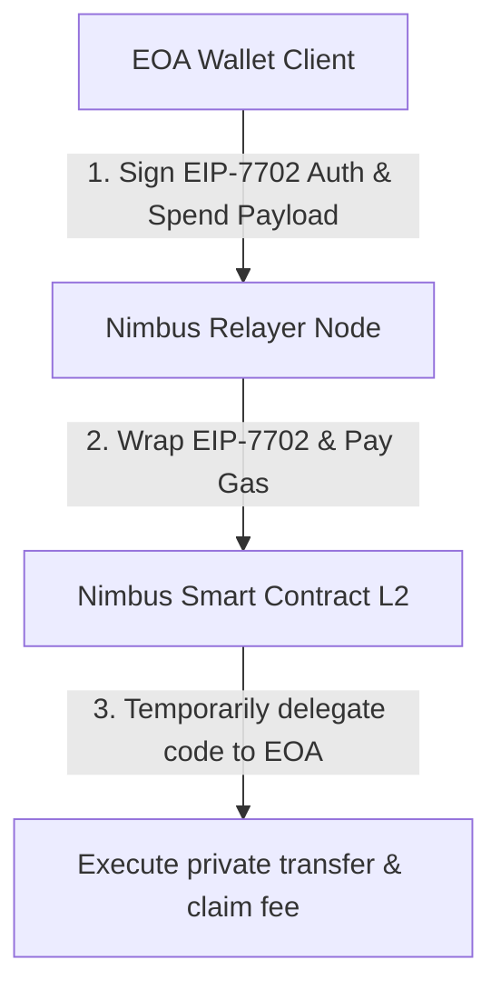
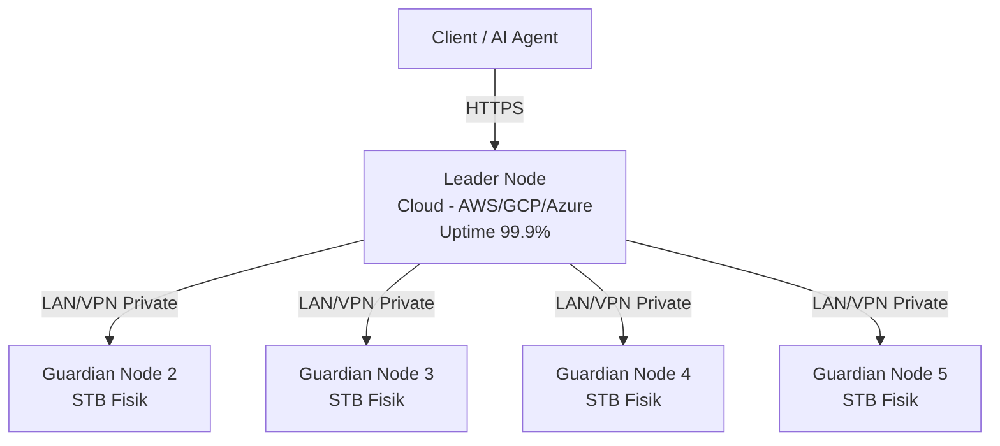
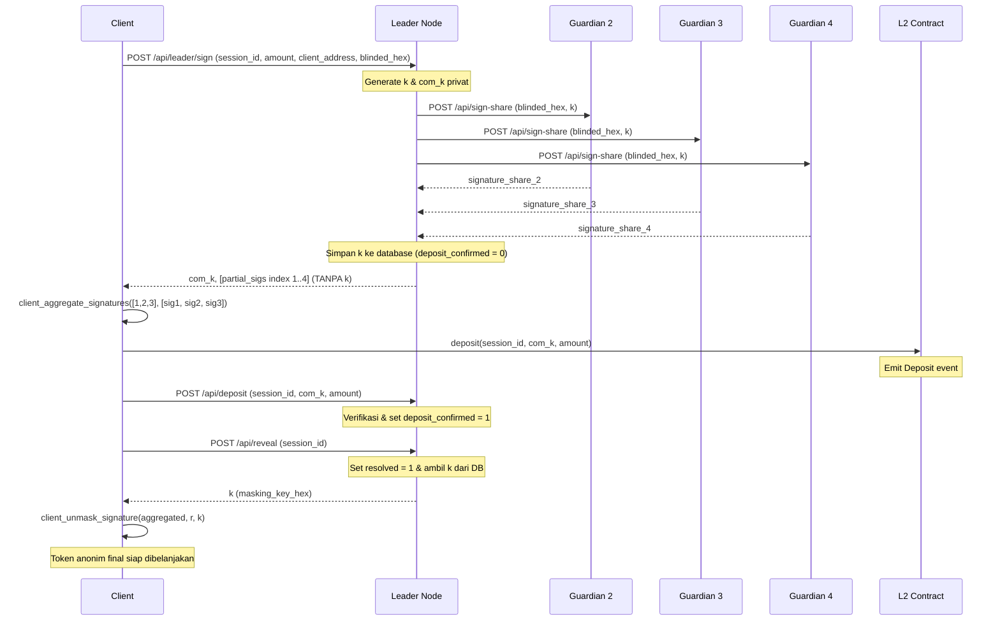
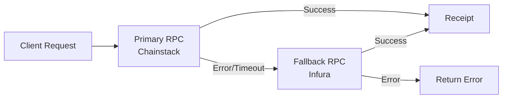

# Nimbus Node: Relayer API & Gasless Transaction Architecture

Dokumen ini mendokumentasikan desain teknis, endpoints, dan optimalisasi **Nimbus Node (Relayer API)** yang bertanggung jawab menjembatani wallet klien dengan smart contract L2 untuk transaksi privat secara instan dan tanpa gas fee (*gasless*).

---

## 0. Informasi Deployment Testnet L2

Berikut adalah informasi deployment resmi kontrak Nimbus di testnet Arbitrum Sepolia untuk referensi integrasi relayer node:
*   **Alamat Kontrak Nimbus (L2)**: `0x208f0e4390f59e3052c557bf23a47b2ab4697a10`
*   **Jaringan**: Arbitrum Sepolia Testnet
*   **Arbitrum RPC Endpoint**: `https://sepolia-rollup.arbitrum.io/rpc`
*   **Explorer**: [Sepolia Arbiscan](https://sepolia.arbiscan.io/address/0x208f0e4390f59e3052c557bf23a47b2ab4697a10)

---

## 1. Peran Utama Relayer (Nimbus Node)

Nimbus Node berjalan sebagai server web API mandiri (ditulis menggunakan **Rust Axum**) yang bertindak sebagai **Paymaster/Relayer** untuk menyelesaikan dua kendala utama UX Web3:
1.  **Cold Start Barrier (Bebas Gas Fee):** Pengguna tidak memerlukan saldo ETH
    di dompet mereka untuk mentransfer token privat. Relayer menalangi gas fee
    ETH on-chain. Mekanisme reimbursement stablecoin masih memerlukan desain
    accounting dan authorization sebelum diaktifkan.
2.  **EIP-7702 Delegation:** Mengaktifkan fitur smart wallet (seperti tanda tangan gasless dan batching) langsung pada alamat dompet EOA biasa (seperti Metamask tradisional) tanpa biaya deployment kontrak yang mahal.

---

## 2. Inovasi & Optimalisasi Arsitektur (Riset Jurnal 2026)

### A. Alur Delegasi EIP-7702 (Pectra Upgrade)
Di tahun 2026, Upgrade Pectra Ethereum mengaktifkan **EIP-7702** yang memperkenalkan tipe transaksi `0x04`. 



*   Klien menandatangani berkas otorisasi EIP-7702 off-chain yang mendelegasikan hak eksekusi ke smart contract Nimbus.
*   Klien mengirim otorisasi tersebut bersama data transfer privat ke `nimbus-node`.
*   `nimbus-node` mengirimkan transaksi ke blockchain L2, membayar gas fee ETH, dan memotong stablecoin (USDC) dari transaksi untuk biaya relayer.

### B. Antrean Settlement Persisten

Relayer tidak langsung menyatakan pembayaran berhasil ketika request diterima.
Setiap request `spend` disimpan ke tabel SQLite `spend_queue` sebelum API
mengembalikan status `QUEUED`.

*   Worker berjalan setiap **2 detik** dan mengambil item menggunakan
    transactional claim serta lease.
*   Status queue mengikuti lifecycle `queued`, `retryable`, `broadcasting`,
    `submitted`, `confirmed`, atau `failed`.
*   Retry count, error terakhir, tx hash, block number, dan timestamp disimpan.
*   Item terminal dipertahankan untuk audit dan tidak dihapus setelah satu loop.
*   Same-chain spend digabungkan secara adaptif melalui `batchSpend()` dengan
    ukuran 2 sampai 8 item. Satu item dan cross-chain spend memakai jalur single.
*   Batch bersifat opt-in melalui `NIMBUS_BATCH_ENABLED=true` dan hanya boleh
    diaktifkan setelah kontrak yang memiliki `batchSpend()` selesai dideploy.
*   Batch window normal ditargetkan maksimal 1 detik dengan hard timeout worker
    2 detik. Pengguna harus diberi tahu bahwa batching dapat menambah latency
    sekitar 1 sampai 2 detik sebelum broadcast.
*   Penghematan gas belum boleh dinyatakan sebagai persentase tetap sampai
    benchmark testnet membandingkan single spend dan batch receipt.

### C. Batas Privasi Metadata

Persistent queue melindungi reliabilitas settlement, bukan anonimitas metadata.
Worker saat ini mengambil item berdasarkan urutan `created_at` dan `id`.
Timing correlation, traffic analysis, dan strategi batching/shuffling masih perlu
threat model serta benchmark tersendiri sebelum diklaim sebagai kontrol privasi.

### D. Fixed Execution Quote dan Margin Batch

Biaya transaksi L2 terdiri dari execution cost dan komponen data/L1. Model
fixed quote masih memerlukan settlement accounting sebelum aktif:
1.  **Quote Sebelum Tanda Tangan**: User menyetujui execution fee maksimum dan
    expiry. Quote harus cukup untuk menutup jalur single.
2.  **Margin Efisiensi**: Jika transaksi berhasil digabungkan, selisih antara
    execution quote dan biaya batch aktual menjadi margin relayer/protokol.
3.  **Transparansi**: Biaya disebut `execution fee`, bukan `actual gas`, karena
    nilainya tidak wajib sama dengan receipt cost setiap user.
4.  **Status Implementasi**: Runtime settlement saat ini meneruskan `amount`
    yang telah ditandatangani ke contract tanpa pemotongan kedua oleh relayer.
    Billing execution fee belum production sampai `max_execution_fee`, expiry,
    rounding, authorization, dan reconciliation diimplementasikan.

### E. Resilience, Secrets & Request Deduplication
Mengikuti rekomendasi audit keamanan infrastruktur relayer node 2026:
*   **Key Rotation (Vault & In-Memory Re-masking)**: Key shares ditarik dari OpenBao KMS saat startup dan dapat dirotasi secara periodik tanpa restart. Kunci dipecah secara linear di memori (`part1 + part2`) dan di-remask (diacak kembali splitnya) secara periodik untuk pertahanan mendalam (*defense-in-depth*).
*   **Circuit Breakers**: Membatasi kegagalan kaskade dengan membungkus panggilan eksternal (Guardian RPC, Vault KMS, Blockchain RPC) dalam Circuit Breaker 3-state (Closed, Open, Half-Open).
*   **Request Idempotency**: Mencegah pemrosesan ganda transaksi akibat retry dari client menggunakan tabel cache idempotency berbasis SQLite dengan key berumur 24 jam.

---

## 3. Konfigurasi Node (Environment Variables)

Every instance of `nimbus-node` reads configurations from environment variables at startup:

| Variable | Default | Description |
| :--- | :--- | :--- |
| `NIMBUS_SHARE_INDEX` | `1` | Index share node ini dalam skema Shamir (1 hingga n). Digunakan sebagai fallback jika key share yang diload berupa scalar raw 32-byte. |
| `NIMBUS_SHARE_KEY` | `Fr(12345)` | **(Fallback / Dev Mode Only)** Hex-encoded scalar BLS12-381 Fr (32-byte) atau tuple `(usize, Fr)` (40-byte). Jika data 40-byte terdeteksi, node secara otomatis mengekstrak share index dari kunci tersebut dan mengesampingkan `NIMBUS_SHARE_INDEX`. |
| `NIMBUS_VAULT_TOKEN` | `None` | Token otentikasi OpenBao / HashiCorp Vault. Mengaktifkan penarikan kunci otomatis via KMS. |
| `NIMBUS_VAULT_ADDR` | `http://127.0.0.1:8200` | URL/Port server OpenBao / HashiCorp Vault. |
| `NIMBUS_VAULT_PATH` | `v1/secret/data/nimbus` | Endpoint API path untuk mengambil rahasia (KV v2 engine). |
| `NIMBUS_KEY_ROTATION` | `false` | Mengaktifkan mekanisme rotasi kunci otomatis. |
| `NIMBUS_KEY_ROTATION_INTERVAL` | `3600` | Durasi interval rotasi/re-masking kunci dalam satuan detik (default: 1 jam). |
| `NIMBUS_DB_PATH` | `./nimbus-relayer.db` | Path penyimpanan file SQLite persistent. |
| `NIMBUS_DB_KEY` | `None` | Kunci enkripsi untuk database SQLite/SQLCipher (Wajib diisi di produksi). |
| `NIMBUS_X402_RECIPIENT` | `None` | Address EVM penerima settlement x402. Endpoint x402 menolak request jika tidak dikonfigurasi. |
| `NIMBUS_BATCH_ENABLED` | `false` | Aktifkan adaptive same-chain batching setelah kontrak `batchSpend()` dideploy dan diuji. |

### Integrasi OpenBao / Vault (Production Mode)

Untuk deployment di tingkat produksi (production-ready), kunci rahasia pembagian BLS tidak boleh disimpan dalam plaintext di environment variable `NIMBUS_SHARE_KEY`. Jalankan OpenBao/Vault server lokal di masing-masing STB/Guardian secara independen:

1. Simpan secret di OpenBao / Vault:
   ```bash
   vault kv put secret/nimbus share_key="<share_hex>"
   ```
2. Jalankan relayer dengan mengaitkan token dan alamat Vault:
   ```bash
   NIMBUS_SHARE_INDEX=1 \
   NIMBUS_VAULT_ADDR="http://127.0.0.1:8200" \
   NIMBUS_VAULT_TOKEN="hvs.xxxxxxxxxxxxxxxxxxxx" \
   NIMBUS_VAULT_PATH="v1/secret/data/nimbus" \
   cargo run
   ```

Metode ini memastikan kunci didekripsi langsung di memori RAM dan tidak pernah bocor ke disk server atau environment variable Linux.

### Panduan Pengamanan OpenBao untuk Produksi (Rekomendasi Ahli)

Ketika melakukan deployment kluster OpenBao di perangkat fisik STB Anda, terapkan 4 prinsip keamanan berikut untuk menjamin integritas protokol Nimbus:

1. **Bangun Kluster Ganjil (3 atau 5 Node Raft)**
   * OpenBao menggunakan algoritma konsensus Raft untuk replikasi data rahasia. 
   * Pastikan Anda mengaktifkan kluster HA dengan jumlah node ganjil (minimal 3 atau 5) guna menghindari skenario split-brain dan mempertahankan quorum apabila salah satu STB mengalami kegagalan hardware atau pemutusan koneksi internet.

2. **Kebijakan Isolasi Ketat (Isolation Policy - Wajib!)**
   * Terapkan kebijakan hak akses minimal (*least privilege*). Setiap node Guardian (STB) hanya diberi akses ACL untuk membaca shard kuncinya sendiri.
   * Buat policy terpisah di mana STB 1 hanya bisa mengakses `secret/data/nimbus/share-1`, STB 2 hanya mengakses `secret/data/nimbus/share-2`, dst. 
   * Dengan kebijakan isolasi ini, apabila satu STB berhasil ditembus oleh penyerang, mereka tidak memiliki izin akses API untuk mengunduh kunci share milik STB/Guardian lainnya.

3. **Otentikasi Menggunakan AppRole (Bukan Token Statis)**
   * Hindari penggunaan token root statis (`NIMBUS_VAULT_TOKEN`) yang berumur panjang di file environment produksi.
   * Konfigurasikan metode autentikasi **AppRole** di OpenBao. Setiap relayer STB akan menggunakan pasangan `RoleID` dan `SecretID` unik untuk menukar token akses dinamis berumur pendek (*short-lived token*) saat startup, yang otomatis di-refresh secara berkala.

4. **Solusi Otomatisasi Unseal (The Unseal Problem)**
   * Secara default, setiap kali OpenBao server melakukan booting ulang (karena pemadaman listrik STB atau restart sistem), server akan masuk ke mode tersegel (*sealed*) dan semua kunci enkripsi dikunci.
   * Untuk menghindari keharusan operator memasukkan kunci unseal secara manual pada setiap perangkat, implementasikan fitur **Auto-Unseal** (misal dengan menggunakan mode transit auto-unseal via server penunjang yang aman, AWS/GCP KMS gratisan, atau local hardware security keys).

---

## 4. Topologi Deployment (Cloud + Fisik Hybrid)

Arsitektur yang direkomendasikan untuk ketahanan sistem adalah **hybrid**: Leader Node di cloud dengan uptime 99.9%, dan Guardian Node di hardware fisik murah (STB bekas) yang terhubung via tunnel private (WireGuard/Tailscale).



- **Leader Node** (cloud): Menerima request dari client, men-generate masking key `k`, mengumpulkan partial signature dari semua Guardian, lalu mengagregasi menjadi `com_k` final.
- **Guardian Nodes** (fisik, tidak terekspos internet): Hanya menerima request dari Leader via jaringan private. Setiap Guardian menyimpan satu share kunci. Tidak bisa diakses langsung dari luar.

---

## 5. Struktur Modul

Nimbus Node telah direfaktor menjadi struktur modular yang terorganisir dengan baik:

```
nimbus-node/src/
├── main.rs              # Entry point minimal
├── dto.rs               # Request/Response DTOs
├── state.rs             # AppState + database and circuit breaker state
├── database.rs          # SQLCipher persistent SQLite database
├── circuit_breaker.rs   # Resilience Circuit Breaker pattern
├── key_rotation.rs      # Key rotation and in-memory split management
├── http.rs              # HTTP client utilities
├── kms.rs               # OpenBao/Vault KMS integration
└── handlers/
    ├── mod.rs           # Handler exports
    ├── health.rs        # Health check endpoint
    ├── deposit.rs       # Deposit & reveal handlers
    ├── spend.rs         # Spend + batch processing logic
    ├── x402.rs          # x402 facilitator endpoint
    └── threshold.rs     # Threshold signing handlers
```

### Keunggulan Struktur Modular:
- **Separation of Concerns**: DTOs, state, HTTP, KMS, dan handlers terpisah
- **Maintainability**: Mudah menambah endpoint baru tanpa mengubah file lain
- **Security**: KMS integration terisolasi di modul terpisah
- **Testability**: Setiap modul dapat ditest secara independen
- **Documentation**: 18 comment lines + 2 doc comments tersebar di semua modul

### Organisasi Handlers:
- **health.rs**: Health check untuk monitoring (termasuk status database dan RPC)
- **deposit.rs**: Deposit escrow dan reveal masking key (mendukung idempotensi)
- **spend.rs**: Spend handler + batch processing dengan gas economics (mendukung slippage, deadline, dan idempotensi)
- **x402.rs**: x402 protocol facilitator untuk AI agents
- **threshold.rs**: Distributed threshold signing (Leader + Guardian) dengan circuit breaker

---

## 6. Spesifikasi HTTP API Endpoints

### A. Health Check
Mengecek status kesehatan node relayer, jumlah antrean transaksi, nullifier yang terproses, serta saldo wallet relayer dan akumulasi keuntungan.
*   **Method:** `GET`
*   **Path:** `/health`
*   **Response (JSON):**
    ```json
    {
      "status": "OK", // Bisa berupa "OK", "DEGRADED_RPC_DOWN", atau "ERROR_DATABASE_DOWN"
      "queued_transactions": 0,
      "processed_nullifiers": 15,
      "relayer_wallet_balance_eth": 10.0,
      "relayer_accumulated_profit_usdc": 0.0
    }
    ```

### B. Registrasi Deposit Escrow
Dihubungi oleh klien untuk mendaftarkan sesi deposit minting baru.
*   **Method:** `POST`
*   **Path:** `/api/deposit`
*   **Payload (JSON):**
    ```json
    {
      "session_id": "sid_1283918239...",
      "com_k": "commitment_key_hex_in_g2...",
      "amount": 100000000,
      "idempotency_key": "optional-uuid-string-for-deduplication"
    }
    ```
*   **Response (JSON):**
    ```json
    {
      "status": "SUCCESS",
      "message": "Escrow registered for session sid_1283918239..."
    }
    ```

### C. Pengungkapan Kunci Masking (Atomic Release)
Dihubungi oleh klien untuk meminta kunci masking $k$ setelah deposit stablecoin dikonfirmasi on-chain.
*   **Method:** `POST`
*   **Path:** `/api/reveal`
*   **Payload (JSON):**
    ```json
    {
      "session_id": "sid_1283918239..."
    }
    ```
*   **Response (JSON):**
    ```json
    {
      "status": "SUCCESS",
      "valid": true,
      "message": "Masking key verified and released. Escrow resolved.",
      "masking_key_hex": "k_key_hex_scalar..."
    }
    ```

### D. Pengiriman Pembayaran Gasless & Lintas Rantai
Dihubungi oleh klien untuk mengirimkan token privat secara anonim, baik secara lokal di rantai asal maupun lintas rantai (Fase B) tanpa menggunakan gas fee ETH.
*   **Method:** `POST`
*   **Path:** `/api/spend`
*   **Payload (JSON):**
    ```json
    {
      "nullifier": "nullifier_hash_hex...",
      "sig_hex": "unmasked_signature_alpha_hex...",
      "recipient": "0xrecipient_address...",
      "eip7702_auth": {
        "eoa_address": "0xclient_eoa_address...",
        "delegate_contract": "0xdelegate_contract_address...",
        "signature": "authorization_signature_hex..."
      },
      "cross_chain": {
        "destination_chain_selector": 405157,
        "destination_contract": "0xdestination_contract_address..."
      },
      "min_payout": 95000000,                      // Opsional: Slippage protection (USDC base units, 6 desimal)
      "deadline": 1780720000,                       // Opsional: Deadline timestamp detik (Unix)
      "idempotency_key": "optional-uuid-string"      // Opsional: Idempotency key untuk deduplikasi request
    }
    ```
    *   *Catatan*: Objek `cross_chain` bersifat opsional. Jika disediakan,
        relayer membuat payload 584 byte dan mengirim source transaction ke
        Router Chainlink CCIP. Source receipt belum membuktikan destination
        execution.
*   **Response (JSON):**
    ```json
    {
      "status": "QUEUED",
      "message": "Spend persisted with settlement id 42",
      "queue_position": 1,
      "estimated_gas_usdc": 1.25                    // Opsional: Perkiraan beban biaya gas relayer dalam USDC
    }
    ```

### E. Verifikasi Pembayaran x402 (Fase C: AI Agent Facilitator)
Menerima payload PAYMENT-SIGNATURE terenkode Base64 dari AI Agent yang menggunakan token anonim Nimbus untuk membayar akses resource API secara privat, memverifikasi nullifier, dan menjadwalkan settlement.
*   **Method:** `POST`
*   **Path:** `/api/x402/verify`
*   **Payload (JSON):**
    ```json
    {
      "payment_signature_b64": "eyJ4NDAyVmVyc2lvbiI6Mix...(base64 encoded PAYMENT-SIGNATURE)",
      "resource_uri": "https://api.example.com/market-data"
    }
    ```
    *   `payment_signature_b64`: Isi header `PAYMENT-SIGNATURE` x402 v2 (berupa Base64-encoded JSON) yang berisi:
        *   `x402Version`: Versi protokol (harus bernilai 2).
        *   `scheme`: Skema pembayaran (e.g. `"exact"`).
        *   `network`: Identifikasi jaringan CAIP-2 (e.g. `"eip155:42161"` untuk Arbitrum One).
        *   `payment`: Objek `NimbusPaymentPayload` berisi `nullifier`, `alpha_neg_hex`, `hm_hex`, `pk_iss_hex` -- bukti spend anonim Nimbus yang menggantikan otorisasi EIP-3009 standar.
    *   `resource_uri`: URI resource yang dibayar (opsional, untuk kebutuhan pencatatan/audit).
*   **Response (JSON):**
    ```json
    {
      "success": true,
      "tx_hash": null,
      "message": "Nimbus payment persisted as settlement 42; awaiting receipt confirmation"
    }
    ```

Response tersebut hanya mengakui bahwa request berhasil disimpan. Resource
server tidak boleh menganggapnya sebagai bukti settlement on-chain. Konfigurasi
`NIMBUS_X402_RECIPIENT` wajib berupa address EVM valid.

### F. Threshold Minting: Guardian Sign-Share
Dihubungi oleh Leader Node ke setiap Guardian Node via jaringan private untuk meminta partial signature menggunakan share kunci lokal node tersebut. Guardian Node tidak pernah mengekspos endpoint ini ke internet publik.
*   **Method:** `POST`
*   **Path:** `/api/sign-share`
*   **Payload (JSON):**
    ```json
    {
      "session_id": "sid_1283918239...",
      "amount": 100000000,
      "client_address": "0xclient_address...",
      "com_k_hex": "hex_encoded_masking_key_commitment_g2_point...",
      "blinded_hex": "hex_encoded_blinded_message_G1_point...",
      "k_hex": "hex_encoded_masking_key_fr_scalar...",
      "leader_address": "0xleader_address...",
      "timestamp": 1780720000,
      "signature_hex": "hex_encoded_leader_ecdsa_signature..."
    }
    ```
    *   `session_id`: ID sesi minting yang unik untuk registrasi dan replay protection.
    *   `amount`: Jumlah nominal stablecoin sesi minting ini.
    *   `client_address`: Alamat dompet klien.
    *   `com_k_hex`: Commitment kunci masking ($com_k = k \cdot pk_{iss}$).
    *   `blinded_hex`: Blinded message G1 point dari client (hex-encoded bytes).
    *   `k_hex`: Masking key sementara $k$ yang di-generate oleh Leader untuk sesi ini.
    *   `leader_address`: Address dompet EVM Leader yang meminta tanda tangan.
    *   `timestamp`: Epoch timestamp request penandatanganan (Unix timestamp detik).
    *   `signature_hex`: Tanda tangan ECDSA milik Leader atas payload parameter sesi untuk membuktikan keaslian request.
*   **Logika Verifikasi Guardian:**
    Sebelum Guardian menghasilkan partial signature share, node Guardian akan melakukan verifikasi berlapis:
    1.  **Timestamp Validation:** Memastikan request dikirim dalam rentang ±60 detik terakhir.
    2.  **Leader ECDSA Signature Verification:** Memulihkan address penandatangan dari `signature_hex` dan memastikan address tersebut cocok dengan `leader_address` serta terdaftar dalam allowlist `NIMBUS_TRUSTED_LEADERS`.
    3.  **Cryptographic Point Verification:** Menghitung $com_k = k \cdot pk_{iss}$ secara independen menggunakan $k$ dan memverifikasi hasilnya sama dengan `com_k_hex` untuk menjamin konsistensi komitmen kunci masking.
    4.  **Replay Protection:** Mendaftarkan sesi secara lokal di database relayer. Jika `session_id` sudah pernah diproses sebelumnya, request akan ditolak untuk mencegah double signing.
*   **Response (JSON):**
    ```json
    {
      "status": "SUCCESS",
      "signature_share_hex": "hex_encoded_partial_bls_signature..."
    }
    ```

### G. Threshold Minting: Leader Aggregate Sign
Dihubungi oleh client untuk memulai proses minting token anonim secara terdesentralisasi. Leader Node men-generate masking key $k$, menghubungi semua Guardian secara paralel via private network, mengumpulkan partial signature, lalu mengembalikan semuanya ke client untuk diagregasi menggunakan `client_aggregate_signatures` di SDK. Masking key $k$ disimpan secara privat oleh Leader Node dan tidak dibocorkan di tahap ini.
*   **Method:** `POST`
*   **Path:** `/api/leader/sign`
*   **Payload (JSON):**
    ```json
    {
      "session_id": "sid_1283918239...",
      "amount": 100000000,
      "client_address": "0xclient_address...",
      "blinded_hex": "hex_encoded_blinded_message_G1_point...",
      "guardian_urls": [
        "http://10.0.0.2:8080",
        "http://10.0.0.3:8080",
        "http://10.0.0.4:8080",
        "http://10.0.0.5:8080"
      ],
      "pk_iss_hex": "hex_encoded_issuer_public_key_g2_point..."
    }
    ```
    *   `session_id`: ID sesi minting yang unik untuk mencegah replay dan overwrite.
    *   `amount`: Jumlah nominal stablecoin (dalam unit basis 6 desimal).
    *   `client_address`: Alamat dompet client.
    *   `guardian_urls`: Daftar URL internal Guardian Node (IP private / VPN). Tidak pernah berupa alamat publik.
    *   `pk_iss_hex`: Opsional -- public key Issuer untuk komputasi commitment $com_k = k \cdot pk_{iss}$.
*   **Response (JSON):**
    ```json
    {
      "status": "SUCCESS",
      "session_id": "sid_1283918239...",
      "com_k_hex": "hex_encoded_masking_key_commitment_g2_point...",
      "partial_signatures": [
        { "index": 1, "signature_hex": "hex_partial_sig_leader..." },
        { "index": 2, "signature_hex": "hex_partial_sig_guardian2..." },
        { "index": 3, "signature_hex": "hex_partial_sig_guardian3..." }
      ]
    }
    ```
    *   `com_k_hex`: Commitment kunci masking ($com_k = k \cdot pk_{iss}$) yang akan diverifikasi client sebelum unmasking.
    *   `partial_signatures`: Daftar partial BLS signature dari setiap node yang berhasil merespons. Client membutuhkan minimal $t$ signature untuk aggregasi Lagrange.

#### Alur Threshold Minting End-to-End dengan Atomic Release (t=3, n=5)




---

## 7. Real Transaction Broadcasting & RPC Fallback (Roadmap #12)

### A. Arsitektur EVM Client (Alloy 1.x)

Nimbus Node menggunakan Alloy 1.x untuk encoding ABI, signing, RPC submission,
dan pengambilan receipt transaksi EVM.

**Struktur Modul:**
```rust
pub struct EvmClient {
    provider: DynProvider,              // Primary RPC provider
    fallback_provider: Option<DynProvider>,  // Fallback RPC (opsional)
    signer_address: Address,            // Relayer wallet address
    contract_address: Address,          // Nimbus contract L2
}
```

### B. Environment Variables

Konfigurasi EVM client melalui environment variables berikut:

| Variable | Required | Default | Description |
|----------|----------|---------|-------------|
| `NIMBUS_RPC_URL` | Ya | - | WebSocket RPC endpoint primary (Chainstack/Infura/Alchemy) |
| `NIMBUS_RPC_FALLBACK_URL` | Tidak | - | WebSocket RPC endpoint fallback (auto-switch on error) |
| `NIMBUS_RELAYER_PRIVATE_KEY` | Ya | - | Private key relayer wallet (harus punya saldo ETH testnet) |
| `NIMBUS_CONTRACT_ADDRESS` | Ya | - | Address Nimbus contract yang sudah deployed |

**Contoh Setup Testnet:**
```bash
export NIMBUS_RPC_URL="wss://arbitrum-sepolia.core.chainstack.com/d18e11a2327c1a17c030975e3e0c8e24"
export NIMBUS_RPC_FALLBACK_URL="wss://arbitrum-sepolia.infura.io/ws/v3/e0442523234742288f49543cb9e16da9"
export NIMBUS_RELAYER_PRIVATE_KEY="0xb89bc61712cfa0c890c0967f186c23afdf0b770743bc4f5505300100e8c7226e"
export NIMBUS_CONTRACT_ADDRESS="0x208f0e4390f59e3052c557bf23a47b2ab4697a10"
cargo run
```

**Mode tanpa EVM client:**
- Request tetap berada di persistent queue dengan status `retryable`.
- Worker tidak menghasilkan mock tx hash.
- Production dan hard-test tetap wajib fail closed jika konfigurasi EVM tidak
  tersedia; enforcement startup khusus mode tersebut masih TODO.

### C. RPC Fallback Mechanism

Untuk menghindari downtime akibat RPC provider rate-limiting atau network issues, Nimbus Node mengimplementasikan **automatic RPC fallback** dengan 2-tier provider strategy:

**Alur Fallback:**


**Implementasi:**
```rust
async fn send_tx_with_fallback(
    &self,
    tx: TransactionRequest,
) -> Result<TransactionOutcome> {
    // Try primary provider
    let result = self.provider.send_transaction(tx.clone()).await;
    
    let pending_tx = match result {
        Ok(pending) => pending,
        Err(e) => {
            eprintln!("PRIMARY RPC ERROR: {}", e);
            
            // Fallback ke secondary provider
            if let Some(ref fallback) = self.fallback_provider {
                println!("FALLBACK: Switching to secondary RPC provider...");
                fallback.send_transaction(tx)
                    .await
                    .context("Fallback RPC juga gagal")?
            } else {
                return Err(anyhow::anyhow!("Primary RPC gagal dan no fallback configured"));
            }
        }
    };

    let tx_hash = format!("0x{:x}", pending_tx.tx_hash());
    let receipt = pending_tx.get_receipt().await?;
    Ok(TransactionOutcome {
        tx_hash,
        block_number: receipt.block_number.unwrap_or(0),
        success: receipt.status(),
    })
}
```

**Skenario Error yang Di-Handle:**
- Rate limiting (429 Too Many Requests)
- Network timeout (connection timeout > 30s)
- WebSocket connection drop
- RPC node out of sync
- Provider maintenance downtime

### D. Transaction Flow

**Spend Transaction Broadcasting:**
```rust
pub async fn broadcast_spend_transaction(
    &self,
    nullifier: &str,
    recipient: &str,
    amount: u64,
) -> Result<TransactionOutcome> {
    println!("RELAYER: Broadcasting spend transaction");
    println!("  Nullifier   : {}...", &nullifier[..12]);
    println!("  Recipient   : {}", recipient);
    println!("  Amount      : {} USDC", amount as f64 / 1_000_000.0);

    let tx = TransactionRequest::default()
        .with_to(self.contract_address)
        .with_value(U256::ZERO)
        .with_gas_limit(500_000);  // Fixed gas limit

    self.send_tx_with_fallback(tx).await
}
```

**CCIP Cross-Chain Transaction:**
```rust
pub async fn broadcast_ccip_transaction(
    &self,
    destination_chain_selector: u64,
    destination_contract: &str,
    nullifier_hex: &str,
    alpha_neg_hex: &str,
    pk_iss_hex: &str,
    recipient_hex: &str,
    collateral_token_hex: &str,
    condition_id_hex: Option<&str>,
    amount: u64,
) -> Result<TransactionOutcome> {
    // 1. Pack 584-byte payload
    let mut payload = vec![0u8; 584];
    // ... packing logic ...

    // 2. Encode EVMExtraArgsV2 with allowOutOfOrderExecution = true (Aha! Moment)
    let extra_args_struct = EVMExtraArgsV2 {
        gasLimit: U256::from(750_000),
        allowOutOfOrderExecution: true,
    };
    let mut extra_args = vec![0x18, 0x1d, 0xcf, 0x10];
    extra_args.extend_from_slice(&extra_args_struct.abi_encode());

    // 3. Query native CCIP fee dynamically
    let message = EVM2AnyMessage {
        receiver: receiver_bytes.into(),
        data: payload.into(),
        tokenAmounts: vec![],
        feeToken: Address::ZERO,
        extraArgs: extra_args.into(),
    };
    let ccip_fee = self.query_fee(destination_chain_selector, &message).await?;

    // 4. Send transaction to CCIP Router ccipSend()
    let tx = TransactionRequest::default()
        .with_to(self.ccip_router_address)
        .with_value(ccip_fee)
        .with_gas_limit(1_200_000)
        .with_input(Bytes::from(ccip_send_call));

    self.send_tx_with_fallback(tx).await
}
```

### E. Gas Economics Integration

Settlement worker menunggu receipt sebelum menandai item `confirmed`.

**Receipt-backed confirmation:**
```rust
let receipt = pending_tx.get_receipt().await?;
let outcome = TransactionOutcome {
    tx_hash,
    block_number: receipt.block_number.unwrap_or(0),
    success: receipt.status(),
};
```

### F. Security & Error Handling

**Key Security Measures:**
- Private key NEVER logged or printed ke console
- WebSocket connection menggunakan TLS (wss://)
- Persistent nonce allocation dan replacement policy belum selesai
- Gas limit fixed per transaction type (prevent gas griefing)
- Queue aktif mereservasi nullifier; tabel `nullifiers` hanya diisi setelah
  receipt sukses

**Error Handling Strategy:**
- Primary RPC error: Automatic fallback ke secondary RPC
- Both RPC fail: item kembali `retryable` dengan exponential backoff
- Nonce conflict dan replacement transaction masih memerlukan reconciliation
- Gas estimation fail: Use fixed gas limit fallback
- Receipt error: item retryable sampai retry limit; crash boundary dan
  sender+nonce reconciliation tetap harus di-hard-test

**Logging Best Practices:**
```rust
println!("RELAYER: Transaction broadcasted");
println!("  Tx Hash     : {}", tx_hash);  // Public info, OK to log

// NEVER DO THIS:
// println!("Private Key: {}", private_key);  // FORBIDDEN
```

### G. Batas Verifikasi

- DEC-005 membuktikan persistence, lease, retry, duplicate reservation, dan
  receipt status melalui unit/integration test lokal.
- Confirmation depth, reorg handling, persistent nonce, replacement
  transaction, serta crash setelah RPC menerima transaksi tetapi sebelum tx
  hash tersimpan masih terbuka.
- Hard-test HT-06 tetap wajib sebelum mainnet.
