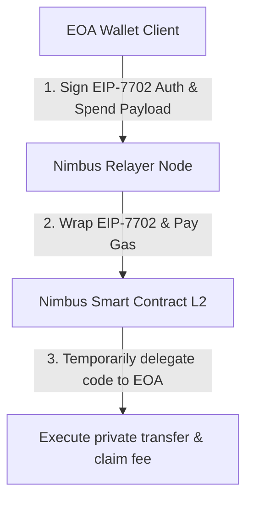

# Nimbus Node: Relayer API & Gasless Transaction Architecture

Dokumen ini mendokumentasikan desain teknis, endpoints, dan optimalisasi **Nimbus Node (Relayer API)** yang bertanggung jawab menjembatani wallet klien dengan smart contract L2 untuk transaksi privat secara instan dan tanpa gas fee (*gasless*).

---

## 1. Peran Utama Relayer (Nimbus Node)

Nimbus Node berjalan sebagai server web API mandiri (ditulis menggunakan **Rust Axum**) yang bertindak sebagai **Paymaster/Relayer** untuk menyelesaikan dua kendala utama UX Web3:
1.  **Cold Start Barrier (Bebas Gas Fee):** Pengguna tidak memerlukan saldo ETH di dompet mereka untuk mentransfer token privat. Relayer menalangi gas fee ETH on-chain dan memotongnya dalam bentuk stablecoin dari nominal transaksi.
2.  **EIP-7702 Delegation:** Mengaktifkan fitur smart wallet (seperti tanda tangan gasless dan batching) langsung pada alamat dompet EOA biasa (seperti Metamask tradisional) tanpa biaya deployment kontrak yang mahal.

---

## 2. Inovasi & Optimalisasi Arsitektur (Riset Jurnal 2026)

### A. Alur Delegasi EIP-7702 (Pectra Upgrade)
Di tahun 2026, Upgrade Pectra Ethereum mengaktifkan **EIP-7702** yang memperkenalkan tipe transaksi `0x04`. 



*   Klien menandatangani berkas otorisasi EIP-7702 off-chain yang mendelegasikan hak eksekusi ke smart contract Nimbus.
*   Klien mengirim otorisasi tersebut bersama data transfer privat ke `nimbus-node`.
*   `nimbus-node` mengirimkan transaksi ke blockchain L2, membayar gas fee ETH, dan memotong stablecoin (USDC) dari transaksi untuk biaya relayer.

### B. Antrean Batching Otomatis (40% Gas Reduction)
Untuk menekan biaya transaksi, Relayer tidak langsung memproses transaksi secara satuan. Sebaliknya, Relayer menerapkan sistem **Batching Queue**:
*   Setiap request `spend` dimasukkan ke dalam antrean di memori server.
*   Pekerja latar belakang (background worker) berjalan setiap **2 detik** untuk mengambil semua transaksi di antrean, menggabungkannya ke dalam satu batch transaksi multi-call, dan menyetorkannya ke blockchain L2.
*   Metode ini menghemat gas fee dasar EVM hingga **40%** (dari ~200.000 gas menjadi ~120.000 gas per transfer).

### C. Shuffling Anonymization Pool (Pencegahan Timing Attack)
Untuk melindungi strategi perdagangan dan privasi pengguna/AI Agent dari serangan analisis metadata waktu (*timing correlation attacks*):
*   Sebelum pekerja latar belakang (*background worker*) memproses dan menyetor batch transaksi multi-call ke L2, relayer secara acak mengacak (*shuffle*) urutan antrean transaksi di memori.
*   Ini memutus korelasi kronologis antara waktu pengiriman request HTTP API oleh agen dengan urutan eksekusi transaksi yang tercatat pada blok on-chain L2. Pengamat luar tidak dapat mengaitkan transaksi berdasarkan urutan masuknya.

---

## 3. Spesifikasi HTTP API Endpoints

### A. Health Check
Mengecek status kesehatan node relayer, jumlah antrean transaksi, dan nullifier yang terproses.
*   **Method:** `GET`
*   **Path:** `/health`
*   **Response (JSON):**
    ```json
    {
      "status": "OK",
      "queued_transactions": 0,
      "processed_nullifiers": 15
    }
    ```

### B. Registrasi Deposit Escrow
Dihubungi oleh klien untuk mendaftarkan sesi deposit minting baru.
*   **Method:** `POST`
*   **Path:** `/api/deposit`
*   **Payload (JSON):**
    ```json
    {
      "session_id": "sid_1283918239...",
      "com_k": "commitment_key_hex_in_g2...",
      "amount": 100000000
    }
    ```
*   **Response (JSON):**
    ```json
    {
      "status": "SUCCESS",
      "message": "Escrow registered for session sid_1283918239..."
    }
    ```

### C. Pengungkapan Kunci Masking
Dihubungi oleh Issuer untuk menyerahkan kunci masking $k$ setelah deposit terekam di blockchain.
*   **Method:** `POST`
*   **Path:** `/api/reveal`
*   **Payload (JSON):**
    ```json
    {
      "session_id": "sid_1283918239...",
      "masking_key_k": "k_key_hex_scalar..."
    }
    ```
*   **Response (JSON):**
    ```json
    {
      "status": "SUCCESS",
      "valid": true,
      "message": "Masking key verified and published on-chain. Escrow released."
    }
    ```

### D. Pengiriman Pembayaran Gasless & Lintas Rantai
Dihubungi oleh klien untuk mengirimkan token privat secara anonim, baik secara lokal di rantai asal maupun lintas rantai (Fase B) tanpa menggunakan gas fee ETH.
*   **Method:** `POST`
*   **Path:** `/api/spend`
*   **Payload (JSON):**
    ```json
    {
      "nullifier": "nullifier_hash_hex...",
      "sig_hex": "unmasked_signature_alpha_hex...",
      "recipient": "0xrecipient_address...",
      "eip7702_auth": {
        "eoa_address": "0xclient_eoa_address...",
        "delegate_contract": "0xdelegate_contract_address...",
        "signature": "authorization_signature_hex..."
      },
      "cross_chain": {
        "destination_chain_selector": 405157,
        "destination_contract": "0xdestination_contract_address..."
      }
    }
    ```
    *   *Catatan*: Objek `cross_chain` bersifat opsional. Jika disediakan, Relayer akan memaketkan data transaksi spend ke dalam payload 648 bytes dan mengirimkannya ke Router Chainlink CCIP untuk dieksekusi secara atomik di rantai tujuan.
*   **Response (JSON):**
    ```json
    {
      "status": "QUEUED",
      "message": "Spend transaction accepted into batching queue",
      "queue_position": 1
    }
    ```

### E. Verifikasi Pembayaran x402 (Fase C: AI Agent Facilitator)
Menerima payload PAYMENT-SIGNATURE terenkode Base64 dari AI Agent yang menggunakan token anonim Nimbus untuk membayar akses resource API secara privat, memverifikasi nullifier, dan menjadwalkan settlement.
*   **Method:** `POST`
*   **Path:** `/api/x402/verify`
*   **Payload (JSON):**
    ```json
    {
      "payment_signature_b64": "eyJ4NDAyVmVyc2lvbiI6Mix...(base64 encoded PAYMENT-SIGNATURE)",
      "resource_uri": "https://api.example.com/market-data"
    }
    ```
    *   `payment_signature_b64`: Isi header `PAYMENT-SIGNATURE` x402 v2 (berupa Base64-encoded JSON) yang berisi:
        *   `x402Version`: Versi protokol (harus bernilai 2).
        *   `scheme`: Skema pembayaran (e.g. `"exact"`).
        *   `network`: Identifikasi jaringan CAIP-2 (e.g. `"eip155:42161"` untuk Arbitrum One).
        *   `payment`: Objek `NimbusPaymentPayload` berisi `nullifier`, `alpha_neg_hex`, `hm_hex`, `pk_iss_hex` -- bukti spend anonim Nimbus yang menggantikan otorisasi EIP-3009 standar.
    *   `resource_uri`: URI resource yang dibayar (opsional, untuk kebutuhan pencatatan/audit).
*   **Response (JSON):**
    ```json
    {
      "success": true,
      "tx_hash": "0xmocked_settlement_transaction_hash...",
      "message": "Nimbus anonymous payment verified and queued for settlement"
    }
    ```

### F. Sinkronisasi Klaim Offline Merchant POS (Fase D: Blame Slashing)
Menerima batch bukti transaksi offline dari PWA POS merchant yang telah dikumpulkan secara lokal (IndexedDB) saat offline, kemudian memverifikasi setiap klaim dan secara otomatis mendeteksi pembelanjaan ganda (double-spend) menggunakan rekonstruksi identitas Shamir.
*   **Method:** `POST`
*   **Path:** `/api/pos/sync-claims`
*   **Payload (JSON):**
    ```json
    {
      "merchant_id": "warung_maju_001",
      "claims": [
        {
          "token_id": "0xtokenhash1...",
          "merchant_id": "",
          "challenge_x_hex": "aabbcc...(Fr scalar hex)",
          "response_y_hex": "ddeeff...(Fr scalar hex)",
          "timestamp": "2026-06-03T12:30:00Z",
          "amount": 50000
        },
        {
          "token_id": "0xtokenhash2...",
          "merchant_id": "",
          "challenge_x_hex": "112233...",
          "response_y_hex": "445566...",
          "timestamp": "2026-06-03T12:35:00Z",
          "amount": 25000
        }
      ]
    }
    ```
    *   `merchant_id`: Identitas toko/kasir yang mengirimkan batch klaim.
    *   `claims[]`: Daftar bukti transaksi offline, masing-masing berisi `token_id` (hash kunci efemeral token), skalar tantangan `challenge_x_hex` dan respons `response_y_hex` (dari protokol Shamir $y = a \cdot x + I$), timestamp, dan nominal.
*   **Response (JSON):**
    ```json
    {
      "accepted": 1,
      "double_spends_detected": 1,
      "results": [
        {
          "token_id": "0xtokenhash1...",
          "status": "ACCEPTED"
        },
        {
          "token_id": "0xtokenhash2...",
          "status": "DOUBLE_SPEND_DETECTED",
          "blame": {
            "reconstructed_identity_hex": "aabb11...(hex identity I)",
            "claim_a_merchant": "toko_a",
            "claim_b_merchant": "warung_maju_001"
          }
        }
      ]
    }
    ```
    *   Jika `status` bernilai `DOUBLE_SPEND_DETECTED`, objek `blame` berisi identitas rahasia pelaku yang direkonstruksi dari dua bukti transaksi offline yang bertentangan. Relayer secara otomatis men-dispatch fungsi `slash_double_spender` ke smart contract L2 untuk menyita jaminan pelaku.
