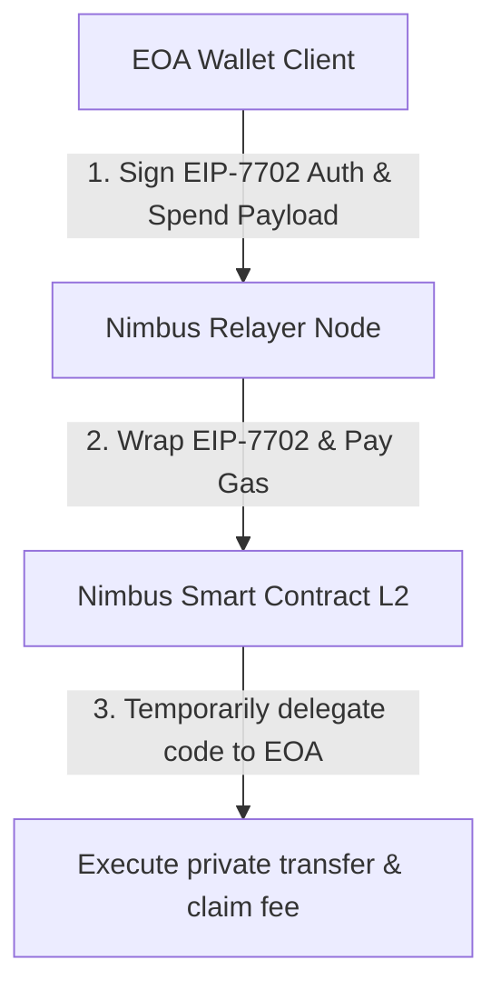
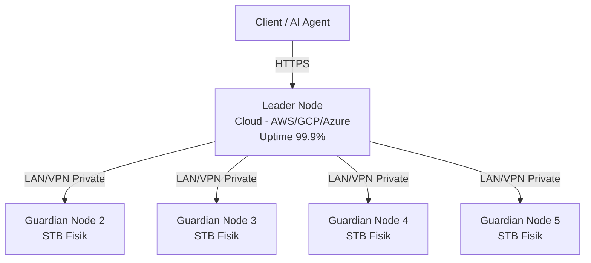
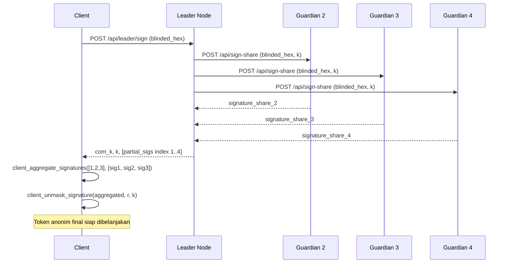

# Nimbus Node: Relayer API & Gasless Transaction Architecture

Dokumen ini mendokumentasikan desain teknis, endpoints, dan optimalisasi **Nimbus Node (Relayer API)** yang bertanggung jawab menjembatani wallet klien dengan smart contract L2 untuk transaksi privat secara instan dan tanpa gas fee (*gasless*).

---

## 0. Informasi Deployment Testnet L2

Berikut adalah informasi deployment resmi kontrak Nimbus di testnet Arbitrum Sepolia untuk referensi integrasi relayer node:
*   **Alamat Kontrak Nimbus (L2)**: `0x7cdc38331f302be1c2fe6c882495ad81ff0d8228`
*   **Jaringan**: Arbitrum Sepolia Testnet
*   **Arbitrum RPC Endpoint**: `https://sepolia-rollup.arbitrum.io/rpc`
*   **Explorer**: [Sepolia Arbiscan](https://sepolia.arbiscan.io/address/0x7cdc38331f302be1c2fe6c882495ad81ff0d8228)

---

## 1. Peran Utama Relayer (Nimbus Node)

Nimbus Node berjalan sebagai server web API mandiri (ditulis menggunakan **Rust Axum**) yang bertindak sebagai **Paymaster/Relayer** untuk menyelesaikan dua kendala utama UX Web3:
1.  **Cold Start Barrier (Bebas Gas Fee):** Pengguna tidak memerlukan saldo ETH di dompet mereka untuk mentransfer token privat. Relayer menalangi gas fee ETH on-chain dan memotongnya dalam bentuk stablecoin dari nominal transaksi.
2.  **EIP-7702 Delegation:** Mengaktifkan fitur smart wallet (seperti tanda tangan gasless dan batching) langsung pada alamat dompet EOA biasa (seperti Metamask tradisional) tanpa biaya deployment kontrak yang mahal.

---

## 2. Inovasi & Optimalisasi Arsitektur (Riset Jurnal 2026)

### A. Alur Delegasi EIP-7702 (Pectra Upgrade)
Di tahun 2026, Upgrade Pectra Ethereum mengaktifkan **EIP-7702** yang memperkenalkan tipe transaksi `0x04`. 



*   Klien menandatangani berkas otorisasi EIP-7702 off-chain yang mendelegasikan hak eksekusi ke smart contract Nimbus.
*   Klien mengirim otorisasi tersebut bersama data transfer privat ke `nimbus-node`.
*   `nimbus-node` mengirimkan transaksi ke blockchain L2, membayar gas fee ETH, dan memotong stablecoin (USDC) dari transaksi untuk biaya relayer.

### B. Antrean Batching Otomatis (40% Gas Reduction)
Untuk menekan biaya transaksi, Relayer tidak langsung memproses transaksi secara satuan. Sebaliknya, Relayer menerapkan sistem **Batching Queue**:
*   Setiap request `spend` dimasukkan ke dalam antrean di memori server.
*   Pekerja latar belakang (background worker) berjalan setiap **2 detik** untuk mengambil semua transaksi di antrean, menggabungkannya ke dalam satu batch transaksi multi-call, dan menyetorkannya ke blockchain L2.
*   Metode ini menghemat gas fee dasar EVM hingga **40%** (dari ~200.000 gas menjadi ~120.000 gas per transfer).

### C. Shuffling Anonymization Pool (Pencegahan Timing Attack)
Untuk melindungi strategi perdagangan dan privasi pengguna/AI Agent dari serangan analisis metadata waktu (*timing correlation attacks*):
*   Sebelum pekerja latar belakang (*background worker*) memproses dan menyetor batch transaksi multi-call ke L2, relayer secara acak mengacak (*shuffle*) urutan antrean transaksi di memori.
*   Ini memutus korelasi kronologis antara waktu pengiriman request HTTP API oleh agen dengan urutan eksekusi transaksi yang tercatat pada blok on-chain L2. Pengamat luar tidak dapat mengaitkan transaksi berdasarkan urutan masuknya.

### D. Dynamic Batch Gas Reimbursement & Share-of-Savings Markup
Berdasarkan riset L2 Gas Economics 2026, biaya transaksi L2 didominasi oleh L1 batch posting cost (calldata/blobs) dan L2 execution cost. Dengan menggunakan batching, biaya L1 posting cost dapat dibagi rata di antara seluruh transaksi dalam batch tersebut. Nimbus Node mengadopsi model **Share-of-Savings Markup**:
1.  **Estimasi Penghematan**: Relayer mengestimasi biaya transaksi jika dikirim secara individual versus biaya riil yang dibagi per transaksi dalam batch.
2.  **Markup Dinamis**: Relayer memotong **10%** dari selisih penghematan gas (savings) tersebut sebagai margin operasional/profit relayer.
3.  **Potongan Saldo Bersih (Net Payout)**: Biaya gas batched + markup langsung dikonversi ke nominal USDC dan dipotong dari stablecoin transaksi (`amount`). Penerima menerima *net payout* setelah dikurangi gas fee ini, menghilangkan kebutuhan wallet user untuk memiliki gas token native (ETH).

---

## 3. Konfigurasi Node (Environment Variables)

Every instance of `nimbus-node` reads configurations from environment variables at startup:

| Variable | Default | Description |
| :--- | :--- | :--- |
| `NIMBUS_SHARE_INDEX` | `1` | Index share node ini dalam skema Shamir (1 hingga n). Digunakan sebagai fallback jika key share yang diload berupa scalar raw 32-byte. |
| `NIMBUS_SHARE_KEY` | `Fr(12345)` | **(Fallback / Dev Mode Only)** Hex-encoded scalar BLS12-381 Fr (32-byte) atau tuple `(usize, Fr)` (40-byte). Jika data 40-byte terdeteksi, node secara otomatis mengekstrak share index dari kunci tersebut dan mengesampingkan `NIMBUS_SHARE_INDEX`. |
| `NIMBUS_VAULT_TOKEN` | `None` | Token otentikasi OpenBao / HashiCorp Vault. Mengaktifkan penarikan kunci otomatis via KMS. |
| `NIMBUS_VAULT_ADDR` | `http://127.0.0.1:8200` | URL/Port server OpenBao / HashiCorp Vault. |
| `NIMBUS_VAULT_PATH` | `v1/secret/data/nimbus` | Endpoint API path untuk mengambil rahasia (KV v2 engine). |

### Integrasi OpenBao / Vault (Production Mode)

Untuk deployment di tingkat produksi (production-ready), kunci rahasia pembagian BLS tidak boleh disimpan dalam plaintext di environment variable `NIMBUS_SHARE_KEY`. Jalankan OpenBao/Vault server lokal di masing-masing STB/Guardian secara independen:

1. Simpan secret di OpenBao / Vault:
   ```bash
   vault kv put secret/nimbus share_key="<share_hex>"
   ```
2. Jalankan relayer dengan mengaitkan token dan alamat Vault:
   ```bash
   NIMBUS_SHARE_INDEX=1 \
   NIMBUS_VAULT_ADDR="http://127.0.0.1:8200" \
   NIMBUS_VAULT_TOKEN="hvs.xxxxxxxxxxxxxxxxxxxx" \
   NIMBUS_VAULT_PATH="v1/secret/data/nimbus" \
   cargo run
   ```

Metode ini memastikan kunci didekripsi langsung di memori RAM dan tidak pernah bocor ke disk server atau environment variable Linux.

### Panduan Pengamanan OpenBao untuk Produksi (Rekomendasi Ahli)

Ketika melakukan deployment kluster OpenBao di perangkat fisik STB Anda, terapkan 4 prinsip keamanan berikut untuk menjamin integritas protokol Nimbus:

1. **Bangun Kluster Ganjil (3 atau 5 Node Raft)**
   * OpenBao menggunakan algoritma konsensus Raft untuk replikasi data rahasia. 
   * Pastikan Anda mengaktifkan kluster HA dengan jumlah node ganjil (minimal 3 atau 5) guna menghindari skenario split-brain dan mempertahankan quorum apabila salah satu STB mengalami kegagalan hardware atau pemutusan koneksi internet.

2. **Kebijakan Isolasi Ketat (Isolation Policy - Wajib!)**
   * Terapkan kebijakan hak akses minimal (*least privilege*). Setiap node Guardian (STB) hanya diberi akses ACL untuk membaca shard kuncinya sendiri.
   * Buat policy terpisah di mana STB 1 hanya bisa mengakses `secret/data/nimbus/share-1`, STB 2 hanya mengakses `secret/data/nimbus/share-2`, dst. 
   * Dengan kebijakan isolasi ini, apabila satu STB berhasil ditembus oleh penyerang, mereka tidak memiliki izin akses API untuk mengunduh kunci share milik STB/Guardian lainnya.

3. **Otentikasi Menggunakan AppRole (Bukan Token Statis)**
   * Hindari penggunaan token root statis (`NIMBUS_VAULT_TOKEN`) yang berumur panjang di file environment produksi.
   * Konfigurasikan metode autentikasi **AppRole** di OpenBao. Setiap relayer STB akan menggunakan pasangan `RoleID` dan `SecretID` unik untuk menukar token akses dinamis berumur pendek (*short-lived token*) saat startup, yang otomatis di-refresh secara berkala.

4. **Solusi Otomatisasi Unseal (The Unseal Problem)**
   * Secara default, setiap kali OpenBao server melakukan booting ulang (karena pemadaman listrik STB atau restart sistem), server akan masuk ke mode tersegel (*sealed*) dan semua kunci enkripsi dikunci.
   * Untuk menghindari keharusan operator memasukkan kunci unseal secara manual pada setiap perangkat, implementasikan fitur **Auto-Unseal** (misal dengan menggunakan mode transit auto-unseal via server penunjang yang aman, AWS/GCP KMS gratisan, atau local hardware security keys).

---

## 4. Topologi Deployment (Cloud + Fisik Hybrid)

Arsitektur yang direkomendasikan untuk ketahanan sistem adalah **hybrid**: Leader Node di cloud dengan uptime 99.9%, dan Guardian Node di hardware fisik murah (STB bekas) yang terhubung via tunnel private (WireGuard/Tailscale).



- **Leader Node** (cloud): Menerima request dari client, men-generate masking key `k`, mengumpulkan partial signature dari semua Guardian, lalu mengagregasi menjadi `com_k` final.
- **Guardian Nodes** (fisik, tidak terekspos internet): Hanya menerima request dari Leader via jaringan private. Setiap Guardian menyimpan satu share kunci. Tidak bisa diakses langsung dari luar.

---

## 5. Spesifikasi HTTP API Endpoints

### A. Health Check
Mengecek status kesehatan node relayer, jumlah antrean transaksi, nullifier yang terproses, serta saldo wallet relayer dan akumulasi keuntungan.
*   **Method:** `GET`
*   **Path:** `/health`
*   **Response (JSON):**
    ```json
    {
      "status": "OK",
      "queued_transactions": 0,
      "processed_nullifiers": 15,
      "relayer_wallet_balance_eth": 10.0,
      "relayer_accumulated_profit_usdc": 0.0
    }
    ```

### B. Registrasi Deposit Escrow
Dihubungi oleh klien untuk mendaftarkan sesi deposit minting baru.
*   **Method:** `POST`
*   **Path:** `/api/deposit`
*   **Payload (JSON):**
    ```json
    {
      "session_id": "sid_1283918239...",
      "com_k": "commitment_key_hex_in_g2...",
      "amount": 100000000
    }
    ```
*   **Response (JSON):**
    ```json
    {
      "status": "SUCCESS",
      "message": "Escrow registered for session sid_1283918239..."
    }
    ```

### C. Pengungkapan Kunci Masking
Dihubungi oleh Issuer untuk menyerahkan kunci masking $k$ setelah deposit terekam di blockchain.
*   **Method:** `POST`
*   **Path:** `/api/reveal`
*   **Payload (JSON):**
    ```json
    {
      "session_id": "sid_1283918239...",
      "masking_key_k": "k_key_hex_scalar..."
    }
    ```
*   **Response (JSON):**
    ```json
    {
      "status": "SUCCESS",
      "valid": true,
      "message": "Masking key verified and published on-chain. Escrow released."
    }
    ```

### D. Pengiriman Pembayaran Gasless & Lintas Rantai
Dihubungi oleh klien untuk mengirimkan token privat secara anonim, baik secara lokal di rantai asal maupun lintas rantai (Fase B) tanpa menggunakan gas fee ETH.
*   **Method:** `POST`
*   **Path:** `/api/spend`
*   **Payload (JSON):**
    ```json
    {
      "nullifier": "nullifier_hash_hex...",
      "sig_hex": "unmasked_signature_alpha_hex...",
      "recipient": "0xrecipient_address...",
      "eip7702_auth": {
        "eoa_address": "0xclient_eoa_address...",
        "delegate_contract": "0xdelegate_contract_address...",
        "signature": "authorization_signature_hex..."
      },
      "cross_chain": {
        "destination_chain_selector": 405157,
        "destination_contract": "0xdestination_contract_address..."
      }
    }
    ```
    *   *Catatan*: Objek `cross_chain` bersifat opsional. Jika disediakan, Relayer akan memaketkan data transaksi spend ke dalam payload 648 bytes dan mengirimkannya ke Router Chainlink CCIP untuk dieksekusi secara atomik di rantai tujuan.
*   **Response (JSON):**
    ```json
    {
      "status": "QUEUED",
      "message": "Spend transaction accepted into batching queue",
      "queue_position": 1
    }
    ```

### E. Verifikasi Pembayaran x402 (Fase C: AI Agent Facilitator)
Menerima payload PAYMENT-SIGNATURE terenkode Base64 dari AI Agent yang menggunakan token anonim Nimbus untuk membayar akses resource API secara privat, memverifikasi nullifier, dan menjadwalkan settlement.
*   **Method:** `POST`
*   **Path:** `/api/x402/verify`
*   **Payload (JSON):**
    ```json
    {
      "payment_signature_b64": "eyJ4NDAyVmVyc2lvbiI6Mix...(base64 encoded PAYMENT-SIGNATURE)",
      "resource_uri": "https://api.example.com/market-data"
    }
    ```
    *   `payment_signature_b64`: Isi header `PAYMENT-SIGNATURE` x402 v2 (berupa Base64-encoded JSON) yang berisi:
        *   `x402Version`: Versi protokol (harus bernilai 2).
        *   `scheme`: Skema pembayaran (e.g. `"exact"`).
        *   `network`: Identifikasi jaringan CAIP-2 (e.g. `"eip155:42161"` untuk Arbitrum One).
        *   `payment`: Objek `NimbusPaymentPayload` berisi `nullifier`, `alpha_neg_hex`, `hm_hex`, `pk_iss_hex` -- bukti spend anonim Nimbus yang menggantikan otorisasi EIP-3009 standar.
    *   `resource_uri`: URI resource yang dibayar (opsional, untuk kebutuhan pencatatan/audit).
*   **Response (JSON):**
    ```json
    {
      "success": true,
      "tx_hash": "0xmocked_settlement_transaction_hash...",
      "message": "Nimbus anonymous payment verified and queued for settlement"
    }
    ```

### F. Sinkronisasi Klaim Offline Merchant POS (Fase D: Blame Slashing)
Menerima batch bukti transaksi offline dari PWA POS merchant yang telah dikumpulkan secara lokal (IndexedDB) saat offline, kemudian memverifikasi setiap klaim dan secara otomatis mendeteksi pembelanjaan ganda (double-spend) menggunakan rekonstruksi identitas Shamir.
*   **Method:** `POST`
*   **Path:** `/api/pos/sync-claims`
*   **Payload (JSON):**
    ```json
    {
      "merchant_id": "warung_maju_001",
      "claims": [
        {
          "token_id": "0xtokenhash1...",
          "merchant_id": "",
          "challenge_x_hex": "aabbcc...(Fr scalar hex)",
          "response_y_hex": "ddeeff...(Fr scalar hex)",
          "timestamp": "2026-06-03T12:30:00Z",
          "amount": 50000
        },
        {
          "token_id": "0xtokenhash2...",
          "merchant_id": "",
          "challenge_x_hex": "112233...",
          "response_y_hex": "445566...",
          "timestamp": "2026-06-03T12:35:00Z",
          "amount": 25000
        }
      ]
    }
    ```
    *   `merchant_id`: Identitas toko/kasir yang mengirimkan batch klaim.
    *   `claims[]`: Daftar bukti transaksi offline, masing-masing berisi `token_id` (hash kunci efemeral token), skalar tantangan `challenge_x_hex` dan respons `response_y_hex` (dari protokol Shamir $y = a \cdot x + I$), timestamp, dan nominal.
*   **Response (JSON):**
    ```json
    {
      "accepted": 1,
      "double_spends_detected": 1,
      "results": [
        {
          "token_id": "0xtokenhash1...",
          "status": "ACCEPTED"
        },
        {
          "token_id": "0xtokenhash2...",
          "status": "DOUBLE_SPEND_DETECTED",
          "blame": {
            "reconstructed_identity_hex": "aabb11...(hex identity I)",
            "claim_a_merchant": "toko_a",
            "claim_b_merchant": "warung_maju_001"
          }
        }
      ]
    }
    ```
    *   Jika `status` bernilai `DOUBLE_SPEND_DETECTED`, objek `blame` berisi identitas rahasia pelaku yang direkonstruksi dari dua bukti transaksi offline yang bertentangan. Relayer secara otomatis men-dispatch fungsi `slash_double_spender` ke smart contract L2 untuk menyita jaminan pelaku.

### G. Threshold Minting: Guardian Sign-Share
Dihubungi oleh Leader Node ke setiap Guardian Node via jaringan private untuk meminta partial signature menggunakan share kunci lokal node tersebut. Guardian Node tidak pernah mengekspos endpoint ini ke internet publik.
*   **Method:** `POST`
*   **Path:** `/api/sign-share`
*   **Payload (JSON):**
    ```json
    {
      "blinded_hex": "hex_encoded_blinded_message_G1_point...",
      "k_hex": "hex_encoded_masking_key_fr_scalar...",
      "share_sk_hex": null
    }
    ```
    *   `blinded_hex`: Blinded message G1 point dari client (hex-encoded bytes).
    *   `k_hex`: Masking key sementara $k$ yang di-generate oleh Leader untuk sesi ini.
    *   `share_sk_hex`: Opsional -- override share secret key (hanya untuk keperluan testing). Jika `null`, node menggunakan `NIMBUS_SHARE_KEY` dari environment.
*   **Response (JSON):**
    ```json
    {
      "status": "SUCCESS",
      "signature_share_hex": "hex_encoded_partial_bls_signature..."
    }
    ```

### H. Threshold Minting: Leader Aggregate Sign
Dihubungi oleh client untuk memulai proses minting token anonim secara terdesentralisasi. Leader Node men-generate masking key $k$, menghubungi semua Guardian secara paralel via private network, mengumpulkan partial signature, lalu mengembalikan semuanya ke client untuk diagregasi menggunakan `client_aggregate_signatures` di SDK.
*   **Method:** `POST`
*   **Path:** `/api/leader/sign`
*   **Payload (JSON):**
    ```json
    {
      "blinded_hex": "hex_encoded_blinded_message_G1_point...",
      "guardian_urls": [
        "http://10.0.0.2:8080",
        "http://10.0.0.3:8080",
        "http://10.0.0.4:8080",
        "http://10.0.0.5:8080"
      ],
      "pk_iss_hex": "hex_encoded_issuer_public_key_g2_point..."
    }
    ```
    *   `guardian_urls`: Daftar URL internal Guardian Node (IP private / VPN). Tidak pernah berupa alamat publik.
    *   `pk_iss_hex`: Opsional -- public key Issuer untuk komputasi commitment $com_k = k \cdot pk_{iss}$.
*   **Response (JSON):**
    ```json
    {
      "status": "SUCCESS",
      "com_k_hex": "hex_encoded_masking_key_commitment_g2_point...",
      "k_hex": "hex_encoded_masking_key_fr_scalar...",
      "partial_signatures": [
        { "index": 1, "signature_hex": "hex_partial_sig_leader..." },
        { "index": 2, "signature_hex": "hex_partial_sig_guardian2..." },
        { "index": 3, "signature_hex": "hex_partial_sig_guardian3..." }
      ]
    }
    ```
    *   `com_k_hex`: Commitment kunci masking ($com_k = k \cdot pk_{iss}$) yang akan diverifikasi client sebelum unmasking.
    *   `partial_signatures`: Daftar partial BLS signature dari setiap node yang berhasil merespons. Client membutuhkan minimal $t$ signature untuk aggregasi Lagrange.

#### Alur Threshold Minting End-to-End (t=3, n=5)



