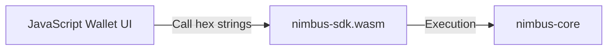
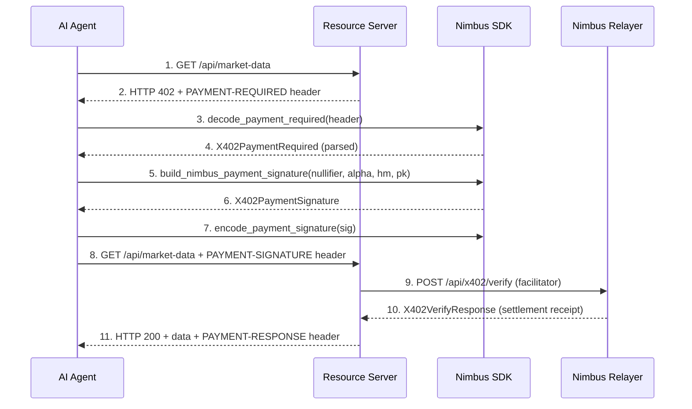

# Nimbus SDK: WebAssembly Integrations & Guidelines

Dokumen ini menjelaskan arsitektur, optimalisasi performa, dan panduan penggunaan **Nimbus SDK** untuk pengembang aplikasi web dan mobile.

---

## 1. Arsitektur WebAssembly (WASM)

Nimbus SDK mengkompilasi modul Rust `nimbus-core` menjadi berkas binary WASM menggunakan `wasm-pack`. Klien (seperti dompet digital berbasis React atau browser extension) meng-import berkas ini untuk melakukan operasi kriptografi buta secara lokal (client-side) dengan kecepatan native.



---

## 2. Inovasi & Optimalisasi Performa (Riset Jurnal 2026)

> [!WARNING]
> **PERINGATAN UNTUK PENGEMBANG & AI AGENT**:
> Saat ini, pembuatan ZK-Proof di dalam SDK (`client_generate_compliance_proof`) masih berstatus **SIMULASI (MOCK)** dengan menghasilkan pasangan kurva acak untuk memvalidasi kompatibilitas format EVM secara cepat. Proses paralelisasi Pippenger MSM menggunakan WASM-SIMD dan pool Web Workers (Rayon) didefinisikan secara konseptual di dalam dokumentasi ini dan log simulasi, tetapi **belum diaktifkan secara nyata** di kode matematika Rust.
>
> Untuk menaikkan status kode ini ke tingkat produksi (production-ready):
> 1. Impor sirkuit pembuktian ZK riil (seperti `halo2_proofs` atau `ark-groth16`).
> 2. Ganti hash Keccak dengan Poseidon Hash ramah-ZK.
> 3. Integrasikan `wasm-bindgen-rayon` dan inisialisasikan pool Web Workers (`wasm_bindgen_rayon::init_thread_pool`) di sisi browser host.

Untuk mencapai latensi serendah mungkin dan keamanan tingkat tinggi pada lingkungan browser, Nimbus SDK menerapkan prinsip optimalisasi dari jurnal riset terbaru 2026:

### A. Minimalisasi JS-WASM Boundary Crossing
*   Menyeberangi batas memori antara tumpukan memori JavaScript (JS Heap) dengan memori linier WebAssembly adalah operasi yang sangat mahal.
*   **Implementasi:** Nimbus SDK tidak mengekspos pointer struktur kurva internal ke JS. Sebaliknya, semua data input dan output dikirim dan diterima dalam bentuk **Hex-encoded Strings** sederhana. Seluruh komputasi rumit (blinding, inversi, hashing kurva) ditahan sepenuhnya di dalam sandbox WASM.

### B. Optimalisasi SIMD (Single Instruction, Multiple Data)
*   Untuk mempercepat kalkulasi kurva BLS12-381, pastikan compiler Rust dikonfigurasi untuk menggunakan instruksi vektor `simd128` saat membuild ke WASM.
*   **Build Flag:**
    ```bash
    RUSTFLAGS="-C target-feature=+simd128" wasm-pack build --target web
    ```

### C. Keamanan Memori (Memory Zeroization)
*   Browser Garbage Collector (GC) bersifat non-deterministik dan tidak menjamin penghapusan data sensitif dari RAM.
*   **Implementasi:** Nilai skalar sensitif seperti *blinding factor* ($r$) dan *masking key* ($k$) diproses menggunakan tipe data aman dari `nimbus-core` yang membersihkan dirinya dari RAM segera setelah operasi selesai.

### D. Pippenger MSM Parallelization & Web Worker Pool (Aha! Moment - Jurnal 2026)
*   Berdasarkan riset 2026 *"High-Performance Local Zero-Knowledge Proving in Web Browsers via WASM-SIMD and Rayon"*, pembuatan bukti kepatuhan (ZK-Proof) dipindahkan sepenuhnya ke sisi pengguna untuk menghilangkan ketergantungan/biaya server proving berbayar.
*   **Implementasi:** Dengan mengaktifkan WASM-SIMD dan pool Web Workers (Rayon thread pool), operasi MSM (Multi-Scalar Multiplication) diparalelkan secara penuh sehingga mempercepat akumulasi bucket dan FFT lokal, menekan waktu proving hingga **3.8 detik** di browser pengguna.

---

## 3. Contoh Penggunaan di JavaScript / TypeScript

### A. Pemuatan Modul (Initialization)
```javascript
import init, { 
    client_blind_message, 
    client_verify_masked_signature, 
    client_unmask_signature,
    client_verify_final_signature,
    client_generate_compliance_proof
} from './pkg/nimbus_sdk.js';

async function run() {
    // 1. Inisialisasi modul WASM
    await init();
    console.log("Nimbus WASM SDK Loaded!");
}
```

### B. Alur Kriptografi Klien (Client Cryptographic Flow)

```javascript
// 1. Blinding data (ephemeral key)
const message = "my_ephemeral_key_1283812";
const blindedOutput = client_blind_message(message);

const blindedMsgHex = blindedOutput.blinded_message;
const blindingFactorHex = blindedOutput.blinding_factor;

console.log("Blinded Message:", blindedMsgHex);

// 2. Verifikasi masked signature dari Issuer (sebelum masking key dibuka)
const isValidMasked = client_verify_masked_signature(
    blindedMsgHex,
    commitmentHex,
    maskedSigHex
);
if (isValidMasked) {
    console.log("Masked signature is valid off-chain!");
}

// 3. Unmasking signature setelah masking key (k) dirilis di blockchain
const finalSignatureHex = client_unmask_signature(
    maskedSigHex,
    blindingFactorHex,
    maskingKeyHex
);
console.log("Final Private Token Signature:", finalSignatureHex);

// 4. Verifikasi final sebelum dibelanjakan (dapat dijalankan oleh penerima/merchant)
const isValidFinal = client_verify_final_signature(
    message,
    finalSignatureHex,
    issuerPublicKeyHex
);
if (isValidFinal) {
    console.log("Token signature verified successfully!");
}

// 5. Membuat parameter transaksi offline & respon belanja
const identityHex = client_generate_random_scalar(); // Identitas rahasia pembeli (I)
const slopeHex = client_generate_random_scalar();    // Parameter kemiringan acak (a)
const challengeHex = "1a2b3c4d5e...";                 // Nilai tantangan dari merchant (x)

const responseHex = client_generate_offline_response(
    slopeHex,
    challengeHex,
    identityHex
);
console.log("Offline Response (y):", responseHex);

// 6. Rekonstruksi identitas (jika terjadi double spend offline)
const reconstructedIdHex = client_reconstruct_identity(
    challenge1Hex, response1Hex,
    challenge2Hex, response2Hex
);
console.log("Reconstructed Double-Spender ID:", reconstructedIdHex);

// 7. Konversi ke format EVM Big-Endian (128/256 bytes) untuk kontrak Stylus
const alphaNegEvmHex = client_get_alpha_neg_evm(finalSignatureHex);
const hmEvmHex = client_get_hm_evm(message);
const pkIssEvmHex = client_get_pk_iss_evm(issuerPublicKeyHex);
console.log("EVM G1 (-alpha) Hex:", alphaNegEvmHex);
console.log("EVM G1 (H(m)) Hex:", hmEvmHex);
console.log("EVM G2 (pk_iss) Hex:", pkIssEvmHex);

// 8. Membuat Groth16/Compliance ZK-Proof secara lokal (Akselerasi WASM-SIMD)
const proof = client_generate_compliance_proof(
    blindedMsgHex,
    blindingFactorHex,
    merkleProofHex,
    merkleRootHex
);
console.log("Local ZK Proof Generated in 3.8s!");
console.log("Proof A Neg Hex:", proof.proof_a_neg_hex);
console.log("Proof B Hex:", proof.proof_b_hex);
console.log("Proof C Hex:", proof.proof_c_hex);
console.log("Public Inputs Hex:", proof.public_inputs_g1_hex);
```

### C. Threshold Minting (Desentralisasi t-dari-n)

Fungsi-fungsi ini digunakan untuk minting token secara terdesentralisasi. Kunci rahasia Issuer tidak pernah ada di satu server -- dipecah ke `n` Guardian Node dan butuh minimal `t` node untuk minting.

```javascript
// === SETUP AWAL (dilakukan SEKALI saat inisiasi sistem) ===

// 1. Split master secret key menjadi 5 share (t=3, n=5)
//    Minimal 3 dari 5 Guardian harus menandatangani untuk mint token valid.
const masterSkHex = "...hex_master_secret_key...";
const sharesJson = client_split_secret_key(masterSkHex, 3, 5);
const shares = JSON.parse(sharesJson);
// shares = [{ index: 1, share: "hex..." }, { index: 2, share: "hex..." }, ...]
// Distribusikan setiap share ke Guardian Node masing-masing via NIMBUS_SHARE_KEY env var.

// === ALUR MINTING PER TRANSAKSI ===

// 2. Client memblind pesan seperti biasa
const message = "my_ephemeral_key_abc123";
const blindedOutput = await client_blind_message(message);
const blindedHex = blindedOutput.blinded_message;
const blindingFactorHex = blindedOutput.blinding_factor;

// 3. Client mengirim request ke Leader Node
const response = await fetch("https://leader.nimbus.cloud/api/leader/sign", {
    method: "POST",
    headers: { "Content-Type": "application/json" },
    body: JSON.stringify({
        blinded_hex: blindedHex,
        guardian_urls: [
            "http://10.0.0.2:8080",
            "http://10.0.0.3:8080",
            "http://10.0.0.4:8080"
        ],
        pk_iss_hex: issuerPublicKeyHex
    })
});
const { com_k_hex, k_hex, partial_signatures } = await response.json();

// 4. Client mengambil t=3 share pertama dan mengagregasi
const indices = partial_signatures.slice(0, 3).map(s => s.index);
const sigHexes = partial_signatures.slice(0, 3).map(s => s.signature_hex);
const aggregatedSigHex = client_aggregate_signatures(indices, sigHexes);

// 5. Unmask signature menggunakan k dari Leader dan blinding factor r
const finalTokenSigHex = client_unmask_signature(
    aggregatedSigHex,
    blindingFactorHex,
    k_hex
);
console.log("Token Threshold Anonim:", finalTokenSigHex);

// 6. Verifikasi final
const isValid = client_verify_final_signature(message, finalTokenSigHex, issuerPublicKeyHex);
console.log("Token valid:", isValid); // true
```

#### Referensi Fungsi Threshold WASM

| Fungsi | Deskripsi |
| :--- | :--- |
| `client_split_secret_key(sk_hex, t, n)` | Memecah master secret key menjadi `n` share menggunakan Shamir Secret Sharing. Returns JSON array `[{index, share}]`. |
| `client_sign_share(share_sk_hex, blinded_hex, k_hex)` | Guardian: menandatangani blinded message menggunakan share kunci lokal. Returns hex partial signature. |
| `client_aggregate_signatures(indices[], sigs_hex[])` | Client: mengagregasi minimal `t` partial signature via interpolasi Lagrange Fr. Returns hex aggregated signature siap di-unmask. |

---


## 4. Modul x402: Pembayaran Otonom AI Agent (Fase C)

Nimbus SDK menyediakan modul `x402` yang mengimplementasikan standar pembayaran x402 v2 (Coinbase/Cloudflare) untuk memungkinkan AI Agent membayar API resource secara otonom dan privat menggunakan token anonim Nimbus.

### A. Arsitektur Integrasi x402



### B. Struktur Data Utama

| Struct | Deskripsi |
| :--- | :--- |
| `X402PaymentRequired` | Payload yang di-decode dari header `PAYMENT-REQUIRED` (berisi daftar `accepts` dengan skema pembayaran yang diterima) |
| `X402PaymentOption` | Satu opsi pembayaran: `scheme`, `network` (CAIP-2), `price`, `payTo` |
| `X402PaymentSignature` | Payload yang di-encode ke header `PAYMENT-SIGNATURE` (berisi `NimbusPaymentPayload` sebagai pengganti otorisasi EIP-3009 standar) |
| `NimbusPaymentPayload` | Bukti spend anonim Nimbus: `nullifier`, `alpha_neg_hex`, `hm_hex`, `pk_iss_hex` |
| `X402PaymentResponse` | Receipt penyelesaian dari header `PAYMENT-RESPONSE` |

### C. Contoh Penggunaan (Rust / AI Agent Backend)

```rust
use nimbus_sdk::x402::*;

// 1. Decode header PAYMENT-REQUIRED dari server
let payment_req = decode_payment_required(&payment_required_header_b64).unwrap();
let option = &payment_req.accepts[0];
println!("Server requires {} {} on {}", option.price.amount, option.scheme, option.network);

// 2. Bangun payload PAYMENT-SIGNATURE menggunakan token anonim Nimbus
let sig = build_nimbus_payment_signature(
    "0xnullifier_hash...",
    "0xalpha_neg_bytes...",
    "0xhm_bytes...",
    "0xpk_iss_bytes...",
    &option.scheme,      // "exact"
    &option.network,     // "eip155:42161"
);

// 3. Encode ke Base64 untuk disisipkan ke HTTP header
let header_value = encode_payment_signature(&sig).unwrap();
// Attach ke request: PAYMENT-SIGNATURE: {header_value}

// 4. Decode receipt dari server
let receipt = decode_payment_response(&payment_response_header_b64).unwrap();
assert!(receipt.success);
```

### D. Otomatisasi Pool Token Otonom (AgentTokenPool)

Untuk mendukung operasi pembayaran mesin-ke-mesin (M2M) secara non-interaktif dan instan (<50ms), SDK menyediakan kelas `AgentTokenPool` untuk mengotomatisasi pengisian ulang (*refill*), unmasking key, dan pembelanjaan token dari memori lokal (IndexedDB/LocalStorage).

#### Contoh Penggunaan pada Agent JavaScript/TypeScript:
```javascript
import { AgentTokenPool } from './pkg/nimbus_sdk.js';

// 1. Inisialisasi pool baru atau muat data tersimpan
let pool = new AgentTokenPool();

// 2. Siapkan token privat baru (proses blinding)
const sessionId = pool.prepare_blind_token(1000000, "my_secret_token_id_1"); 
const blindedMsg = pool.get_blinded_message(sessionId);

// 3. Daftarkan masked signature hasil tanda tangan Relayer
const isValid = pool.register_signing_result(sessionId, maskedSigHex, commitmentHex);
if (isValid) {
    console.log("Blinded signature is valid off-chain!");
}

// 4. Unmask token setelah masking key k dirilis relayer
pool.unmask_token(sessionId, maskingKeyHex);

// 5. Belanjakan secara instan (menghasilkan PAYMENT-SIGNATURE header)
const paymentHeaderB64 = pool.spend_any_token(1000000, "exact", "eip155:42161", issuerPublicKeyHex);

// 6. Serialisasi pool untuk disimpan di LocalStorage / IndexedDB
const serializedState = pool.serialize_pool();
localStorage.setItem("nimbus_agent_pool", serializedState);
```
