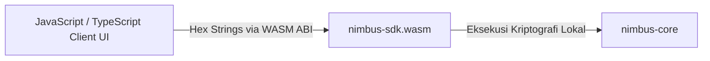

# Nimbus SDK — 01: Arsitektur WebAssembly (WASM)

Dokumen ini menjelaskan arsitektur kompilasi WebAssembly, struktur modul internal, dan teknik optimalisasi performa browser pada [`nimbus-sdk`](file:///workspaces/Zeltra-Protocol/nimbus-sdk).

---

## 1. Peran Nimbus SDK

`nimbus-sdk` mengkompilasi primitif kriptografi Rust dari `nimbus-core` menjadi berkas binary WebAssembly (**WASM**) menggunakan `wasm-pack`:
* Memungkinkan aplikasi client (dompet digital Web3, frontend React/Next.js, browser extensions, atau script Node.js) melakukan operasi kriptografi buta dan pembuatan proof ZK secara **lokal di sisi client (*client-side*)** dengan kecepatan mendekati native.
* Menjaga kerahasiaan privat: Kunci rahasia, *blinding factor* ($r$), dan *spending key* tidak pernah dikirimkan ke server relayer.



---

## 2. Struktur Modul SDK (`nimbus-sdk/src/`)

```text
nimbus-sdk/src/
├── lib.rs              # Entrypoint WASM, deklarasi modul, & re-export publik
├── wasm_types.rs       # Struct wrapper WASM (BlindedOutput, ZkComplianceProof)
├── blind_wasm.rs       # Binding WASM protokol BDHKE (blind, unmask, verify masked)
├── threshold_wasm.rs   # Binding WASM agregasi threshold signature (Lagrange)
├── evm_wasm.rs         # Helper konversi format byte Big-Endian EVM
├── fee_wasm.rs         # Kalkulasi quote fee & gross-up di client
├── zk_wasm.rs          # Prover & verifier ZK Groth16 client-side
├── eip712.rs           # Penandatanganan typed data EIP-712 quote execution fee
└── x402/               # Modul protokol micropayment agen AI (HTTP 402)
    ├── mod.rs          # Integrasi modul
    ├── types.rs        # Struktur data pembayaran x402
    ├── codec.rs        # Encoding/decoding Base64 JSON payload
    └── pool.rs         # Manajer token pool agen AI
```

---

## 3. Optimalisasi Performa di Browser

Untuk mencapai latensi serendah mungkin di lingkungan browser:

1. **Minimalisasi JS-WASM Boundary Crossing:**
   Menyeberangi batas memori antara JS Heap dan linier memory WASM adalah operasi yang mahal. Nimbus SDK mengirimkan dan menerima data dalam bentuk **Hex-encoded Strings** sederhana. Seluruh komputasi rumit (blinding, inversi skalar, hashing kurva) dieksekusi di dalam sandbox WASM.
2. **Optimalisasi SIMD128 (Single Instruction, Multiple Data):**
   Mendukung instruksi vektor 128-bit untuk mempercepat operasi aljabar kurva BLS12-381 dan NTT/MSM di browser:
   ```bash
   RUSTFLAGS="-C target-feature=+simd128" wasm-pack build --target web
   ```
3. **Pembersihan Memori (*Zeroization*):**
   Browser Garbage Collector bersifat non-deterministik. Nilai skalar sensitif seperti *blinding factor* ($r$) dan spending key dibersihkan seketika dari RAM setelah operasi selesai menggunakan crate `zeroize`.
