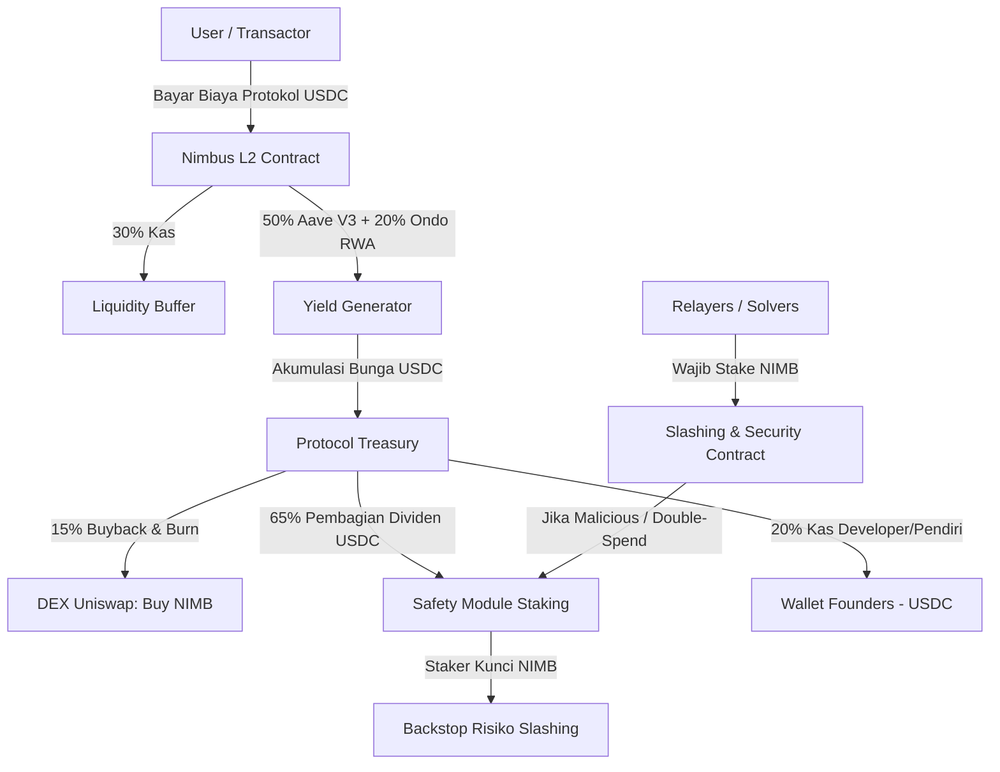
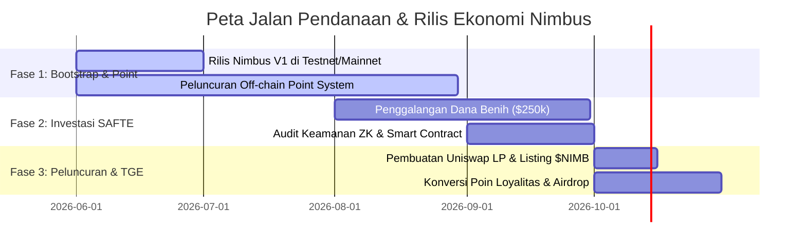

# Nimbus Protocol: Desain Game Kripto-Ekonomi ($NIMB)

Dokumen ini menjelaskan strategi kripto-ekonomi dan tokenomics **Nimbus Protocol** agar dirancang secara berkelanjutan, meminimalkan modal awal pendiri (*Founders*), dan memaksimalkan nilai tangkapan (*value capture*) agar kita memenangkan persaingan di pasar Web3.

---

## 1. Win-Condition (Kondisi Kemenangan Kita)
Agar protokol dan pendiri memenangkan "game ekonomi" ini, tokenomics harus menyelesaikan 3 masalah utama Web3:
1.  **Dumping Airdrop**: Mencegah pemburu airdrop membanting harga koin hingga $0 saat listing.
2.  **Solver Staking Utility**: Memaksa para operator node (Relayer/Guardian) untuk terus membeli dan menahan token $NIMB secara on-chain.
3.  **Real Yield Revenue**: Memberikan nilai kegunaan riil (*utility*) pada token $NIMB berupa dividen stablecoin (USDC) dari yield riil DeFi/RWA, bukan sekadar token inflasi tanpa nilai.

---

## 2. Arsitektur Sirkulasi & Utilitas Token ($NIMB)

### A. Syarat Staking Relayer & Guardian (Kunci Utama Buy-Demand)
*   **Mekanisme**: Setiap Relayer (Leader) dan Guardian yang ingin memproses transaksi Nimbus dan mendapatkan biaya markup (*markup fee* dari *gas savings* user) **wajib membeli dan melakukan staking sejumlah token $NIMB** sebagai jaminan (bond).
*   **Slashing**: Jika Relayer terbukti bersalah (misal: menolak merilis masking key, melakukan double-spend, atau offline saat verifikasi CCIP), token $NIMB yang mereka stake akan di-**slash** (disita) secara otomatis oleh smart contract.
*   **Dampak Ekonomi**: Semakin tinggi volume transaksi Nimbus, semakin banyak Relayer yang ingin bergabung demi mendapatkan profit operasional. Ini memaksa pembelian massal token $NIMB secara terus-menerus di pasar terbuka (Uniswap) untuk dijadikan jaminan staking.

### B. Safety Module Staking (Dividen Real Yield)
*   **Mekanisme**: Pemegang token $NIMB (termasuk retail, investor, dan founder) dapat mengunci koin mereka ke dalam **Safety Module**.
*   **Fungsi**: Kunci staking ini berfungsi sebagai *backstop* (asuransi sistem) jika terjadi kegagalan CCIP lintas rantai atau exploit teknis pada brankas likuiditas.
*   **Reward (Real Yield)**: Sebagai kompensasi atas risiko ini, staker mendapatkan **pembagian keuntungan riil dalam bentuk USDC** (bukan token inflasi baru) yang bersumber dari:
    1.  **65% APY Yield** yang dihasilkan oleh rasio brankas 30/50/20 (Aave & Ondo RWA).
    2.  Porsi potongan biaya transaksi / deposit minting fee.
*   **Dampak Ekonomi**: Menawarkan dividen USDC membuat pemegang koin enggan menjual token $NIMB mereka. Mereka lebih memilih mengunci token demi mendapatkan passive income USDC pasif yang stabil.

### C. Protokol Deflasi: Automated Buyback & Burn
*   Setiap bulan, smart contract Treasury secara otomatis menggunakan **15% dari akumulasi hasil yield USDC** untuk membeli kembali (*buyback*) token $NIMB dari Uniswap LP.
*   Token $NIMB hasil buyback tersebut kemudian dibakar secara permanen (*burn*).
*   **Dampak Ekonomi**: Pasokan token $NIMB di sirkulasi akan terus berkurang secara matematis seiring berjalannya waktu, mendorong kenaikan harga secara organik seiring pertumbuhan volume transaksi platform.

### D. Model Kesetimbangan Bakar & Cetak (Burn-and-Mint Equilibrium - BME)
Mengacu pada publikasi ilmiah terbaru tahun 2025/2026 mengenai *DePIN Tokenomics Framework*, Nimbus menerapkan model **Burn-and-Mint Equilibrium (BME)** untuk menyeimbangkan dinamika suplai dan memicu roda ekonomi (*flywheel*) perangkat STB Guardian:
1.  **Stabilitas Harga Jasa (USD Denominated)**: Pengguna membayar biaya transaksi flat dalam mata uang stabil (misal: $0.05 USDC per transaksi *spend* privat). Hal ini melindungi pengguna dari volatilitas harga koin $NIMB.
2.  **Mekanisme Pembakaran (Burn)**: USDC biaya transaksi tersebut dikirim ke smart contract penukar otomatis yang membelinya menjadi token $NIMB di Uniswap, lalu membakarnya (*burn*) dari peredaran.
3.  **Mekanisme Pencetakan (Mint)**: Jaringan secara berkala memproduksi (*mint*) token $NIMB baru dengan emisi linier tetap untuk menggaji pemilik STB Guardian atas kerja komputasi tanda tangan dan jaminan uptime mereka.
4.  **Dinamika Equilibrium**:
    *   **Ketika Transaksi Ramai (Demand Tinggi)**: Jumlah $NIMB yang dibakar dari biaya transaksi akan **jauh lebih besar** daripada jumlah koin baru yang dicetak untuk reward Guardian. Akibatnya, pasokan token deflasi drastis, meningkatkan harga $NIMB di pasar terbuka.
    *   **Ketika Transaksi Sepi (Demand Rendah)**: Jumlah koin yang dicetak melebihi koin yang dibakar. Koin baru memotivasi para pemilik STB baru untuk masuk karena "biaya modal" membeli token jaminan di pasar sedang murah. Ini secara otomatis merekrut infrastruktur fisik baru (STB) saat kapasitas jaringan sedang murah.

### E. Adaptive Value Capture Engine (Inovasi Jurnal Bisnis 2026)
Sebagai antisipasi terhadap risiko de-pegging stablecoin atau guncangan likuiditas di pasar L2, Nimbus merancang mesin bagi-hasil adaptif (*Adaptive Value Capture Engine*) yang diatur oleh parameter algoritma on-chain:
*   Jika TVL (Total Value Locked) di brankas 30/50/20 berada dalam zona aman dengan volatilitas rendah, **65% hasil yield** dibagikan langsung ke staker Safety Module dalam bentuk USDC.
*   Jika terjadi volatilitas pasar ekstrem di DeFi (misal APY Aave jatuh di bawah 2% atau ada guncangan di stablecoin), kontrak secara dinamis mengalihkan porsi yield: **20% dialihkan ke kas darurat protokol**, **15% ke penambahan jaminan LP Uniswap**, dan sisa **30% ke staking dividends**. Ini memastikan dana investor dan pendiri terlindungi dari guncangan makro ekonomi kripto tanpa perlu campur tangan manual yang lambat.

---
## 3. Distribusi Cap Table & Rencana Penguncian (Vesting)

Untuk menjamin kelangsungan hidup proyek dan meyakinkan investor besar, pembagian 100.000.000 token $NIMB diatur secara ketat dengan kontrak vesting otomatis:

| Alokasi | Porsi (%) | Jumlah Token | Cliff (Jeda Penguncian) | Vesting (Pencairan) | Fungsi Ekonomi |
| :--- | :--- | :--- | :--- | :--- | :--- |
| **Founders & Team** | 30% | 30.000.000 | 12 Bulan | 24 Bulan Linier | Insentif jangka panjang bagi pendiri agar fokus membangun produk. |
| **Seed Investors** | 20% | 20.000.000 | 6 Bulan | 18 Bulan Linier | Memberikan kepastian ROI bagi investor awal dengan rilis bertahap. |
| **Community Airdrop** | 10% | 10.000.000 | 0 Bulan (TGE) | 4 Bulan Bertahap | Menarik user awal. Pembagian bertahap mencegah penjualan massal (*dump*) instan. |
| **Safety & Node Rewards**| 15% | 15.000.000 | 0 Bulan | Emisi Linier (4 tahun)| Hadiah untuk relayer node dan staker awal Safety Module. |
| **Treasury & LP Incentives**| 15% | 15.000.000 | 0 Bulan | Sesuai Kebutuhan | Cadangan likuiditas Uniswap dan kerja sama ekosistem. |
| **Public Sale / IDO** | 10% | 10.000.000 | 0 Bulan (TGE) | 100% Unlocked | Likuiditas awal pasar saat listing di DEX. |

---

## 4. Strategi Go-To-Market & Penggalangan Dana

Bagaimana kita mengamankan modal dan membangun proyek ini dari nol tanpa boncos secara finansial?

### Fase 1: Bootstrap Tanpa Modal (Poin Loyalitas)
1.  Luncurkan Nimbus V1 menggunakan stablecoin USDC murni.
2.  Buka program **Nimbus Points** untuk pengguna yang bertransaksi atau mendepositkan dana ke brankas 30/50/20.
3.  Poin ini dihitung secara off-chain (gratis biaya database). Ini mengumpulkan data pasar asli (*Product-Market Fit*) tanpa mengeluarkan uang sepeser pun untuk tokenomics.

### Fase 2: Penggalangan Dana Investor ($250k) via SAFTE
1.  Gunakan data transaksi nyata dan volume points dari Fase 1 sebagai bahan presentasi (*pitch deck*) ke VC (Venture Capital) atau Angel Investor.
2.  Tawarkan investasi **$250,000** menggunakan dokumen hukum **SAFTE (Simple Agreement for Future Tokens)**.
3.  Investor menyetorkan cash/USDC, dan mereka berhak mendapatkan 20% alokasi token $NIMB saat rilis resmi nanti, dengan penguncian vesting ketat (Cliff 6 bulan, 18 bulan linier).

### Fase 3: Peluncuran Token & Likuidasi
1.  Dari dana $250k investor, gunakan **$50,000 USDC** untuk dipasangkan dengan **5.000.000 $NIMB** (5% alokasi publik) ke Uniswap Liquidity Pool.
2.  Gunakan **$25,000** untuk mengaudit sirkuit ZK dan smart contract.
3.  Sisa **$175,000 USDC** disimpan di kas sebagai modal Anda untuk operasional dan gaji tim bulanan.
4.  Lakukan airdrop token secara berkala kepada pemegang Nimbus Points sebagai bentuk hadiah loyalitas.
5.  Karena likuiditas pool Uniswap dalam ($50k) dan airdrop dibagikan bertahap, harga koin $NIMB akan stabil dan cenderung naik seiring buyback otomatis dari yield kas protokol.
