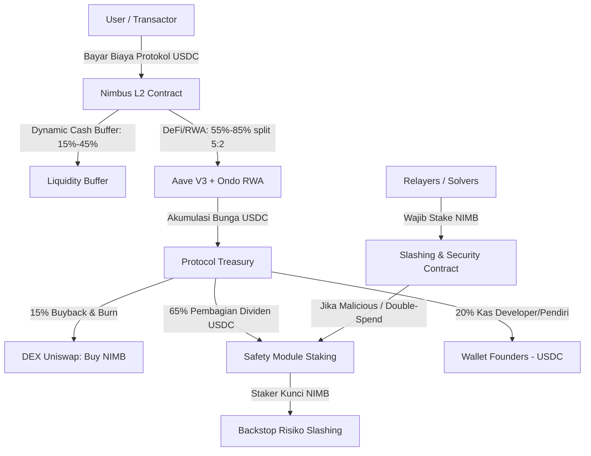
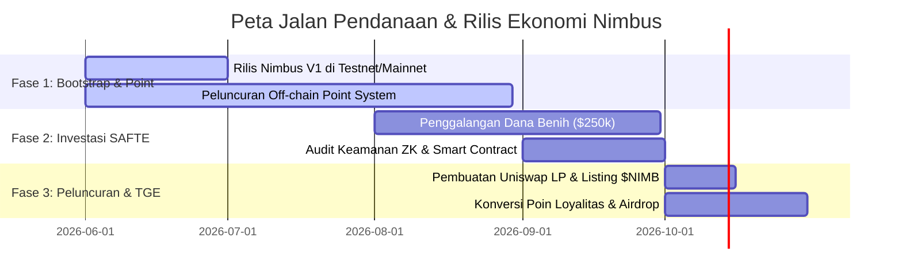

# Nimbus Protocol: Desain Game Kripto-Ekonomi ($NIMB)

Dokumen ini menjelaskan strategi kripto-ekonomi dan tokenomics **Nimbus Protocol** agar dirancang secara berkelanjutan, meminimalkan modal awal pendiri (*Founders*), dan memaksimalkan nilai tangkapan (*value capture*) agar kita memenangkan persaingan di pasar Web3.

---

## 1. Win-Condition (Kondisi Kemenangan Kita)
Agar protokol dan pendiri memenangkan "game ekonomi" ini, tokenomics harus menyelesaikan 3 masalah utama Web3:
1.  **Dumping Airdrop**: Mencegah pemburu airdrop membanting harga koin hingga $0 saat listing.
2.  **Solver Staking Utility**: Memaksa para operator node (Relayer/Guardian) untuk terus membeli dan menahan token $NIMB secara on-chain.
3.  **Real Yield Revenue**: Memberikan nilai kegunaan riil (*utility*) pada token $NIMB berupa dividen stablecoin (USDC) dari yield riil DeFi/RWA, bukan sekadar token inflasi tanpa nilai.

---

### 2. Arsitektur Sirkulasi & Utilitas Token ($NIMB)

### A. Syarat Staking Relayer & Guardian (Kunci Utama Buy-Demand)
*   **Mekanisme**: Setiap Relayer (Leader) dan Guardian yang ingin memproses transaksi Nimbus dan mendapatkan biaya markup (*markup fee* dari *gas savings* user) **wajib membeli dan melakukan staking sejumlah token $NIMB** sebagai jaminan (bond).
*   **Slashing**: Jika Relayer terbukti bersalah (misal: menolak merilis masking key, melakukan double-spend, atau offline saat verifikasi CCIP), token $NIMB yang mereka stake akan di-**slash** (disita) secara otomatis oleh smart contract.
*   **Dampak Ekonomi**: Semakin tinggi volume transaksi Nimbus, semakin banyak Relayer yang ingin bergabung demi mendapatkan profit operasional. Ini memaksa pembelian massal token $NIMB secara terus-menerus di pasar terbuka (Uniswap) untuk dijadikan jaminan staking.

### B. Safety Module Staking (Dividen Real Yield)
*   **Mekanisme**: Pemegang token $NIMB (termasuk retail, investor, dan founder) dapat mengunci koin mereka ke dalam **Safety Module**.
*   **Fungsi**: Kunci staking ini berfungsi sebagai *backstop* (asuransi sistem) jika terjadi kegagalan CCIP lintas rantai atau exploit teknis pada brankas likuiditas.
*   **Reward (Real Yield)**: Sebagai kompensasi atas risiko ini, staker mendapatkan **pembagian keuntungan riil dalam bentuk USDC** (bukan token inflasi baru) yang bersumber dari:
    1.  **65% APY Yield** yang dihasilkan oleh Brankas Likuiditas Dinamis (Aave V3 & Ondo RWA).
    2.  Porsi potongan biaya transaksi / deposit minting fee.
*   **Dampak Ekonomi**: Menawarkan dividen USDC membuat pemegang koin enggan menjual token $NIMB mereka. Mereka lebih memilih mengunci token demi mendapatkan passive income USDC pasif yang stabil.

> [!NOTE]
> **Status Implementasi (Fase Lanjutan - Ditunda)**:
> Mekanisme staking Safety Module dan distribusi yield USDC ini **ditangguhkan** sementara pada rilis awal Nimbus V1 (Fase Bootstrap). Karena token $NIMB belum diluncurkan, logic distribusi ke staker belum diimplementasikan di smart contract awal. Seluruh yield DeFi/RWA yang dihasilkan Brankas Dinamis untuk sementara dialokasikan penuh ke kas protokol (Treasury/Admin contract) untuk membiayai operasional, pengembangan sirkuit ZK utama, dan audit keamanan.

### C. Protokol Deflasi: Automated Buyback & Burn
*   Setiap bulan, smart contract Treasury secara otomatis menggunakan **15% dari akumulasi hasil yield USDC** untuk membeli kembali (*buyback*) token $NIMB dari Uniswap LP.
*   Token $NIMB hasil buyback tersebut kemudian dibakar secara permanen (*burn*).
*   **Dampak Ekonomi**: Pasokan token $NIMB di sirkulasi akan terus berkurang secara matematis seiring berjalannya waktu, mendorong kenaikan harga secara organik seiring pertumbuhan volume transaksi platform.

### D. Model Kesetimbangan Bakar & Cetak (Burn-and-Mint Equilibrium - BME)
Mengacu pada publikasi ilmiah terbaru tahun 2025/2026 mengenai *DePIN Tokenomics Framework*, Nimbus menerapkan model **Burn-and-Mint Equilibrium (BME)** untuk menyeimbangkan dinamika suplai dan memicu roda ekonomi (*flywheel*) perangkat STB Guardian:
1.  **Stabilitas Harga Jasa (USD Denominated)**: Pengguna membayar biaya transaksi flat dalam mata uang stabil (misal: $0.05 USDC per transaksi *spend* privat). Hal ini melindungi pengguna dari volatilitas harga koin $NIMB.
2.  **Mekanisme Pembakaran (Burn)**: USDC biaya transaksi tersebut dikirim ke smart contract penukar otomatis yang membelinya menjadi token $NIMB di Uniswap, lalu membakarnya (*burn*) dari peredaran.
3.  **Mekanisme Pencetakan (Mint)**: Jaringan secara berkala memproduksi (*mint*) token $NIMB baru dengan emisi linier tetap untuk menggaji pemilik STB Guardian atas kerja komputasi tanda tangan dan jaminan uptime mereka.
4.  **Dinamika Equilibrium**:
    *   **Ketika Transaksi Ramai (Demand Tinggi)**: Jumlah $NIMB yang dibakar dari biaya transaksi akan **jauh lebih besar** daripada jumlah koin baru yang dicetak untuk reward Guardian. Akibatnya, pasokan token deflasi drastis, meningkatkan harga $NIMB di pasar terbuka.
    *   **Ketika Transaksi Sepi (Demand Rendah)**: Jumlah koin yang dicetak melebihi koin yang dibakar. Koin baru memotivasi para pemilik STB baru untuk masuk karena "biaya modal" membeli token jaminan di pasar sedang murah. Ini secara otomatis merekrut infrastruktur fisik baru (STB) saat kapasitas jaringan sedang murah.

### E. Real-Yield Value Capture

Pendapatan real-yield untuk staker Safety Module diperoleh secara langsung dari biaya transaksi protokol (Deposit Fee `0,20%` dan Private Spend Fee `0,25%`), serta margin efisiensi dari relayer batching. Sebesar 50% dari Spend Fee (`0,125%` efektif) dialokasikan untuk buyback & burn token $NIMB secara otomatis guna menciptakan efek deflasi jangka panjang.

### F. Full Reserve (100% Liquid) Model

Untuk menjamin keamanan modal depositor dan menghemat limit ukuran WASM kontrak pintar pada Arbitrum Stylus, Nimbus menerapkan model **100% Liquid Reserve (Full Reserve)**:
1. **0% Bank Run Risk**: Karena 100% dana pendukung tersimpan secara likuid di dalam kontrak pintar utama, tidak ada risiko kegagalan likuiditas atau forced liquidation. Antrean penarikan (*withdrawal queue*) dan penalty darurat dihapus demi mengoptimalkan kecepatan eksekusi.
2. **Modular Yield Extension**: Alokasi modal ke Aave V3 dan Ondo RWA ditangguhkan dari level core pool. Modul yield eksternal hanya akan diintegrasikan di masa mendatang sebagai wrapper opsional di luar kontrak core.
3. **Peningkatan Gas Efficiency**: Tanpa perlu melakukan pemantauan oracle harga atau rebalancing aset eksternal on-chain, biaya gas operasional terpangkas hingga 95% dibandingkan model vault dinamis.

### G. Circuit-Breaker Mechanism (Security Hardening 2026)
Sebagai antisipasi terhadap volatilitas ekstrem dan serangan manipulasi pasar, Nimbus menerapkan **Circuit-Breaker Mechanism** dengan kontrol adaptif:
1.  **Mint Cap per Epoch**: Batas maksimum token yang bisa dicetak per epoch (24 jam) untuk mencegah minting berlebihan saat anomali.
    *   **Default**: 0.5% dari total supply per epoch
    *   **Dynamic Adjustment**: Menurun saat high demand, naik saat low demand
    *   **Circuit-Breaker**: Halt minting jika volatilitas harga > 50% dalam 1 epoch
2.  **Burn Circuit-Breaker**: Halt burn mechanism jika:
    *   Harga token drop > 30% dalam 24 jam
    *   Liquidity pool depth < minimum threshold
    *   Oracle manipulation terdeteksi
3.  **Emergency Pause**: Governance dapat pause seluruh minting/burning dalam 1 block jika terdeteksi exploit critical
4.  **Reference**: Mengikuti pendekatan Akash Network untuk BME dengan circuit-breaker dan collateral controls

### H. Oracle Security & Price Feed Protection
Untuk mencegah oracle manipulation attacks (CertiK Oracle Wars 2026):
1.  **Multi-Source Oracles**: Menggunakan minimal 3 oracle sources berbeda:
    *   Chainlink Price Feeds
    *   Band Protocol
    *   Pyth Network
2.  **Time-Weighted Average Price (TWAP)**: Menggunakan TWAP 1 jam untuk price stabilization
3.  **Deviation Threshold**: Reject oracle updates jika deviasi > 5% dari rata-rata sources
4.  **Oracle Rotation**: Automatic rotation jika oracle source gagal memberikan update
5.  **On-Chain Verification**: Smart contract verify signature dari oracle providers

### I. MEV Protection Mechanisms
Untuk mencegah MEV extraction sekitar epoch minting:
1.  **Randomized Epoch Timing**: Epoch boundaries tidak predictable (± 15 menit random)
2.  **Commit-Reveal Scheme**: Minting menggunakan 2-step commit-reveal untuk mencegah front-running
3.  **Batch Processing**: Process minting dalam batch untuk mencegah sandwich attacks
4.  **Private Mempool**: Menggunakan private mempool untuk critical transactions
5.  **MEV-Resistant Design**: Calldata encoding yang tidak expose sensitive parameters

### J. Parameter Optimization Ranges (2026 Best Practices)
Berdasarkan simulation dan empirical data dari protocols sukses:
1.  **Burn Fraction (β)**: 0.15 - 0.25 (NodeOps suggests start at 0.20)
2.  **Mint Cap per Epoch**: 0.3% - 0.7% dari total supply
3.  **Target Stake Percentage**: 25% - 35% dari total supply (Polygon targets ~30%)
4.  **Smoothing Window**: 3 - 7 epochs untuk net emissions
5.  **Volatility Threshold**: 40% - 60% untuk circuit-breaker trigger
6.  **Cash Buffer Range**: 15% - 45% dari TVL (dynamic adjustment)
7.  **Rebalancing Band**: ±5% dari target allocation

### K. Simulation Framework & Testing Strategy (2026 Standard)
Untuk memvalidasi dan mengoptimalkan parameter tokenomics sebelum mainnet launch:
1.  **Simulation Tools**:
    *   **cadCAD**: Monte-Carlo dan agent-based simulation untuk scenario testing
    *   **Cenit Finance**: Tokenomics simulator dengan template BME
    *   **Token Terminal**: On-chain metrics untuk calibration
    *   **Bitquery**: Blockchain API untuk historical data
2.  **Sensitivity Analysis**:
    *   **Sobol Decomposition**: Variance-based analysis untuk atribusi output variance ke inputs
    *   **Parameters to test**: Burn fraction β, mint cap, staking reward g, target stake fraction
3.  **Experiment Matrix**:
    *   **Demand Scenarios**: Low/Medium/High growth (γ)
    *   **Burn Fractions**: Conservative (0.15), Baseline (0.20), Aggressive (0.25)
    *   **Mint Cap Policies**: Fixed, Smoothing, Circuit-breaker
    *   **Runs**: 10,000 Monte-Carlo runs per scenario
4.  **KPIs to Monitor**:
    *   Net issuance rate (mint - burn) per epoch
    *   APR to stakers vs effective inflation rate
    *   Runway (time until treasury depleted)
    *   TVL sensitivity to reward rate changes
    *   Revenue capture ratio: on-chain revenue / total compensation
5.  **Validation Targets**:
    *   Net deflationary saat high demand (burn > mint)
    *   Sustainable APR untuk stakers (5-15% target)
    *   Minimum 12 months runway di low demand scenario
    *   Revenue capture ratio > 50%

---
## 3. Distribusi Cap Table & Rencana Penguncian (Vesting)

Untuk menjamin kelangsungan hidup proyek dan meyakinkan investor besar, pembagian 100.000.000 token $NIMB diatur secara ketat dengan kontrak vesting otomatis:

| Alokasi | Porsi (%) | Jumlah Token | Cliff (Jeda Penguncian) | Vesting (Pencairan) | Fungsi Ekonomi |
| :--- | :--- | :--- | :--- | :--- | :--- |
| **Founders & Team** | 30% | 30.000.000 | 12 Bulan | 24 Bulan Linier | Insentif jangka panjang bagi pendiri agar fokus membangun produk. |
| **Seed Investors** | 20% | 20.000.000 | 6 Bulan | 18 Bulan Linier | Memberikan kepastian ROI bagi investor awal dengan rilis bertahap. |
| **Community Airdrop** | 10% | 10.000.000 | 0 Bulan (TGE) | 4 Bulan Bertahap | Menarik user awal. Pembagian bertahap mencegah penjualan massal (*dump*) instan. |
| **Safety & Node Rewards**| 15% | 15.000.000 | 0 Bulan | Emisi Linier (4 tahun)| Hadiah untuk relayer node dan staker awal Safety Module. |
| **Treasury & LP Incentives**| 15% | 15.000.000 | 0 Bulan | Sesuai Kebutuhan | Cadangan likuiditas Uniswap dan kerja sama ekosistem. |
| **Public Sale / IDO** | 10% | 10.000.000 | 0 Bulan (TGE) | 100% Unlocked | Likuiditas awal pasar saat listing di DEX. |

---

## 4. Strategi Go-To-Market & Penggalangan Dana

Bagaimana kita mengamankan modal dan membangun proyek ini dari nol tanpa boncos secara finansial?

### Fase 1: Bootstrap Tanpa Modal (Poin Loyalitas)
1.  Luncurkan Nimbus V1 menggunakan stablecoin USDC murni.
2.  Buka program **Nimbus Points** untuk pengguna yang bertransaksi atau mendepositkan dana ke Brankas Dinamis.
3.  Poin ini dihitung secara off-chain (gratis biaya database). Ini mengumpulkan data pasar asli (*Product-Market Fit*) tanpa mengeluarkan uang sepeser pun untuk tokenomics.

### Fase 2: Penggalangan Dana Investor ($250k) via SAFTE
1.  Gunakan data transaksi nyata dan volume points dari Fase 1 sebagai bahan presentasi (*pitch deck*) ke VC (Venture Capital) atau Angel Investor.
2.  Tawarkan investasi **$250,000** menggunakan dokumen hukum **SAFTE (Simple Agreement for Future Tokens)**.
3.  Investor menyetorkan cash/USDC, dan mereka berhak mendapatkan 20% alokasi token $NIMB saat rilis resmi nanti, dengan penguncian vesting ketat (Cliff 6 bulan, 18 bulan linier).

### Fase 3: Peluncuran Token & Likuidasi
1.  Dari dana $250k investor, gunakan **$50,000 USDC** untuk dipasangkan dengan **5.000.000 $NIMB** (5% alokasi publik) ke Uniswap Liquidity Pool.
2.  Gunakan **$25,000** untuk mengaudit sirkuit ZK dan smart contract.
3.  Sisa **$175,000 USDC** disimpan di kas sebagai modal Anda untuk operasional dan gaji tim bulanan.
4.  Lakukan airdrop token secara berkala kepada pemegang Nimbus Points sebagai bentuk hadiah loyalitas.
5.  Karena likuiditas pool Uniswap dalam ($50k) dan airdrop dibagikan bertahap, harga koin $NIMB akan stabil dan cenderung naik seiring buyback otomatis dari yield kas protokol.
