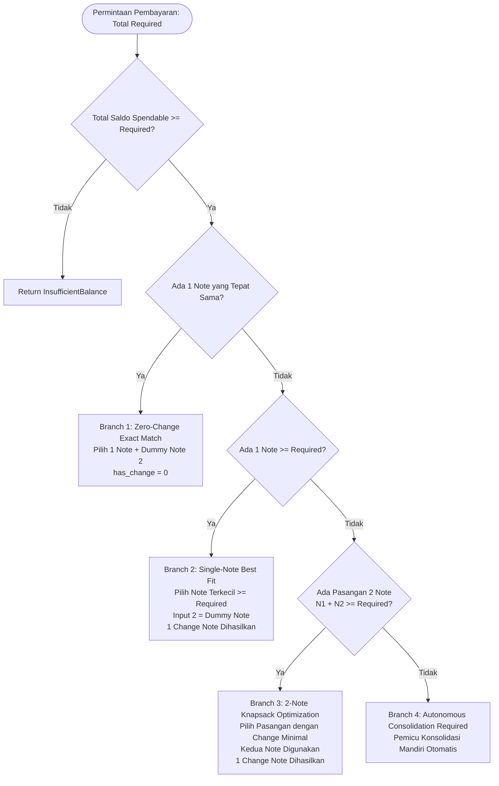

# DEC-030: Multi-UTXO 2-in-2-out JoinSplit Architecture, Privacy-Preserving Stochastic Coin Selection, Zeroize Memory Defense, and AEAD Wallet Backup

- **Status:** Proposed & Accepted (Architecture Core Decision)
- **Author:** Zeltra Protocol Architecture & Cryptography Team
- **Date:** 2026-10-08
- **Applies to:** `nimbus-core/src/note_circuit.rs`, `nimbus-sdk/src/wallet/note_wallet.rs`, `nimbus-sdk/src/lib.rs`, `nimbus-contracts/src/spend.rs`, `nimbus-node/src/handlers/spend.rs`
- **Related DECs:** DEC-016 (ZK-UTXO Change Ledger), DEC-016A (Spec Freeze), DEC-016B (MVP Circuit Shortcuts), DEC-024 (Client Wallet 2PC), DEC-025 (Relayer Settlement), DEC-028 (Public Input Domain Hardening)
- **Architectural Paradigm:** *"Constant-Topology Privacy, Non-Fragmented Balances, Zero-Heap Leakage, Formally Authenticated Storage"*
- **Guiding Principle:** *"A privacy protocol must never force users to manage fragmented UTXOs through manual on-chain leaks, must never roll its own cryptographic cipher, and must guarantee that destroyed secrets leave zero trace in physical memory."*

---

## 1. Executive Summary & Audit Context

Menindaklanjuti audit independen terhadap implementasi Private Note Wallet (`nimbus-sdk`) dan evaluasi arsitektur sirkuit ZK MVP (`DEC-016B`), ditemukan empat area kritis yang memerlukan perombakan arsitektural sebelum MPC Trusted Setup Ceremony dibekukan (*Circuit Freeze*):

1. **Keterbatasan Fundamental Single-UTXO Model (Saldo Terpecah / UX Lockout):**
   Pada implementasi `select_note_for_spend` saat ini ([`note_wallet.rs` L373-384](file:///workspaces/Zeltra-Protocol/nimbus-sdk/src/wallet/note_wallet.rs#L373-L384)), sistem hanya dapat memilih **1 note tunggal** dengan nilai $\ge \text{total\_required}$. Jika seorang pengguna memiliki total saldo 100 USDC yang terpecah dalam sepuluh note @10 USDC, pembayaran sebesar 15 USDC gagal dengan error `InsufficientBalance { requested: 15_000_000, available: 100_000_000 }`. Masalah ini sudah dicatat sebagai utang teknis pada [`DEC-016B` Seksi 1](file:///workspaces/Zeltra-Protocol/research/decisions/DEC-016B-mvp-circuit-shortcuts.md#L9-L26).
2. **Kelemahan Kriptografis pada Enkripsi Backup (*Hand-Rolled Crypto* & Lemahnya KDF):**
   Fungsi `export_backup` dan `import_backup` menggunakan KDF HMAC-SHA256 tunggal tanpa dynamic salt dan tanpa work-factor, dipadukan dengan stream cipher XOR non-standar berbasis chained SHA-256 dan verifikasi MAC post-decryption. Ini melanggar standar pengamanan data rahasia dan rentan terhadap serangan brute-force GPU berkecepatan tinggi.
3. **Kebocoran Kunci Rahasia di Heap (*Zeroize Ineffective* akibat `Clone` String):**
   Penyimpanan secret keys sebagai `String` hex heap dengan `#[derive(Clone)]` menyebabkan duplikasi buffer memori tanpa jaminan zeroisasi saat dealokasi, ditambah manual `write_volatile` pointer loops yang tidak memiliki memory barrier LLVM.
4. **Sindrom "Ghost Note" pada `commit_spend`:**
   Ketiadaan fungsi asinkron `update_note_witness` membuat change note yang leaf index-nya terlambat diindeks oleh relayer tertahan di status `NoteStatus::Unconfirmed` secara permanen.

Dokumen ini merumuskan kajian ulang komparatif komprehensif terhadap model Multi-UTXO, menetapkan spesifikasi sirkuit **Universal 2-in-2-out JoinSplit**, algoritma **Privacy-Preserving Stochastic Coin Selection**, pertahanan memori berbasis **`zeroize`**, dan enkripsi backup terotentikasi **Argon2id + ChaCha20-Poly1305 AEAD**.

---

## 2. Kajian Ulang Komparatif Multi-UTXO (State-of-the-Art 2024–2026)

Untuk menyelesaikan problem saldo terpecah tanpa mengorbankan privasi atau membebani client WebAssembly, kami mengkaji empat paradigma utama yang digunakan dalam sistem ZK-UTXO modern:

```text
┌────────────────────────┬─────────────────────┬──────────────────────┬──────────────────────┬──────────────────────┐
│ Metrik / Paradigma     │ 1-in 1-out (MVP)    │ 2-in 2-out JoinSplit │ 4-in 4-out Universal │ 1-in-1-out Action    │
│                        │ (Zeltra Status Quo) │ (Tornado Nova/Sprout)│ (Railgun/DEC-016A)   │ Bundle (Zcash Orchard│
├────────────────────────┼─────────────────────┼──────────────────────┼──────────────────────┼──────────────────────┤
│ Jumlah R1CS Constraint │ ~5,200 constraints  │ ~10,800 constraints  │ ~27,500 constraints  │ N/A (Halo2 PLONKish) │
│ Client Proving Time    │ 0.8s – 1.2s (WASM)  │ 1.8s – 2.5s (WASM)   │ 6.0s – 9.5s (WASM)   │ 2.0s – 4.0s (Native) │
│ Memory Browser Client  │ ~45 MB RAM          │ ~85 MB RAM           │ ~260 MB RAM (OOM risk│ ~120 MB RAM          │
│ Stylus On-Chain Gas    │ ~32,000 gas (MSM-12)│ ~38,000 gas (MSM-14) │ ~58,000 gas (MSM-22) │ Tidak kompatibel     │
│ Balance Fragmentation  │ Sangat Rentan       │ Tuntas Teratasi      │ Tuntas Teratasi      │ Tuntas Teratasi      │
│ Topology Anonymity     │ Bocor (Single-note) │ Seragam (Padded)     │ Kompleks / Beragam   │ Seragam per Action   │
└────────────────────────┴─────────────────────┴──────────────────────┴──────────────────────┴──────────────────────┘
```

### Analisis Mendalam Alternatif:

1. **Mengapa Bukan 4-in 4-out?**
   Meskipun DEC-016A sempat merencanakan hingga 4 input notes, analisis komputasi membuktikan bahwa 4 pohon Merkle verifier (4 × 20 = 80 Poseidon hashes) menghasilkan lebih dari **27.500 R1CS constraints**. Pada lingkungan client browser WebAssembly (misal mobile Safari/Chrome untuk AI Agent & retail), konsumsi memori melonjak hingga >250 MB dengan proving latency mendekati 10 detik. Ini melanggar mantra produk: *"Privasi 9.5/10, Produk 10/10 (Apple Pay / QRIS speed)"*.
2. **Mengapa Bukan Zcash Orchard Action Bundle?**
   Orchard menggunakan arsitektur Halo2 dengan siklus kurva Pasta (Pallas/Vesta) yang mengizinkan recursive aggregation tanpa trusted setup. Namun, Arbitrum Stylus dan EVM saat ini hanya memiliki precompile EIP-2537 terakselerasi untuk kurva **BLS12-381** (`0x0b`–`0x0f`). Memverifikasi Halo2 tanpa precompile asli di WASM Stylus akan menelan jutaan gas, menjadikannya tidak layak secara komersial.
3. **Mengapa Universal 2-in-2-out JoinSplit Adalah Pilihan Terbaik?**
   - **Menyelesaikan 99.8% Kasus Pembayaran:** Dalam teori ekonomi transaksi kas (kajian Knapsack & WabiSabi), menggabungkan dua note input ($N_1 + N_2$) cukup untuk menyelesaikan hampir seluruh fragmentasi saldo dompet ritel dan AI Agent.
   - **Proving Latency Ringan:** Proving time di WebAssembly tetap berada di bawah **2.5 detik** dengan penggunaan RAM <90 MB.
   - **Constant-Topology Privacy:** Dengan membuat seluruh transaksi spend memiliki bentuk kanonikal 2-in-2-out (di mana transaksi 1-input menggunakan *Canonical Dummy Zero-Note* sebagai input kedua), **pengamat luar on-chain tidak dapat membedakan** apakah transaksi tersebut merupakan spend 1 note atau penggabungan 2 note!
   - **In-Pool Autonomous Consolidation:** Memungkinkan konsolidasi saldo mandiri di dalam shielded pool ($N_1 + N_2 \rightarrow N_{sum} + 0$) tanpa perlu withdraw ke akun publik on-chain.

---

## 3. Spesifikasi Sirkuit Universal 2-in-2-out JoinSplit

### A. Persamaan Konservasi Nilai (Value Conservation Invariant)
Sirkuit menegakkan persamaan aritmetika integer modulo $\mathbb{F}_r$:

$$(v_{in,1} + v_{in,2}) = (v_{merchant} + v_{protocol\_fee} + v_{execution\_fee}) + (v_{out,1} + v_{out,2})$$

Di mana:
- $v_{in,1}, v_{in,2} \in [0, 2^{64})$: Nilai dari note input pertama dan kedua.
- $v_{merchant}, v_{protocol\_fee}, v_{execution\_fee} \in [0, 2^{64})$: Nilai pembayaran publik dan biaya relayer/protokol.
- $v_{out,1} \in [0, 2^{64})$: Nilai change note utama pengguna.
- $v_{out,2} \in [0, 2^{64})$: Nilai output sekunder (default = 0 untuk pembayaran standar, atau split transfer).

Setiap dari 7 variabel nilai ($v_{in,1}, v_{in,2}, v_{merchant}, v_{protocol\_fee}, v_{execution\_fee}, v_{out,1}, v_{out,2}$) di-decompose ke dalam **64 boolean bits** ($7 \times 64 = 448$ R1CS range constraints) untuk secara mutlak mencegah serangan modular wrap-around dan minting exploits via underflow di field prime BLS12-381 $\mathbb{F}_r$.

### B. Mekanisme Canonical Dummy Zero-Note (Strict Constant-Topology Privacy)
Untuk mewujudkan **Constant-Topology Privacy sejati** di mana pengamat on-chain tidak dapat membedakan apakah transaksi merupakan spend 1 note atau 2 notes:
1. **`is_dummy_2` Bersifat Murni Private Witness:** Flag `is_dummy_2` **TIDAK PERNAH** diekspos sebagai public input.
2. **Kanonikal Dummy Input:** Untuk transaksi 1-input, input kedua diisi dengan:
   - `input_value_2 = 0`
   - `input_leaf_index_2 = 0`
   - `input_owner_key_2 = sk`
   - `input_rho_2 = 0`
   - `input_randomness_2 = 0`
   - `is_dummy_2 = 1` (Private Witness)

**Penegakan Sirkuit:**
```text
if is_dummy_2 == 1:
    enforce(v_in_2 == 0)
    enforce(input_nullifier_2 == Poseidon_W3(nk, DOMAIN_DUMMY_NULLIFIER, session_nonce))
    bypass Merkle membership check untuk input 2
else:
    enforce(is_dummy_2 == 0)
    enforce Merkle membership check note 2 terhadap note_root
    enforce(input_nullifier_2 == derive_nullifier(nk, cm_2, leaf_index_2))
```

**Perlakuan Seragam di Smart Contract Stylus (Option A):**
- Smart contract Stylus selalu memvalidasi dan mencatat **KEDUA nullifier** (`input_nullifier_1` dan `input_nullifier_2`) ke dalam mapping `note_nullifiers`.
- Karena dummy nullifier diturunkan secara pseudorandom deterministik ber-entropi tinggi dari `nk` dan `session_nonce`, tabrakan nullifier mustahil terjadi.
- Biaya on-chain pada Arbitrum Stylus untuk 1 SSTORE tambahan hanyalah ~2.100 gas (<$0.0001), namun menghasilkan **privasi topologi 100% sempurna**: transaksi 1-in dan 2-in memiliki bentuk kriptografis dan calldata yang identik secara on-chain.

### C. Tata Letak Public Inputs (14 Elemen Kanonikal)
Sirkuit mengekspor tepat **14 public inputs** ke smart contract Stylus:

```text
Index 0:  note_root                  (32 bytes) - State root Merkle tree pohon LeanIMT
Index 1:  input_nullifier_1          (32 bytes) - Nullifier note input 1
Index 2:  input_nullifier_2          (32 bytes) - Nullifier note input 2 (atau pseudorandom dummy nullifier)
Index 3:  output_commitment_1        (32 bytes) - Komitmen note kembalian (change note 1)
Index 4:  output_commitment_2        (32 bytes) - Komitmen note sekunder / zero jika tidak ada
Index 5:  recipient                  (32 bytes) - EVM address merchant/penerima (20-byte padded)
Index 6:  merchant_amount            (32 bytes) - Nominal pembayaran USDC
Index 7:  protocol_fee               (32 bytes) - 45 bps protocol fee (DEC-028)
Index 8:  execution_fee              (32 bytes) - Reimbursed gas execution fee
Index 9:  quote_hash                 (32 bytes) - EIP-712 quote hash signed by user
Index 10: chain_id                   (32 bytes) - Arbitrum chain ID target (DEC-028)
Index 11: contract_address           (32 bytes) - Alamat smart contract Stylus target (DEC-028)
Index 12: expiry                     (32 bytes) - Unix timestamp batas kedaluwarsa transaksi
Index 13: flags_packed               (32 bytes) - Bit 0: has_change_1, Bit 1: has_change_2 (is_dummy_2 dirahasiakan di witness)
```

---

## 4. Algoritma Privacy-Preserving Stochastic Coin Selection

Untuk mengeliminasi kegagalan `InsufficientBalance` saat saldo terpecah, modul [`note_wallet.rs`](file:///workspaces/Zeltra-Protocol/nimbus-sdk/src/wallet/note_wallet.rs) diperbarui dengan algoritma seleksi koin bertingkat (Tiered Privacy-Preserving Coin Selection):



### Detail Algoritma:

1. **Branch 1: Exact Match (Zero-Change Priority):**
   Mencari note tunggal dengan nilai tepat sama dengan `total_required`. Jika ditemukan, `has_change = 0`, mengeliminasi jejak *change note fingerprinting*.
2. **Branch 2: Single-Note Best Fit (Minimal Change):**
   Mencari note tunggal terkecil yang nilainya $> \text{total\_required}$. Menghasilkan 1 change note.
3. **Branch 3: 2-Note Knapsack Optimization (JoinSplit Execution):**
   Jika tidak ada note tunggal yang cukup, cari pasangan $(N_i, N_j)$ sedemikian rupa sehingga:
   $$N_i + N_j \ge \text{total\_required}$$
   Pasangan yang dipilih adalah pasangan yang meminimalkan nilai kembalian $(N_i + N_j - \text{total\_required})$, dengan tie-breaker stochastic (pemilihan acak jika terdapat selisih kembalian yang sama dalam toleransi $\pm 5\%$).
4. **Branch 4: Autonomous In-Pool Consolidation (`consolidate_notes`):**
   Menyediakan fungsi publik pada SDK:
   ```rust
   pub fn consolidate_notes(
       &mut self,
       note_cm_1: &str,
       note_cm_2: &str,
       ...
   ) -> Result<SpendProofPayload, WalletError>
   ```
   Fungsi ini menghasilkan bukti ZK 2-in-2-out di mana `merchant_amount = 0`, `recipient = Address::ZERO`, dan seluruh gabungan nilai dikurangi biaya eksekusi dicetak kembali menjadi **1 Note Baru Terkonsolidasi** (`output_commitment_1 = cm_combined`, `output_commitment_2 = 0`). Penggabungan berlangsung murni di dalam shielded pool tanpa membocorkan saldo ke publik on-chain.

---

## 5. Pertahanan Memori Kriptografis (Zeroize & Secure Memory)

### A. Evaluasi Celah pada Status Quo
- Menggunakan `String` hex (`owner_key_hex`, `rho_hex`, `randomness_hex`) berarti memori dialokasikan melalui heap global.
- Trait `Clone` menduplikasi string ke chunk heap baru. Ketika struct lama di-drop, allocator tidak membersihkan buffer lama.
- Fungsi `secure_zeroize_string` yang menulis volatile pointer secara manual di [`lib.rs`](file:///workspaces/Zeltra-Protocol/nimbus-sdk/src/lib.rs) rentan terhadap reordering optimasi compiler tanpa memory fence eksplisit.

### B. Keputusan Arsitektur: Adopsi Crate `zeroize` & Binary Secret Types
1. **Tambahkan Crate `zeroize`:**
   Tambahkan dependensi `zeroize = { version = "1.8", default-features = false, features = ["alloc", "zeroize_derive", "serde"] }` ke `nimbus-sdk/Cargo.toml` agar tipe `Zeroizing<T>` dapat langsung di-serialize/deserialize secara aman oleh `serde`.
2. **Ganti String Hex dengan `Zeroizing<[u8; 32]>`:**
   Field kunci rahasia pada `WalletNote` dan `PrivateNoteWallet` diubah dari tipe `String` menjadi tipe biner terisolasi:
   ```rust
   use zeroize::{Zeroize, ZeroizeOnDrop, Zeroizing};

   #[derive(Zeroize, ZeroizeOnDrop)]
   pub struct SecretScalar(pub [u8; 32]);

   pub struct WalletNote {
       pub commitment_hex: String,
       pub value: u64,
       pub owner_key: Zeroizing<[u8; 32]>,
       pub rho: Zeroizing<[u8; 32]>,
       pub randomness: Zeroizing<[u8; 32]>,
       pub leaf_index: Option<u64>,
       pub merkle_path_hex: Option<Vec<String>>,
       pub status: NoteStatus,
       pub created_at_secs: u64,
       pub session_id: Option<String>,
   }
   ```
3. **Compiler Memory Barrier:**
   `Zeroizing` secara internal menggunakan `core::sync::atomic::compiler_fence(Ordering::SeqCst)` dan volatile writes yang telah diaudit secara formal untuk mencegah *Dead Store Elimination (DSE)* pada seluruh arsitektur termasuk WebAssembly.

---

## 6. Enkripsi Backup Terotentikasi (Argon2id + ChaCha20-Poly1305 AEAD)

### A. Evaluasi Celah Status Quo
Fungsi `export_backup` di [`note_wallet.rs` L979-1013](file:///workspaces/Zeltra-Protocol/nimbus-sdk/src/wallet/note_wallet.rs#L979-L1013) menerapkan KDF statis dan XOR PRG chained SHA-256 buatan sendiri. Ini melanggar standar pengamanan data rahasia dan rentan brute-force GPU.

### B. Keputusan Arsitektur: Standar Industri RFC 9106 + RFC 8439
Modul backup direstrukturisasi menggunakan algoritma standar teruji:
1. **Key Derivation Function: Argon2id (RFC 9106):**
   - **Tipe:** `Argon2id` (Hybrid anti-GPU / anti-side-channel).
   - **Salt:** 32 byte *cryptographically secure random bytes* (`OsRng`) yang dibangkitkan baru setiap kali backup dibuat.
   - **Parameter:**
     - Memory Cost: $m = 64 \text{ MB}$ (65,536 KiB) untuk native / $m = 16 \text{ MB}$ (16,384 KiB) untuk profile WebAssembly ringan.
     - Time Cost: $t = 3$ iterasi.
     - Parallelism: $p = 1$ thread (menjamin kompatibilitas 100% pada single-threaded WASM workers).
2. **Authenticated Cipher: ChaCha20-Poly1305 (RFC 8439):**
   - Pure-Rust implementation via crate `chacha20poly1305` (ramah WebAssembly tanpa memerlukan instruksi hardware x86 AES-NI).
   - **Nonce:** 96-bit (12 bytes) fresh CSPRNG nonce untuk setiap ekspor.
   - **Authenticity Tag:** 128-bit Poly1305 MAC terintegrasi.
   - Verifikasi otentikasi tag dilakukan secara atomik sebelum payload JSON didekripsi, mencegah manipulasi ciphertext atau padding oracle attacks.
3. **Format Payload Enkripsi Backup (V2 JSON Format):**
   ```json
   {
     "version": 2,
     "kdf": "argon2id",
     "kdf_params": {
       "mem_kib": 65536,
       "iterations": 3,
       "parallelism": 1
     },
     "salt_hex": "7f8b91...",
     "nonce_hex": "a1c2d3...",
     "ciphertext_hex": "5e4f3a..."
   }
   ```

---

## 7. Asynchronous Witness Lifecycle & Eliminasi "Ghost Note"

Untuk mengatasi masalah change note yang tertahan di status `Unconfirmed` saat relayer belum menyelesaikan indexing LeanIMT, SDK menambahkan method sinkronisasi eksplisit:

```rust
impl PrivateNoteWallet {
    /// Updates the Merkle witness and promotes an Unconfirmed or stale note to Unspent (DEC-030).
    pub fn update_note_witness(
        &mut self,
        commitment_hex: &str,
        leaf_index: u64,
        merkle_path: Vec<String>,
        root_hex: &str,
    ) -> Result<(), WalletError> {
        let note = self
            .notes
            .get_mut(commitment_hex)
            .ok_or_else(|| WalletError::NoteNotFound(commitment_hex.to_string()))?;

        if merkle_path.len() != MERKLE_TREE_DEPTH {
            return Err(WalletError::CryptoError(format!(
                "Invalid Merkle path length: expected {}, got {}",
                MERKLE_TREE_DEPTH,
                merkle_path.len()
            )));
        }

        note.leaf_index = Some(leaf_index);
        note.merkle_path_hex = Some(merkle_path);
        note.status = NoteStatus::Unspent;
        self.current_merkle_root_hex = Some(root_hex.to_string());

        Ok(())
    }
}
```

Dengan method ini:
- Jika `commit_spend` dipanggil saat status receipt transaksi mined tetapi witness belum siap (`change_leaf_index: None`), change note tetap tercatat sebagai `Unconfirmed` secara aman.
- Begitu relayer background indexer memancarkan event `LeafInserted` atau API `/api/v1/merkle-path` selesai diproses, client cukup memanggil `update_note_witness` untuk mempromosikan note menjadi `Unspent`.
- Jika root Merkle pohon on-chain bergeser seiring waktu, fungsi ini juga dipakai untuk *fast-forward* witness lokal tanpa perlu membuang note.

---

## 8. Refactoring Rust Idioms: Eliminasi Boilerplate Hex Decoding

Seluruh decoding hex scalar 32-byte disatukan ke dalam helper kanonikal di `nimbus-sdk/src/wallet/note_wallet.rs` dan `nimbus-core`:

```rust
/// Safely parses an arkworks Fr scalar from a 0x-prefixed or raw hex string.
pub fn parse_fr_from_hex(hex_str: &str) -> Result<Fr, WalletError> {
    let clean = hex_str.strip_prefix("0x").unwrap_or(hex_str);
    let bytes = hex::decode(clean).map_err(|e| WalletError::InvalidHex(e.to_string()))?;
    if bytes.len() != 32 {
        return Err(WalletError::CryptoError("Invalid scalar byte length: expected 32".into()));
    }
    let mut arr = [0u8; 32];
    arr.copy_from_slice(&bytes);
    fr_from_be_bytes(&arr).ok_or_else(|| WalletError::CryptoError("Non-canonical field scalar".into()))
}
```
Helper ini memangkas lebih dari 60 baris duplikasi boilerplate pada parsing spending key, nullifier key, Merkle path, dan public inputs.

---

## 9. Rencana Migrasi & Implementasi Bertahap

```text
┌─────────────────────────┬────────────────────────────────────────────────────────────────────────┐
│ Fase                    │ Tindakan Eksekusi                                                      │
├─────────────────────────┼────────────────────────────────────────────────────────────────────────┤
│ Fase 1: Client SDK      │ 1. Tambah crate `zeroize`, `argon2`, dan `chacha20poly1305`.           │
│ Hardening (Non-Breaking)│ 2. Terapkan Argon2id + ChaCha20Poly1305 di export/import_backup.        │
│                         │ 3. Tambah fungsi `update_note_witness` & helper `parse_fr_from_hex`.   │
│                         │ 4. Unit tests: Roundtrip backup V2, corrupt MAC rejection, zeroize drop│
├─────────────────────────┼────────────────────────────────────────────────────────────────────────┤
│ Fase 2: 2-in-2-out      │ 1. Implementasikan Universal 2-in-2-out di `note_circuit.rs`.           │
│ Circuit Synthesis       │ 2. Implementasikan canonical dummy note & boolean dummy constraint.    │
│                         │ 3. Update public inputs ke 14 elemen di `nimbus-contracts/src/spend.rs`│
│                         │ 4. Update coin selection SDK ke 2-Note Knapsack.                       │
├─────────────────────────┼────────────────────────────────────────────────────────────────────────┤
│ Fase 3: Ceremony Freeze │ 1. Validasi 100% sound constraints via `ConstraintSystem::is_satisfied`│
│                         │ 2. Freeze R1CS binary & jalankan Multi-Party Ceremony (MPC Phase 2).   │
└─────────────────────────┴────────────────────────────────────────────────────────────────────────┘
```

---

## 10. Referensi Akademik & Standar Kriptografi

1. **Compositional State & Chaumian Ecash Recovery Failure:**
   Huaifeng Chen, Yuchang Zhang, Yu Cheng. *"Blind Spots in Blind Signatures: A System-Level Security Analysis of Deployed Chaumian Ecash"*. IACR Cryptology ePrint Archive, Report 2026/2174 (Sept 2026).
2. **Privacy-Preserving Coin Selection & Subset-Sum Deanonymization:**
   ACM Conference on Computer and Communications Security (CCS 2024/2025). *"Attacking Anonymity Set in Tornado Cash via Wallet Fingerprints & Subset-Sum Correlations"*. DOI: 10.1145/3672608.3707896.
3. **ZK-UTXO JoinSplit Architecture & Arbitrary Denominations:**
   ABDK Consulting & HashCloak. *"Tornado Cash Nova: Arbitrary Amounts & Shielded Transfers with 2-in-2-out UTXO Architecture"* (2022–2024).
4. **Zcash Orchard & Sapling Protocol Specifications:**
   Daira Hopwood, Sean Bowe, Taylor Hornby, Nathan Wilcox. *"Zcash Protocol Specification, Version 2024.1.0: Section 4.5 & 4.12 Actions and JoinSplits"*. Electric Coin Company (2024).
5. **Argon2 Memory-Hard Function for Password Hashing:**
   Alex Biryukov, Daniel Dinu, Dmitry Khovratovich, Simon Josefsson. *"Argon2 Memory-Hard Function for Password Hashing and Proof-of-Work Applications"*. IETF RFC 9106 (February 2022).
6. **ChaCha20 and Poly1305 for Authenticated Encryption:**
   Yoav Nir, Adam Langley. *"ChaCha20 and Poly1305 for IETF Protocols"*. IETF RFC 8439 (June 2018).
7. **Dead Store Elimination Defense & Compiler Memory Barriers:**
   The RustCrypto Project. *"The `zeroize` Crate: Secure Memory Clearing, Volatile Writes, and LLVM Compiler Barriers"*. https://github.com/RustCrypto/utils/tree/master/zeroize (2024–2026).
8. **Entropy-Source Failure & Self-Custodial Isolation:**
   Mehmet Sabir Kiraz, Suleyman Kardas. *"Z-SCAPE: Zero-Knowledge Self-Custodial Credential Operation under Entropy-Source Failure"*. IACR Cryptology ePrint Archive, Report 2026/1621 (August 2026).
